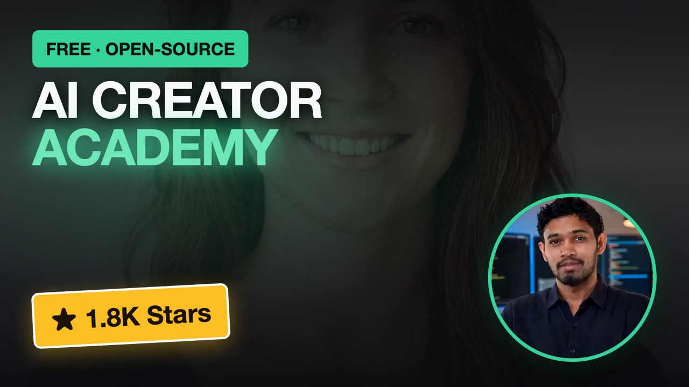

<p align="center">
  <a href="LICENSE"></a>
  <a href="ROADMAP.md"></a>
  <a href="ROADMAP.md"></a>
  <a href="https://github.com/Anil-matcha/ai-creator-academy/stargazers"></a>
</p>

<h1 align="center">AI Creator Academy</h1>

<p align="center"><b>Free, open-source curriculum for making money with generative AI image, video, and audio — for creators and agencies.</b></p>

<p align="center">
  <a href="https://www.youtube.com/watch?v=SC9zJ6AxDek">
    
  </a>
</p>

<p align="center">
  <a href="https://www.youtube.com/watch?v=SC9zJ6AxDek"><b>📺 AI Creator Academy: The Free Course Paid Communities Don't Want You to Find →</b></a>
</p>

---

Most AI education either teaches you to prompt a tool, or teaches you to build one. This teaches something else: how to turn AI-generated image/video/audio — or a tool you build yourself with a coding agent — into an actual, priced, sellable service or product. **Every module ends with pricing, positioning, and where to find your first client — not just "how it works."**

> ⭐ **[Star this repo](https://github.com/Anil-matcha/ai-creator-academy/stargazers)** to bookmark it — new tracks and modules ship regularly.

## Why this exists

Paid communities teaching this (Skool/Whop-style, $47–$97/mo) already cluster around exactly these niches — the demand is proven. What's missing is a version that's free, that cites real numbers instead of vague income claims, and that treats "how do I actually get paid for this" as the main subject instead of an afterthought bolted onto a tool tutorial.

## Table of contents

- [Tracks](#tracks)
- [The shape of a module](#the-shape-of-a-module)
- [Getting started](#getting-started)
- [FAQ](#faq)
- [Contributing](#contributing)
- [License](#license)

## Tracks

15 independent tracks — pick whichever matches the business you want to build, in any order. Numbered by demand evidence and coverage breadth, not by difficulty or prerequisite order. See [ROADMAP.md](ROADMAP.md) for full module-by-module status.

| # | Track | What you build | Modules | Status |
|---|---|---|---|---|
| 1 | [AI Video Ads & UGC](tracks/01-ai-video-ads-ugc/) | Sellable UGC-style ad batches for real brands | 5 | ✅ Live |
| 2 | [AI Filmmaking](tracks/02-ai-filmmaking/) | Short films, trailers, music videos | 5 | ✅ Live |
| 3 | [Faceless AI Channels](tracks/03-faceless-ai-channels/) | A YouTube/TikTok channel with no camera | 5 | ✅ Live |
| 4 | [AI Content Factories](tracks/04-ai-content-factories/) | Idea → script → video → publish, at volume | 6 | ✅ Live |
| 5 | [AI Avatars & Influencers](tracks/05-ai-avatars-and-influencers/) | A consistent AI character as a business | 5 | ✅ Live |
| 6 | [AI Audio & Music](tracks/06-ai-audio-and-music/) | Voice cloning, dubbing, podcasts, music | 5 | ✅ Live |
| 7 | [AI Product Photography](tracks/07-ai-product-photography/) | Studio-quality product shots, no photographer | 4 | ✅ Live |
| 8 | [AI Fashion & Virtual Try-On](tracks/08-ai-fashion-and-virtual-tryon/) | Garment try-on for fashion e-commerce | 4 | ✅ Live |
| 9 | [AI Real Estate Staging](tracks/09-ai-real-estate-staging/) | Empty room → staged listing photo | 3 | ✅ Live |
| 10 | [AI Headshots & Portraits](tracks/10-ai-headshots-and-portraits/) | Consistent professional headshots | 4 | ✅ Live |
| 11 | [AI Print-on-Demand & Merch](tracks/11-ai-print-on-demand-and-merch/) | Sellable AI art on merch, no client needed | 4 | ✅ Live |
| 12 | [AI Stock Content & Licensing](tracks/12-ai-stock-content-and-licensing/) | A licensable stock catalog, sold repeatedly | 3 | ✅ Live |
| 13 | [AI Tools Mastery](tracks/13-ai-tools-mastery/) | Which model for which outcome — a buyer's guide | 4 | ✅ Live |
| 14 | [AI Freelancing & Agency Business](tracks/14-ai-freelancing-and-agency-business/) | Pricing, contracts, clients, scaling a team | 5 | ✅ Live |
| 15 | [AI Agents & Vibe-Coding for Creators](tracks/15-ai-agents-and-vibe-coding/) | Sellable micro-tools, no CS degree needed | 4 | ✅ Live |

### Start here

[**Track 1: AI Video Ads & UGC**](tracks/01-ai-video-ads-ugc/) is the only fully-written track today — it's the proof-of-format pilot every other track will follow.

<details>
<summary><b>Track 1 — all 5 modules (click to expand)</b></summary>

| # | Module |
|:---:|---|
| 1 | [How AI UGC Actually Works](tracks/01-ai-video-ads-ugc/01-how-ugc-works.md) |
| 2 | [Character & Face Consistency](tracks/01-ai-video-ads-ugc/02-character-consistency.md) |
| 3 | [Building a 10-Ad Batch](tracks/01-ai-video-ads-ugc/03-building-an-ad-batch.md) |
| 4 | [Pricing & Selling UGC Ads](tracks/01-ai-video-ads-ugc/04-pricing-and-selling-ugc.md) |
| 5 | [Case Study Teardown](tracks/01-ai-video-ads-ugc/05-case-study-teardown.md) |

</details>

### What a module actually looks like

An excerpt from Track 1, so you know what you're getting before you click in.

<table>
<tr>
<td valign="top" width="50%">

**From Module 1 — the script structure** <sub><i>Do It</i></sub>

```
Hook (0-2 sec)
[A question, bold claim, or visual
surprise that stops the scroll]

Problem / Pitch (2-15 sec)
[What problem does the viewer have,
said like you'd tell a friend]

Proof / Demo (15-25 sec)
Call to Action (25-30 sec)
```

</td>
<td valign="top" width="50%">

**From Module 4 — real pricing ranges** <sub><i>Launch It</i></sub>

| Stage | Price |
|---|---|
| Gig-level, per ad | $10–$55 |
| Project batch (5-8 ads) | $150–$300 |
| Agency retainer | $1,500–$3,000/mo |

Anchored to documented freelance-marketplace and agency-retainer ranges — not invented.

</td>
</tr>
</table>

## The shape of a module

Every module in every track follows the same structure, so you always know what you're getting:

```
Problem → Concept → Do It → Compare Tools → Launch It → Exercises
```

- **Problem / Concept** — the real pain this solves, and the mental model behind it, before any steps.
- **Do It** — the actual step-by-step workflow.
- **Compare Tools** — the honest tradeoff between API-based generation, other paid tools, and local/self-hosted models — never just "APIs are easier."
- **Launch It** — pricing, positioning, and where to find your first client. This is the part most tutorials skip, and the reason this curriculum exists.
- **Templates** — a reusable artifact (a script template, a pricing sheet, an outreach message) saved in the track's shared `templates/` folder.

See [LESSON_TEMPLATE.md](LESSON_TEMPLATE.md) for the full template used to write every module.

## Getting started

**Read online.** Browse a track under [`tracks/`](tracks/) — start with [Track 1](tracks/01-ai-video-ads-ugc/).

**Clone and go:**

```bash
git clone https://github.com/Anil-matcha/ai-creator-academy.git
cd ai-creator-academy
open tracks/01-ai-video-ads-ugc/01-how-ugc-works.md
```

### Prerequisites

- No coding required.
- Either an API key for a generative media provider (any provider works — [muapi.ai](https://muapi.ai) is used as the reference throughout, since it aggregates 500+ models under one API), or a local/self-hosted setup (e.g. ComfyUI) for the modules that support it — every module's "Compare Tools" section covers both paths.
- Curiosity about running this as an actual service, not just a hobby.

## FAQ

**Do I need to know how to code?**
No. Every module is written for creators and freelancers — the only technical step in most modules is calling a generation API or using a tool's UI. If you want to go further, [Track 15](tracks/15-ai-agents-and-vibe-coding/) covers using coding agents to build your own tools — no prior programming background required there either.

**Do I have to use muapi.ai?**
No — any generative media provider works. muapi.ai is used as the reference implementation throughout because it aggregates many models behind one API, but the underlying technique in each module isn't provider-specific.

**Is there a local/free-to-run option, or do I need to pay for API credits?**
Both are covered. Every module's "Compare Tools" section shows the API path alongside a local/self-hosted path (e.g. ComfyUI) where one realistically exists, with an honest cost/speed/quality tradeoff.

**Why isn't [track/niche] covered yet?**
Only Track 1 is fully written so far — it's the pilot proving the format before the rest get written. See [ROADMAP.md](ROADMAP.md) for what's planned, and [CONTRIBUTING.md](CONTRIBUTING.md) if you want to help write one.

## Contributing

Contributions of new modules, fixes to existing ones, or new tracks are welcome — see [CONTRIBUTING.md](CONTRIBUTING.md).

## License

MIT — see [LICENSE](LICENSE).
