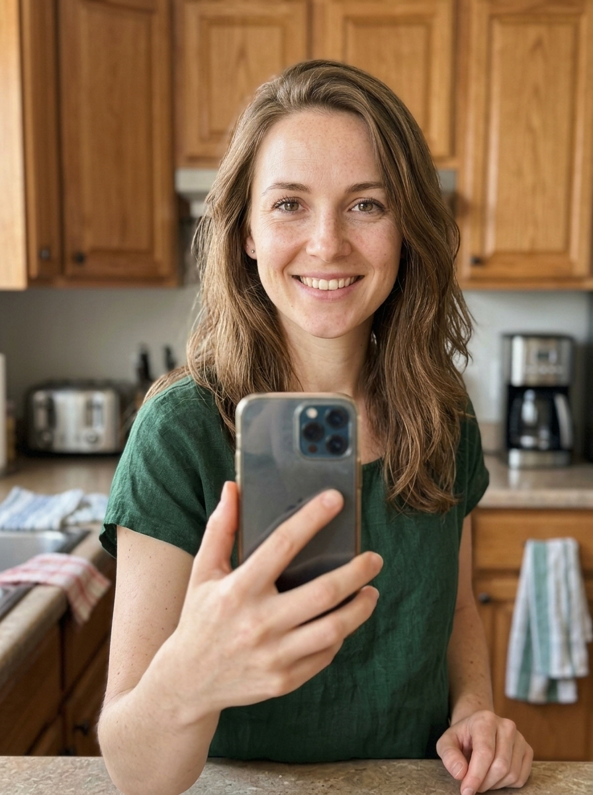

# Character & Face Consistency

> If your AI creator looks like a different person in every shot, nobody will pay for the ad.

**Track:** AI Video Ads & UGC
**Time:** ~40 minutes
**Prerequisites:** How AI UGC Actually Works

## The Problem

This is the single most common complaint from people trying AI-generated content: the same "character" comes out looking like a slightly different person in every generation — different face shape, different age, different outfit continuity. For a one-off image this doesn't matter. For a UGC ad campaign, a faceless channel host, or an AI influencer, it's disqualifying — viewers notice immediately, and clients will reject the work.

Most tutorials skip this because it's the hardest part to explain simply, and it's exactly why this is its own module rather than a footnote.

## The Concept

Consistency comes from giving the model an "anchor" it can't drift away from, instead of re-describing the character in text every time. Three anchor types, from weakest to strongest:

- **Prompt-only consistency** — describing the character in detail every time (hair, face, age, clothing). Weakest — text descriptions are ambiguous and the model fills gaps differently each generation.
- **Reference-image consistency** — feeding a reference photo of the character alongside the prompt, so the model conditions on the actual face, not just a text description. Much stronger, and the easiest to use with API-based models.
- **Fine-tuned/locked identity (LoRA or equivalent)** — training a small adapter on multiple photos of the same character so the model can reproduce that exact identity from any prompt. Strongest and most portable across scenes, but requires more setup (usually a local/self-hosted step, not a single API call).

A fixed **seed** (the random-number starting point for generation) also helps within a single session, but seed-locking alone doesn't survive across different prompts or sessions the way a reference image or trained identity does — treat seed-locking as a helper, not the main mechanism.

## Do It

1. **Pick or generate your anchor character** — either an AI-generated "founder" image or a stand-in reference photo, at high resolution, front-facing, neutral lighting.
2. **Use reference-image conditioning** for every subsequent generation of that character — pass the anchor image alongside each new prompt (different outfit, pose, background) rather than re-describing the person in text.
3. **Check for drift** — generate 3-5 variations and compare: same facial structure, same apparent age, consistent identifying features (freckles, specific hairstyle). If it's drifting, tighten the prompt to describe only what should change (outfit, background) and rely on the reference image for everything about the face.
4. **For heavy repeat use** (a recurring ad character, an influencer, a channel host), consider training a dedicated identity model (LoRA-style) — one-time setup cost, then near-perfect consistency across unlimited future generations.

## Worked Example

Say you generated an anchor image for a recurring "creator" — a woman in her late-20s, front-facing, neutral lighting, brown hair, freckles across her nose — to front your GripMount ads (Module 1) across a whole batch.

<i>This is an actual anchor image — generated once, then reused as the reference for every subsequent shot instead of re-describing the character in text.</i>

**Without a reference image (prompt-only):** re-typing "woman, late 20s, brown hair, freckles" for each new shot produces a *different* woman each time — same rough description, but the model fills in face shape, exact hair length, and freckle placement differently every generation. Across 5 shots you'd likely get 5 recognizably different people.

**With reference-image conditioning:** pass the anchor image alongside each new prompt ("same woman, now in a car, holding a phone" — describing only what changes). Face shape, freckles, and apparent age stay locked because the model is conditioning on the actual image, not re-guessing from text. This is the default that would work for a one-off GripMount client ad.

**Drift-check, actually run** — the anchor woman generated in 3 real settings (car interior, kitchen counter, walking outside), using the anchor image as a reference input to an *edit*-capable image model rather than a plain text prompt:

Same reference image fed into 3 separate generations — only the setting/prompt changed.

**What actually happened:** no meaningful drift across any of the 3 — face shape, freckle pattern, and hair all hold up even in the outdoor shot with completely different lighting than the anchor. This is the real result of reference-image conditioning done right: pass the anchor image as an *edit* input (not just describe the character in a fresh text prompt) and let the prompt describe only the setting. If you *do* see drift in your own attempts — a rounder jaw, vanished freckles, a different apparent age — it's usually because the prompt re-described facial features instead of only the surroundings, or the reference image wasn't actually passed to an edit-capable endpoint.

**When it's worth training a LoRA instead:** if this same "creator" is going to front dozens of ads over months (not just one GripMount batch), a one-time LoRA training pass on 15-20 photos of her locks the identity in even more tightly and removes any per-shot risk at all — worth the setup once reuse, not one-off work, is the plan.

*How the 3 shots above were produced:* uploaded the anchor image once via muapi's `upload_file`, then made 3 separate calls to **`nano-banana-2-edit`** ($0.06/image), passing that same uploaded image as the reference (`images_list`) each time with a prompt describing only the new setting ("same woman as in the reference image, now sitting in a car...") — never re-describing the face itself. Other reference-conditioned edit models that work the same way: `nano-banana-pro-edit`, `gpt-image-2-image-to-image`.

## Compare Tools

For the reference-image step itself, current-generation image models (e.g. Nano Banana 2/Pro, Seedream) hold facial identity noticeably better across prompt changes than older-generation image models — the anchor portrait used in the Worked Example above came from one of these. Model quality matters more here than almost anywhere else in the pipeline, since this whole module exists to fight identity drift.

| Path | Consistency strength | Setup effort | Best for |
|---|---|---|---|
| **muapi API, reference-image conditioning** | Good — strong resemblance across generations | Low — pass a reference image param | Most UGC/ad work; fastest path to "good enough" |
| **Other paid tools with built-in "character" features** | Varies — some wrap reference-image conditioning behind a simpler UI | Low | Teams wanting a GUI over the same underlying technique |
| **Local (ComfyUI + trained LoRA, or LTX 2.3 for the video side)** | Strongest — near-identical identity across any prompt/scene | High — needs a training pass on multiple reference photos, then a workflow to use it | A recurring character used across dozens/hundreds of generations (an influencer, a channel host) where the training cost pays for itself |

Be honest with yourself about how many times you'll reuse this character. Reference-image conditioning via API is the right default for a one-off client ad. A trained local identity is worth the extra setup only once you're generating the same character repeatedly.

## Launch It

**How to price it:** Consistency work isn't billed separately — it's what makes the deliverable usable at all, so it's baked into your ad or content pricing (see Module 4). What you *can* upsell is a **"branded AI character" package** — designing and locking a consistent identity a client can reuse across all future content, priced as a one-time setup fee ($200-$500) plus per-piece production after.

**How to position it:** Frame it as "your reusable AI spokesperson," not "an AI-generated photo." Clients pay more for something they can reuse across campaigns than for a single image.

**Where this shows up:** Every track in this curriculum depends on this module — an AI influencer, a faceless channel's "host," and a UGC ad character are all the same underlying consistency problem applied to a different business model.

## Exercises

1. **Easy:** Generate the same character in 3 different outfits using reference-image conditioning; check for facial drift across them.
2. **Medium:** Generate the same character in 5 different scenes/backgrounds and identify which details drift first (usually: age, specific facial proportions, hairstyle).
3. **Hard:** Set up a local ComfyUI workflow with a trained identity for one character and compare consistency against the API reference-image approach for the same 5 scenes.

## Templates

Reusable template(s) this module produces — fill these in and reuse them on real work:

- [`templates/character-consistency-checklist.md`](templates/character-consistency-checklist.md) — what to check for drift before delivering a batch to a client.

---

[← Previous: How AI UGC Actually Works](01-how-ugc-works.md) · [Track overview](README.md) · Next: [Building a 10-Ad Batch →](03-building-an-ad-batch.md)
