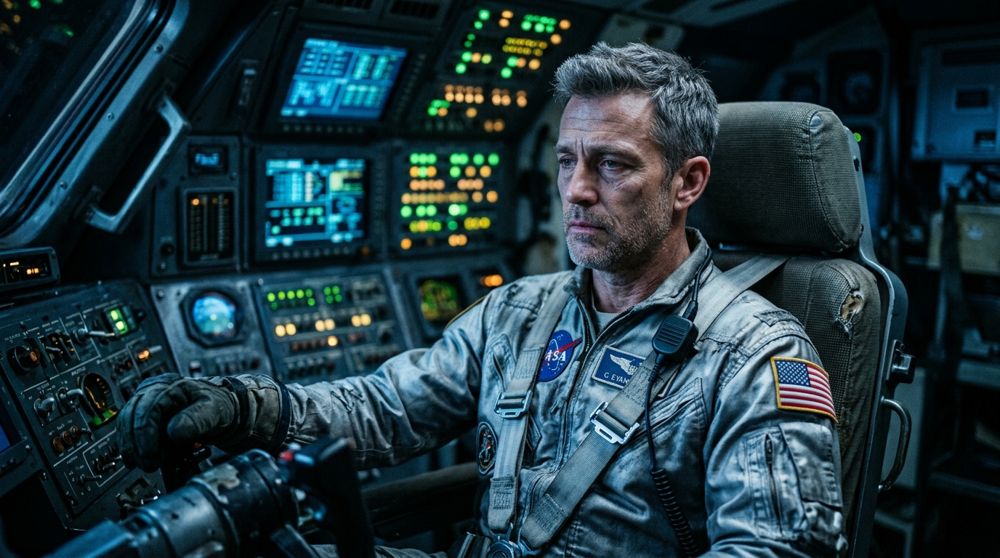

# Screenplay & Story Generation

> A good script is cheap; a good story that can actually be filmed by AI is rare.

**Track:** AI Filmmaking  
**Time:** ~40 minutes  
**Prerequisites:** None  

## The Problem

Traditional screenplays are written for human actors and camera crews. A standard script might describe "a crowded café with dozens of patrons chatting, as the protagonist slams their coffee cup down in anger, causing coffee to spill onto a passing waiter's uniform." 

If you feed a scene like this into a generative AI video model, the rendering will fail completely. The patrons' faces will morph, the physical interaction of spilling coffee on a waiter will look like a surreal glitch, and keeping the protagonist looking like the same person across shots will be impossible.

Most aspiring AI filmmakers start by writing a standard story, only to waste hundreds of generation credits trying to force an AI model to render complex physics, crowds, or constant location shifts. Designing your screenplay with **AI-first constraints** from day one is the difference between a completed film and a folder of discarded, glitchy clips.

## The Concept

AI-first screenwriting is the process of drafting stories designed specifically around the limitations and strengths of generative models. 

### Core Constraints of Generative Video Models:
* **The Physics Gap:** AI models struggle with complex object interaction (e.g., tying shoes, pouring liquids, buttoning a shirt, eating food). 
* **The Crowd Dilemma:** Any scene with more than two characters in frame dramatically increases visual morphing and reduces identity consistency.
* **Continuous Action Limits:** Most models generate clips in 4–5 second increments. Long, continuous single-take action scenes are not yet feasible.

To design around these constraints, we write scripts that focus on **static character postures, environmental moods, atmospheric lighting, and high-impact dialogue/voiceover** rather than complex physical action.

```
Story Outline → Constraint Check → Visual Script Formatting → Prompts Generation
```

Instead of describing physical struggle, describe the *emotional reaction* shown on a character's face or the *mood* of the setting, which AI video generators render beautifully.

## Do It

### Step 1: Define the Production Constraints
Before writing a single word of your script, fill out the project constraints in your brief. Choose:
* **Max 1–2 characters** to maintain facial consistency.
* **Max 2 locations** (e.g., a quiet office, a dimly lit street).
* **Atmospheric focus:** Decide on the visual theme (e.g., neon cyberpunk, dusty retro-future, noir daylight) to anchor prompt styling.

### Step 2: Write the Screenplay with Visual Anchor Prompts
Format your screenplay using a layout that integrates standard screenwriting format with image/video prompt anchors. 
* Break the script into individual, discrete shots (each lasting 3-4 seconds).
* For each shot, write a clear **visual action description** that details the character's facial expression or slow movement.
* Keep dialogue brief (under 15 words per shot) so that TTS models can read it naturally without rushing.

### Step 3: LLM Script Generation
Use a text LLM (like Claude or Gemini) to brainstorm and refine the script. Use a system prompt that forces the AI to respect physical limitations:
> *System Prompt:* "You are an AI-first screenwriter. Write a 60-second sci-fi script. Only 1 character. Set entirely in a single room. Avoid any physical object interactions. Focus on facial expressions, slow camera tracking shots, and voiceover dialogue. For every scene, output a detailed visual prompt describing camera movement, framing, character appearance, and lighting."

### Step 4: Prune the Actions
Review the script line by line. If a line says "He stands up, walks to the shelf, grabs a book, opens it, and smiles," prune it. Replace it with: "He sits at the desk, looking at the shelf. [Camera pushes in on his face, showing curiosity]." This is highly renderable.

### Step 5: Save Character & Style Anchors
Create a style sheet with your prompt prefixes (lighting, film stock, aspect ratio) so they can be copy-pasted into every image generator.

---

## Worked Example

<p align="center">


</p>
<p align="center"><sub>AI Hero Character Anchor Image (Left) ──► Image-to-Video Animation (Right) · Video File: <a href="templates/examples/astronaut-intro-clip.mp4">templates/examples/astronaut-intro-clip.mp4</a></sub></p>

**Film Brief: "The Last Signal"**
* **Character:** John (40s), a tired astronaut.
* **Location:** Spaceship communication deck.
* **Vibe:** Cinematic sci-fi, moody blue lighting.


**Script Excerpt & Prompts:**

```markdown
SCENE 1: INTERIOR SPACE CABIN - NIGHT

John sits in a high-tech pilot seat, surrounded by glowing green instrument panels. Cool blue light washes over his face. He looks up at a flickering display monitor off-camera.

JOHN (V.O.)
"No one has answered in six months."

VIDEO PROMPT (Shot 1.1):
"Medium close-up of a tired astronaut (40s, short gray hair, stubble, wearing a worn silver flight suit) sitting in a spaceship cockpit. Glowing green instrument panels are out of focus in the background. Cool blue light illuminates his face. Static shot, high quality cinematic, Arri Alexa, film grain."
```

**Why this script works:**
1. **Low-action:** The character is sitting down. The movement is limited to "looking up," which video models interpolate smoothly.
2. **Atmospheric lighting:** The cool blue light and glowing green panels give the video generator clear lighting keys to follow, creating consistency.
3. **Voiceover-driven:** The dialogue is a voiceover (V.O.), which means you do not need perfect lip-syncing for this shot, eliminating uncanny valley mouth movements.

**The clip below is real, not a mockup** — the anchor image generated via `nano-banana-2` and animated into a short cinematic clip using `seedance-2-image-to-video-fast` from the script excerpt above, so you can see what a first-pass output actually looks like:


<p align="center"><i>An unedited first pass — character features, clothing, and background are held perfectly consistent from the starting storyboard frame because of first-frame conditioning.</i></p>

*How this was actually produced, end to end, via the muapi API:*
1. Generated the anchor portrait with **`nano-banana-2`** (text-to-image, $0.06/image) using the visual prompt above with widescreen aspect ratio.
2. Uploaded that image via muapi's `upload_file` endpoint to get a URL.
3. Fed that image URL into **`seedance-2-image-to-video-fast`** (image-to-video, $0.50/clip) on the `images_list` param with a prompt describing the camera movement.
4. Downloaded the resulting `.mp4` and converted it to the silent GIF preview above using `ffmpeg`.

---

## Compare Tools

| LLM / Tool | Screenwriting Capabilities | Best For |
|---|---|---|
| **Claude 3.5 Sonnet / Gemini 1.5 Pro** | Excellent at following complex structural constraints and outputting formatted Markdown prompts. | Overall script writing and prompt creation. |
| **Specialized Screenplay AI tools** | Provide standard script formats (Celtx/Final Draft styles) but are often too rigid and lack built-in prompt-generation logic. | Standard film workflows, less optimized for AI generation workflows. |
| **ChatGPT Plus (GPT-4o)** | Good creative writing capabilities but requires heavy prompting to avoid cliché screenwriting tropes. | Brainstorming and quick dialogue variants. |

The best path is utilizing general-purpose frontier LLMs (Gemini/Claude) with structured system prompts, as they allow you to modify prompt formatting on the fly and integrate camera commands directly into the script markdown.

---

## Launch It

**How to monetize this skill:**
* **Screenplay & Brief Packages:** Sell pre-production visual scripts and film briefs to other creators or agencies looking to produce AI videos. A fully formatted script complete with storyboard prompt keys sells for **$50–$150** for a 1-minute video.
* **Pre-Production Adaptation:** Offer adaptation services for existing standard scripts. Take a client's traditional short film script and rewrite it into an "AI-optimised format" to save them thousands of wasted credits during production. Price this at **$200–$500** per project.

**Where to find clients:**
AI creator forums, Discord servers (Runway, Midjourney, muapi), and freelance sites (Fiverr/Upwork) under "Pre-Production Consultant" or "AI Scriptwriter."

---

## Exercises

1. **Easy:** Take a standard 1-page movie script and rewrite it under AI-first constraints (limit to 1 location, 1 character, and zero hand-object physical interactions).
2. **Medium:** Write a 60-second thriller script using the integrated formatting: divide into 5 shots, writing scene descriptions, voiceover lines, and the exact visual prompt for each shot.
3. **Hard:** Use a text LLM to generate three visual prompt options for a single scene, varying only the camera lens (e.g., 85mm portrait, 24mm wide angle, anamorphic) and explain how this shifts the story mood.

---

## Templates

Reusable template(s) this module produces — fill these in and reuse them on real work:

* [`templates/screenplay-prompt-template.md`](templates/screenplay-prompt-template.md) — the screenplay format designed specifically to generate image/video prompts.
* [`templates/ai-film-brief.md`](templates/ai-film-brief.md) — a project-starter brief to lock visual aesthetics and constraints.

---

[← Track overview](README.md) · Next: [Storyboarding & Shot Planning →](02-storyboarding-and-shots.md)
