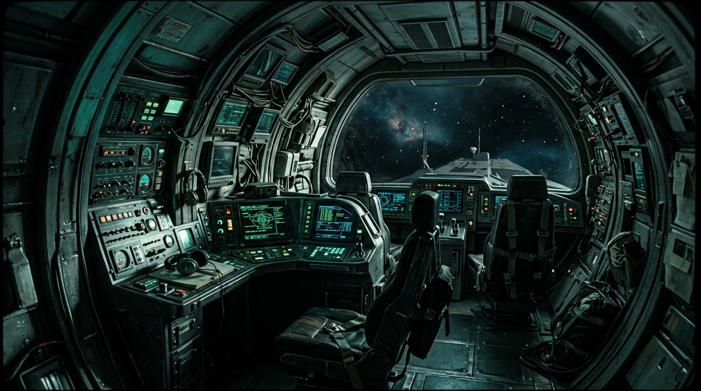
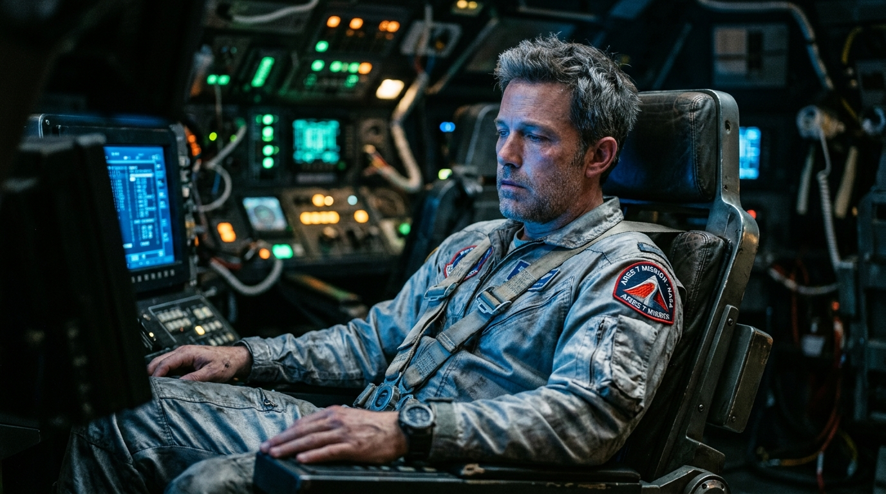
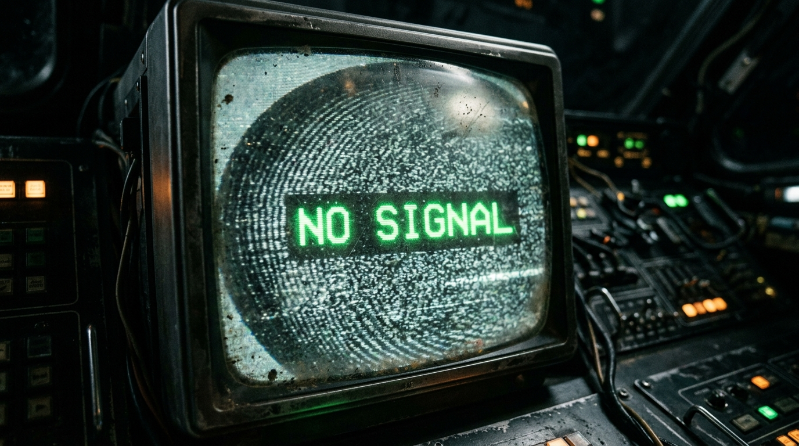

# Storyboarding & Shot Planning

> A storyboard is the blueprint that stops you from burning credits on random video generations.

**Track:** AI Filmmaking  
**Time:** ~40 minutes  
**Prerequisites:** Screenplay & Story Generation  

## The Problem

Generating video clips directly from text prompts is a gamble. AI video models are expensive, slow to render, and highly unpredictable. If you type a prompt like `"A spaceship interior, John walking towards the door"` into a video generator, you might get a great shot, but John’s outfit might be blue, the room might be brightly lit, and the camera angle might be from the ceiling. If you run it again, John's face and clothes will change completely.

If you generate 20 video clips this way, you will end up with a collection of disjointed footage that looks like it belongs to 20 different movies. You will have wasted dozens of dollars in rendering credits and hours of waiting time.

To make a coherent film, you need to establish visual continuity — lighting, color palette, camera framing, and character wardrobe — **before** you render a single frame of video. Storyboarding is the gatekeeper that locks down these elements at a fraction of the cost.

## The Concept

Storyboarding for AI filmmaking is the process of generating a sequence of static images that represent the key shots of your film. 

By using high-quality image models (like Flux or Midjourney) instead of video models, you can rapidly test style, composition, and consistency. These static storyboard frames then act as the **start-frame input** for your image-to-video generator.

```
Visual Style Guide → Character Anchor → Storyboard Images → Image-to-Video
```

To maintain visual consistency across your storyboard, you rely on a **Style Guide** containing:
* **Style Prefix:** A standard set of visual descriptors (film stock, lighting, lens) added to every prompt.
* **Aspect Ratio:** Fixed layout matching your target screen format.
* **Character Reference:** A locked-in seed image of your character fed back into the model to maintain facial details.

---

## Do It

### Step 1: Create the Visual Style Guide
Define your aesthetic parameters using the [`templates/style-guide-template.md`](templates/style-guide-template.md). Lock in your film stock (e.g. `35mm film grain`), your color palette (e.g. `teal shadows, warm amber highlights`), and your camera aspect ratio (e.g. `--ar 16:9`).

### Step 2: Establish the Character Anchor Image
Before drafting scenes, generate your character's "hero portrait." 
* Write a detailed prompt describing the character's face, hair, age, and a specific wardrobe element (e.g., `"A worn silver flight suit with a red shoulder patch"`).
* Generate this image using a high-quality model.
* Save the best image. This is your **Character Reference Image (Cref)**.

### Step 3: Generate the Storyboard Frames
For each shot in your screenplay, generate the static frame.
* Start each prompt with your **Style Prefix**.
* Describe the framing (Wide Shot, Medium Shot, Close-up).
* Reference your Character Anchor Image using the model's image-to-image or character reference capabilities.
* Keep the scene seed constant if the model supports it, varying only the framing and character posture.

### Step 4: Build the Shot List
Log each generated frame into your [`templates/shot-list-template.md`](templates/shot-list-template.md). Note the camera framing, target action, dialogue line, and the file path of the approved static storyboard image.

### Step 5: Check for Visual Continuity
Place the storyboard frames next to each other. Do a drift check:
* Does the character’s hair or outfit shift significantly between cuts?
* Does the environment’s lighting change color temperature?
* If yes, re-render the drifting frames, tightening the text prompts to override the changes.

---

## Worked Example

**Storyboard Script & Scene Breakdown for "The Last Signal" (Scene 1)**

Below is the screenplay script excerpt for Scene 1 and its corresponding 3-shot AI storyboard breakdown:

```markdown
SCENE 1: INT. SPACESHIP COCKPIT - NIGHT

A cramped, metallic flight deck illuminated only by flickering instrument lights. Volumetric green glow washes over the curved control panels. 

JOHN (40s, tired eyes, wearing a weathered silver flight suit) sits alone in the pilot seat. He stares up at a dusty overhead monitor as static hums over the speakers.

JOHN (V.O.)
Day 412. Still no response from deep space relay Theta. If anyone is listening... this is my final transmission.

The overhead monitor flickers aggressively before flashing stark green text: NO SIGNAL.
```

### Storyboard Shot List & Visual Examples

#### Shot 1: Wide Establishing Shot (WS)
<p align="center">

</p>
> **Prompt:** `"Cinematic 35mm film photograph, establishing wide shot of a cramped spaceship cockpit. glowing green control panels line the curved metallic walls. Muted teal lighting with deep shadows. No characters. Widescreen, highly detailed."` 

#### Shot 2: Medium Shot (MS - Character Intro)
<p align="center">

</p>
> **Prompt:** `"Cinematic 35mm film photograph, medium shot of a tired astronaut (40s, short gray hair, stubble, wearing a worn silver flight suit) sitting in a pilot seat inside a spaceship cockpit. Cool blue light illuminates his face, glowing green control panels out of focus in the background. Widescreen."` *(Reference Image: Character Anchor)* 

#### Shot 3: Close-up (CU - Prop Detail Shot)
<p align="center">

</p>
> **Prompt:** `"Cinematic 35mm film photograph, extreme close-up of a dusty CRT monitor screen showing static and a flashing green text reading 'NO SIGNAL'. Widescreen."` 

#### Shot 4: Image-to-Video Motion Animation (I2V)
<p align="center">


</p>
<p align="center"><sub>Static Storyboard Frame (Left) ──► Image-to-Video Motion Animation (Right) · Video File: <a href="templates/examples/storyboard-anim-clip.mp4">templates/examples/storyboard-anim-clip.mp4</a></sub></p>

**Why this sequence works:**
* The Wide shot sets the space.
* The Medium shot introduces the astronaut using the character anchor reference image to lock his face.
* The Close-up shot focuses on a prop. Props don't have facial drift issues, making them excellent transition shots.
* All three prompts share the prefix `"Cinematic 35mm film photograph"` and reference the cockpit's glowing green panels, ensuring color continuity.

---

## Compare Tools

| Path / Tool | Cost basis | Consistency | Best for |
|---|---|---|---|
| **Flux 1.1 / Midjourney v6** (via muapi) | Low (~$0.01 to $0.06 per image generation) | Very High — support image-to-image, style referencing, and seed control | Rapid storyboard iteration and character styling |
| **Specialized Storyboard Software (GUI)** | Subscription-based | Low — generic sketch styles, lacks photo-realistic AI rendering | Traditional hand-drawn boards, not optimized for AI filmmaking |
| **Local ComfyUI (Flux/SDXL)** | Free after GPU investment | Extremely High — custom ControlNet, IP-Adapter, and local LoRA loading | Advanced creators who want pixel-level layout control and zero generation costs |

General-purpose image generation APIs (like Flux/Midjourney) are the best choice for storyboarding. They are cheap enough to run dozens of variations until you get the perfect layout, which you can then pass to video generators.

---

## Launch It

**How to monetize this skill:**
* **Visual Storyboarding Services:** Pitch ad agencies or independent directors who need visual storyboards for their pitches. Standard storyboard rates are **$150–$400** per storyboard deck (10-15 frames). Focus your pitch on the speed of delivery (24-hour turnaround vs. 5 days for a manual artist).
* **Pitch Deck Creator:** Package storyboards, mood boards, and script concepts into a cinematic "Pitch Deck" that indie filmmakers use to secure funding or sponsors. Price this package at **$300–$800**.

**Where to find clients:**
Film freeway, director forums, Upwork, and production agency directories. Cold email local video production agencies offering a "free 3-frame storyboard sample" for one of their upcoming pitches.

---

## Exercises

1. **Easy:** Create a Visual Style Guide for a neo-noir film set in a rainy city, detailing colors, lighting styles, and negative prompts.
2. **Medium:** Generate 3 storyboard images (WS, MS, CU) for a character sitting at a park bench at golden hour, maintaining character and color consistency across all 3 shots.
3. **Hard:** Set up a storyboard sequence where a character moves from an indoor location (warm lighting) to an outdoor location (cool daylight). Write the transition prompts to show how the light changes on their face while keeping the character's clothing and identity locked.

---

## Templates

Reusable template(s) this module produces:

* [`templates/storyboard-script-template.md`](templates/storyboard-script-template.md) — a breakdown template for structuring AI storyboard shots and Image-to-Video prompts.
* [`templates/shot-list-template.md`](templates/shot-list-template.md) — a tracker for logging frames, camera framings, and prompts.
* [`templates/style-guide-template.md`](templates/style-guide-template.md) — a template to lock in your film's prompt prefixes, aspect ratios, and color palette.

---

[← Screenplay & Story Generation](01-screenplay-and-story.md) · Next: [Camera Movement & Cinematography Prompts →](03-camera-movement.md)
