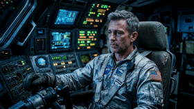

# Camera Movement & Cinematography Prompts

> Camera movement is the difference between an AI slideshow and a movie.

**Track:** AI Filmmaking  
**Time:** ~50 minutes  
**Prerequisites:** Screenplay & Story Generation, Storyboarding & Shot Planning  

## The Problem

Most beginners in AI video generation end up creating what looks like a PowerPoint presentation with slight Ken Burns effects: static characters with wind blowing through their hair, or background dust drifting slightly. 

If they try to force camera movements by typing generic text like `"the camera moves fast,"` the video models often glitch, morphing the character's body parts or turning the entire background into a liquid smear.

Real cinema relies on deliberate, structured camera movements — dolly shots, pans, tilts, crane movements, and tracking shots. To make your AI film look premium and deliberate, you need to know how to prompt these movements in a way the video generator's neural network actually understands.

## The Concept

Video models don't think like camera operators; they think in terms of pixel displacement and temporal flow. When you write a movement prompt, you are instructing the model on how pixels should slide across the screen from frame to frame.

To control this displacement effectively, you use three tools:
1. **First-Frame Conditioning (Image-to-Video):** You feed your storyboard frame from Module 2 as the starting point. This locks the framing and composition.
2. **Cinematography Keywords:** Using precise industry terms (dolly, pan, tilt) instead of vague action words.
3. **Motion Strength Parameters:** Adjusting the model's velocity settings to control how much the frame changes over time.

```
Start Frame (Storyboard) + Camera Direction Prompt + Motion Slider = Cinematic Shot
```

For advanced shots, you can use **First and Last Frame Conditioning**, uploading both the starting shot composition and the ending shot composition, forcing the model to generate the transition between them.

---

## Do It

### Step 1: Prepare Your Storyboard Start-Frame
Select the static storyboard image you generated in Module 2. Make sure it is at your target aspect ratio (16:9 or 2.39:1). Upload it to your video generator's image-to-video input interface.

### Step 2: Formulate the Motion Prompt
Use the [`templates/motion-prompt-library.md`](templates/motion-prompt-library.md) to choose the camera movement that matches the shot's emotional goal. Add the camera movement phrase to the beginning of your prompt.
* *Example:* `"Slow dolly in, camera slowly pushes toward the astronaut's face, Arri Alexa cinematic style, 24fps."`

### Step 3: Set the Motion Strength Slider
If your generator supports it, adjust the motion strength value:
* **For dialogue or subtle scenes:** Set strength to **Low (1–3)**. This prevents face warping while allowing subtle blinks and head tilts.
* **For camera pans, walking, or panning b-roll:** Set strength to **Medium (4–6)**.
* **For fast action, running, or driving:** Set strength to **High (7–9)**.

### Step 4: Render and Review
Render the 4-second clip. Watch the playback and check for:
* **The Morphing Zone:** Did the background objects bend? Did the character grow extra fingers or change clothes mid-shot?
* **Pacing:** Is the camera speed jarring or smooth?
* If the shot glitches, lower the motion strength slider and re-render. If it is too static, rewrite the prompt to place the camera direction at the very start of the text.

### Step 5: (Optional) Set Last-Frame Conditioning
If the action requires a precise end point, upload a second storyboard image to the **Last-Frame Input** box. Write a prompt describing the movement between the two images (e.g. `"Camera pans left from the cockpit window to focus on the radar screen"`).

---

## Worked Example

<p align="center">


</p>
<p align="center"><sub>Static Character Frame (Left) ──► Image-to-Video Dolly Camera Motion (Right) · Video File: <a href="templates/examples/astronaut-clip.mp4">templates/examples/astronaut-clip.mp4</a></sub></p>

**Animating Shot 1.2 from "The Last Signal"**


* **Input Image (Start Frame):** The static portrait of the astronaut sitting in the cockpit.
* **Motion Prompt:**
  > `"Slow cinematic dolly in, camera pushes past glowing green console panels to focus on the tired eyes of the astronaut. Slow, deliberate motion, photorealistic film grain, 24fps."`
* **Motion Settings:** Aspect ratio set to `16:9`, duration `5` seconds.

**Render Breakdown:**
* **0.0 - 1.5 seconds:** The camera slowly slides forward. The glowing panels on the left slide out of the frame correctly, creating depth.
* **1.5 - 3.0 seconds:** The astronaut blinks naturally. The lighting shadows match his face shape as the camera moves closer.
* **3.0 - 5.0 seconds:** The camera comes to a smooth rest on a tight close-up. The face structure and flight suit remain 100% consistent with the starting storyboard.

**Total Cost:** **$0.50** (1x Seedance 2 image-to-video fast API call).

---

## Compare Tools

| Model / Path | Camera Motion Control | Rendering Cost | Best for |
|---|---|---|---|
| **Seedance 2** (via muapi) | Outstanding character and costume preservation using omni_reference first-frame conditioning. Handles human motion and camera pans smoothly. | ~$0.50 per 5-second clip | Character-focused visual storytelling and narrative filmmaking requiring strict visual continuity. |
| **Kling 3.0 / Luma Dream Machine** | Excellent camera tracking, supports start-frame conditioning, and handles human micro-expressions naturally. | ~$0.75 - $0.80 per clip | Professional client work requiring high emotional realism. |
| **Runway Gen-3 Alpha** | Advanced camera brush tools that let you paint direction vectors on the screen. | High (Subscription-based, credits burn fast) | Complex cinematic compositions where prompt text alone isn't enough. |
| **Local ComfyUI (LTX 2.3 / AnimateDiff)** | High control over motion schedules via node setups, but requires significant setup. | **Free** (after GPU purchase) | Mass-producing b-roll clips, landscape scenes, and experimenting without budget limits. |

For character-focused scenes, API-based models like Seedance 2 are the standard due to their ability to lock character features. For atmospheric b-roll (clouds moving, space stars passing, water rippling), local models like LTX 2.3 inside ComfyUI are highly cost-effective since they require less character consistency.

---

## Launch It

**How to monetize this skill:**
* **B-Roll Stock Library:** Generate high-quality cinematic camera moves (e.g. drone tracking shots of futuristic cities, slow macro pans of textures, volumetric light rays in abandoned houses) and package them as stock video libraries. Sell them on stock marketplaces (Adobe Stock, Shutterstock) or directly on Gumroad for **$15–$30** per pack.
* **Camera Movement Presets / Prompt Packs:** Package your tested camera prompts into copy-paste libraries tailored for specific video generators. Sell these packs to other AI creators for **$10–$25** on Whop or Gumroad.

**Where to find buyers:**
Stock websites, indie game developers needing environmental clips, and other AI creators.

---

## Exercises

1. **Easy:** Take a static landscape image and generate a 4-second video clip using three different motion prompts: (1) pan left, (2) tilt up, and (3) dolly zoom. Note the difference in pixel warping.
2. **Medium:** Generate a character close-up shot using a storyboard start-frame. Experiment with motion strength sliders: render one at strength 2, one at strength 5, and one at strength 8. Log the point where facial features begin to break down.
3. **Hard:** Produce a scene transition using first-frame and last-frame conditioning. Lock the first frame as an indoor shot and the last frame as an outdoor shot, creating a continuous camera pass through a door.

---

## Templates

Reusable template(s) this module produces:

* [`templates/motion-prompt-library.md`](templates/motion-prompt-library.md) — a library of camera movement phrasing.
* [`templates/cinematography-cheat-sheet.md`](templates/cinematography-cheat-sheet.md) — a reference sheet for visual layout terminology.

---

[← Storyboarding & Shot Planning](02-storyboarding-and-shots.md) · Next: [Assembling a Short Film →](04-assembling-short-film.md)
