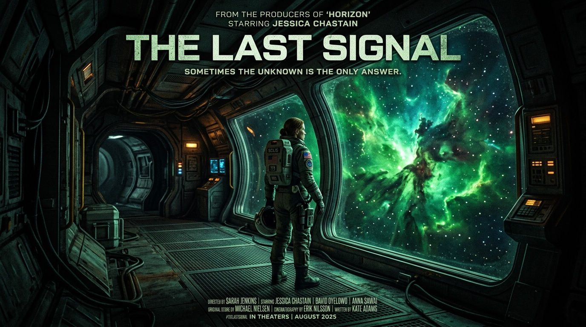

# Selling Short-Form Films

> Festivals want the story; sponsors want the eyeballs; platforms want the assets.

**Track:** AI Filmmaking  
**Time:** ~30 minutes  
**Prerequisites:** Screenplay & Story Generation, Assembling a Short Film  

## The Problem

Most people who make AI short films share them on YouTube or Twitter, get a few hundred views, and make $0. They treat it purely as a hobby or an art project. Because they don't understand the commercial market for digital media, they miss out on the growing economic ecosystem surrounding AI video production.

At the same time, brands are looking for cost-effective visual storytelling, new vertical drama platforms are spending millions of dollars licensing short episodes, and major technology companies are hosting AI film festivals with tens of thousands of dollars in cash prizes.

To turn AI filmmaking into a sustainable business, you must transition from "making cool clips" to understanding how to structure sponsorships, pitch licensing agreements, and target the right monetization funnels.

## The Concept

Monetizing AI short-form video runs along three main avenues, each with a different financial return and effort level:

```
                  ┌───────────────────────┐
                  │ AI Film Festivals     │ ──► Cash Prizes ($1K - $20K) & Brand Exposure
                  ├───────────────────────┤
AI Short Film ──► │ Brand Sponsorships    │ ──► Direct Product Placement ($300 - $1.5K)
                  ├───────────────────────┤
                  │ Platform Licensing    │ ──► Ep. Sales to Vertical Apps ($150 - $500/ep)
                  └───────────────────────┘
```

1. **AI Film Festivals:** High prestige, low predictability. Submitted through aggregator directories, these offer cash prizes and direct introductions to agency directors.
2. **Brand Sponsorships:** Moderate predictability, high margins. You integrate a brand's digital asset (a logo, a product model) into the world of your film.
3. **Platform Licensing:** Highest predictability, volume-driven. Vertical video platforms (ReelShort, DramaBox, etc.) buy rights to short-form episodic narrative content.

---

## Do It

### Step 1: Package Your Visual Deliverables
Before pitching, ensure you have a professional delivery pack:
* **The Master Cut:** Widescreen 16:9 or 2.39:1 high-resolution video.
* **The Vertical Cut:** 9:16 vertical version optimized for mobile feeds.
* **The Clean Master:** A video export with sound effects and music, but *no voice track* (this allows platforms to dub your film into other languages).

### Step 2: Build a Visual Pitch Deck
Use [`templates/sponsorship-pitch-template.md`](templates/sponsorship-pitch-template.md) to outline your project's concept. Include your static storyboard frames from Module 2 to show the high visual quality of the project before it is rendered.

### Step 3: Pitch Brand Sponsorships
Search for mid-sized brands whose aesthetic matches your film theme.
* *Example:* If you are making a sci-fi film, target premium desk accessory or software companies. If you are making a drama, target fashion or skincare brands.
* Send your pitch offering seamless product integration inside your narrative world. Charge an upfront fee (**$300–$1,000** for initial campaigns).

### Step 4: Submit to AI Film Festivals
Set up a profile on FilmFreeway. Search for "AI Film Festivals." Submissions are often free or low-cost. Submit to major ones (e.g. Runway AIFF, muapi Creator Awards) to build industry credibility.

### Step 5: License to Vertical Drama Apps
Reach out to licensing representatives of vertical vertical-video networks. Pitch them a multi-episode mini-series. Provide a terms sheet detailing upfront fees and royalty splits using the [`templates/licensing-agreement-sheet.md`](templates/licensing-agreement-sheet.md).

---

## Worked Example

<p align="center">


</p>
<p align="center"><sub>Licensing Pitch Art (Left) ──► Image-to-Video Film Trailer Motion (Right) · Video File: <a href="templates/examples/last-signal-assembly-clip.mp4">templates/examples/last-signal-assembly-clip.mp4</a></sub></p>

**Licensing "The Last Signal" Series to a Mobile App**


* **The Deal:** A 5-episode vertical mini-series (1 minute per episode).
* **The Agreement terms:**
  * **Exclusivity:** Exclusive license for mobile app distribution for 12 months. Non-exclusive for personal portfolio display.
  * **Upfront Fee:** **$300** per episode (Total **$1,500** upfront).
  * **Royalty Split:** **15%** of net pay-per-view revenue generated by the episodes on the app.
  * **Attribution:** Credit line: *"Created by [Your Name] using muapi models"* visible on the video description page.

**The Financial Math:**
* **Production Cost:** **$25** in video generation API credits (Kling/Luma).
* **Editing Time:** 15 hours total across 5 episodes.
* **Net Upfront Profit:** **$1,475** (approx. **$98/hour**).
* **Passive Tail:** Extra monthly payments from the 15% royalty split as users unlock episodes.

---

## Compare Tools

| Platform / Portal | Purpose | Best for |
|---|---|---|
| **FilmFreeway** | Central directory for film festival submissions globally. Includes filters for budget, genre, and "AI Film" categories. | Gaining credentials, winning cash prizes, and press releases. |
| **Direct Brand Outreach (Email/LinkedIn)** | Reaching marketing managers directly to sell product placements. | Short-term cash flow and direct commercial partnerships. |
| **Whop / Gumroad** | E-commerce hosting platforms to sell digital video assets or prompts. | Selling templates, visual assets, or LUT packs to other creators. |

For direct monetization, cold outreach to brands and licensing to vertical platforms provides immediate, predictable income. Festivals should be treated as a marketing channel to increase your credibility and justify higher rates for future brand deals.

---

## Launch It

**How to price your work:**
* **Product Placement / Sponsorship:** Charge based on production complexity. A 5-second product placement inside a 1-minute cinematic clip is priced at **$300–$800** upfront.
* **Vertical Drama Episodes:** Pitch packages of 10–20 episodes. Sell them at **$150–$350** per episode to mobile platforms, or negotiate a lower upfront fee in exchange for a higher revenue share (20-30%).

**Where to find sponsors:**
Target brands that already advertise heavily on social media (look at Meta Ad Library) but lack high-production-value video assets. Offer them cinematic lookups they cannot get from typical low-budget film crews.

---

## Exercises

1. **Easy:** Draft a 1-page visual pitch deck outline for an AI-generated sci-fi short film, including target brand sponsors.
2. **Medium:** Write a cold pitch email to a real watch or tech gear brand, proposing a 5-second seamless visual integration in a travel-themed short video.
3. **Hard:** Draft a complete licensing term sheet for a 10-episode vertical drama series, defining regional exclusivity, upfront payment milestones, and revenue-sharing terms.

---

## Templates

Reusable template(s) this module produces:

* [`templates/sponsorship-pitch-template.md`](templates/sponsorship-pitch-template.md) — a cold email pitch structure for sponsorships.
* [`templates/licensing-agreement-sheet.md`](templates/licensing-agreement-sheet.md) — a term sheet outlining licensing structures.

---

[← Assembling a Short Film](04-assembling-short-film.md) · [Track overview](README.md)
