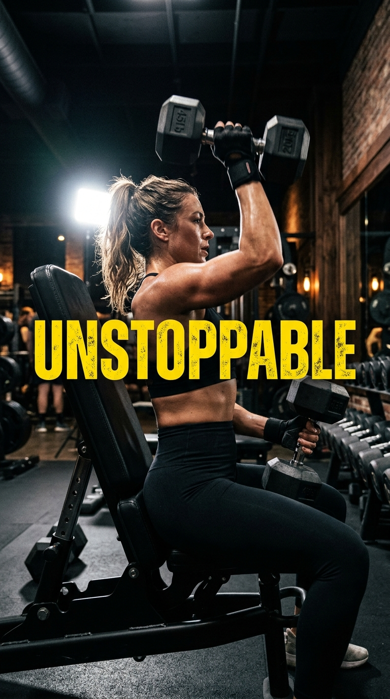

# Building a TikTok/Reels Factory

> Attention is won in the first half-second, and kept with kinetic movement.

**Track:** AI Content Factories  
**Time:** ~45 minutes  
**Prerequisites:** The Multi-Step Production Pipeline  

## The Problem

The swiping velocity on vertical feeds (TikTok, Instagram Reels, YouTube Shorts) is incredibly fast. Users make a decision to watch or swipe in under **0.5 seconds**. If your video starts with a slow fade-in, a corporate logo, or a narrator saying *"Hello guys"*, you have already lost. 

Furthermore, many creators treat vertical video editing like widescreen editing. They leave still images static on the screen, use tiny, hard-to-read captions at the bottom, or place text where it is covered by the platform's user interface overlay (comments, like buttons, and channel names).

To build a high-performance vertical content factory, you need to configure custom editor presets that optimize visual cuts, caption typography, and safe zones specifically for mobile-first swiping feeds.

## The Concept

Vertical feed retention is driven by three main visual elements:

### 1. The Kinetic Cut:
Never leave a still image static on the screen. Even during a single visual clip, you must apply a continuous **slow scale-up** (Ken Burns effect) of **100% to 108%** over 3 seconds. The brain registers this small movement as active video, preventing visual boredom.

### 2. Micro-Word Captions:
Viewers scrolling vertical feeds often watch with audio turned off, or scan the text to decide if the voice is worth listening to. Standard sentences are slow to read. Instead, configure captions to output **1 to 3 words at a time** in a bold, high-contrast, center-aligned font.

### 3. Safe Zone Compliance:
Every platform overlays user interface icons (like, share, comments) on the right side and bottom of the screen. Keep your primary subject and text captions within the **central safe zone** to prevent them from being hidden by platform buttons.

---

## Do It

### Step 1: Set Up the Vertical Canvas
In your editor (e.g. CapCut), set the project aspect ratio to `9:16` (1080 x 1920 pixels). Verify that your background assets cover the entire screen height without leaving black bars at the top or bottom.

### Step 2: Auto-Caption Generation
Run the auto-captioning utility. Once the text tracks are generated, select all captions and apply these visual styles:
* **Font:** Montserrat Bold or Impact.
* **Color:** White (`#FFFFFF`) with a black outline/stroke (width: 8).
* **Keywords:** Scan the timeline. Manually change the font color of action verbs or primary keywords (e.g. "WIN", "DANGER") to Yellow (`#FFD700`) or Green (`#00FF00`).

### Step 3: Positioning within Safe Zones
Position the caption track in the middle of the screen. In the position coordinate boxes, set the Y-axis value so the text sits slightly below center, but well above the account username area:
* Target coordinate: **Y = -120 to -150 pixels** on a standard 1080x1920 grid.

### Step 4: Apply Visual Pacing Rules
Cut your visuals to match the [`templates/tiktok-reels-editor-preset.md`](templates/tiktok-reels-editor-preset.md). Ensure the first visual cut happens at exactly **1.5 seconds**, and subsequent cuts happen every **2.5 to 3.0 seconds**.

### Step 5: Add a Pattern Interrupt
At the 15-second or 30-second mark, insert a sudden visual scale-up (e.g. zoom-in by 120%) combined with a subtle sound effect (a low "whoosh" or "swish"). This resets the user's attention span.

---

## Worked Example

TikTok/Reels Model Image (Left) ──► Image-to-Video Motion Loop (Right) · <a href="templates/examples/fitness-reel-clip.mp4">MP4</a>

**Timeline Construction for "Peak Performance" (Fitness Niche)**

* **Visual Cut pacing:**
  * **0.0 - 1.5s:** Still image of a runner at sunrise (100% to 105% scale-up).
  * **1.5s:** Sharp cut to a close-up of running shoes hitting the asphalt.
  * **3.5s:** Cut to a silhouette athlete doing pull-ups (with a slow zoom-in).

* **Caption Sync:**
  * Voiceover: *"If you want progress, stop looking for comfort."*
  * Captions output sequence: `[If you want] (0.0-0.8s)` -> `[PROGRESS] (0.8-1.5s, highlighted in green)` -> `[stop looking] (1.5-2.5s)` -> `[for comfort] (2.5-3.5s)`.

* **Sound Design:**
  * Background track: Fast-tempo atmospheric synth.
  * 1.5s cut: Low sub-bass drop sound effect.

**The Result:** The video hooks the viewer instantly, the highlighted text draws the eye, and the visual cuts keep the pacing fast and engaging.

---

## Compare Tools

| Editing Path | Speed | Caption Customization | Safe-Zone Guides |
|---|---|---|---|
| **CapCut (Desktop)** | Fast | Excellent (Massive library of text templates and styles) | Built-in (Shows vertical UI overlays) |
| **Premiere Pro** | Medium | Good (Highly customizable, but requires setting up preset templates manually) | Manual setup required |
| **In-App Editors** (TikTok/Reels) | Slow | Low (Basic font options, difficult to time exactly to audio) | Dynamic |

CapCut is the best factory editor for vertical content because it generates auto-captions in seconds, has built-in safe zone lines, and supports rapid batch exports. Use native in-app uploaders only to add final trending audio files during posting.

---

## Launch It

**How to monetize this service:**
* **Batch UGC Packs:** Pitch local gyms, cafes, or beauty brands. Offer to shoot or generate 15 vertical reels for them for **$500–$800**. 
* **Creator Captain Services:** Manage vertical channels for established influencers. You download their long-form YouTube videos, cut them into 10 clips using your presets, and schedule them across TikTok/Reels for a **$1,000/month** retainer.

---

## Exercises

1. **Easy:** Import a widescreen image into a vertical project. Scale and crop it to fit `9:16`. Save it.
2. **Medium:** Auto-generate captions for a 30-second audio track. Apply Montserrat Bold font, change the word group count to 2 words per screen, and color-highlight 3 keywords.
3. **Hard:** Produce a 30-second vertical video that incorporates: (1) cuts every 2 seconds, (2) 100% to 108% scale animations on all background images, and (3) text positioned strictly inside safe zones.

---

## Templates

* [`templates/tiktok-reels-editor-preset.md`](templates/tiktok-reels-editor-preset.md) — layout notes for cut rates, caption typography, and safe zones.

---

[← The Multi-Step Production Pipeline](01-production-pipeline.md) · Next: [Building a YouTube Shorts Factory →](03-youtube-shorts-factory.md)
