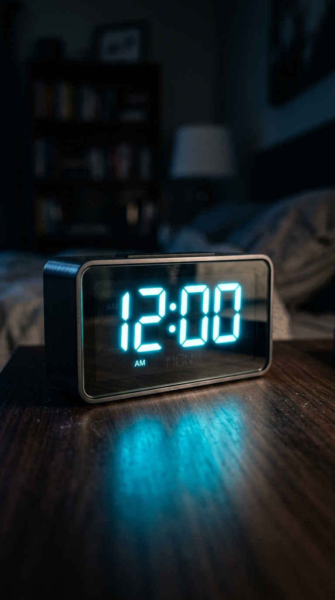

# Building a YouTube Shorts Factory

> A video that never ends is watched forever.

**Track:** AI Content Factories  
**Time:** ~45 minutes  
**Prerequisites:** The Multi-Step Production Pipeline, Building a TikTok/Reels Factory  

## The Problem

On YouTube Shorts, the algorithm is highly focused on **Retention Percentage**. Because Shorts play on an infinite loop, if a viewer watches your video all the way through, and then stays for the first 3 seconds of the loop repeating, the platform records their retention rate as **105%**. If you get enough viewers to stay past the 100% mark, the algorithm pushes your video into the Shorts shelf, yielding hundreds of thousands of views.

However, most creators kill their retention at the very end of their video. They say *"Thanks for watching,"* display a subscribe button, or let the music fade out over 2 seconds of a blank screen. This tells the viewer the video is over, and they swipe away instantly.

To build a high-performance Shorts factory, you must master the art of the **infinite loop**, designing both your script and editing timeline to hide the boundary between the video's end and its restart.

## The Concept

The core mechanism of a high-retention Short is the **Seamless Script & Audio Loop**:

```
[Final Word of Script] ──► (0-frame gap) ──► [First Word of Script]
```

This works because most viewers won't notice a gap-free loop restart — they'll keep watching and only realize they've started again after a second or third loop, which registers as extra watch time. To create an invisible loop:
1. **The Loop Sentence:** The last sentence of the video must remain unfinished. The starting sentence of the video must complete it.
2. **Audio Continuity:** The background music track must maintain a constant volume and tempo across the cut. Never apply a fade-out effect to the audio tail.
3. **Visual Continuity:** The visual style (framing, color grading) of the final clip must closely match the starting clip so the transition does not flash.

*Automated Loop Note:* You can reference the [`AI-Youtube-Shorts-Generator`](https://github.com/Anil-matcha/awesome-generative-ai-apps/tree/main/video_generation/AI-Youtube-Shorts-Generator) repository, which handles the assembly of automated Shorts and audio files programmatically.

---

## Do It

### Step 1: Draft the Loop Hook
Before writing the body of your script, write your looping boundary using the [`templates/shorts-looping-blueprint.md`](templates/shorts-looping-blueprint.md).
* *Ending text:* *"The best secret to high productivity is..."*
* *Starting text:* *"...this simple time-management trick."*
* When the loop executes, the sentence flows naturally: *"The best secret to high productivity is... this simple time-management trick."*

### Step 2: Record/Generate the Audio
Generate the script. When using TTS, output the ending phrase and starting phrase in separate files to prevent the AI voice from dropping its pitch (which typically happens at the end of sentences).

### Step 3: Trim the Audio Tail in the Editor
Place the audio tracks on your timeline. Zoom in to the frame level. Find the exact frame where the voice stops speaking at the end of the video. **Slice and delete all trailing silent frames**. Do not leave even a 0.1-second gap of silence.

### Step 4: Configure Music Continuity
Place your background music track on A2. Cut the track exactly at the end of the video. Make sure the volume level is locked (e.g. at -18dB) from start to finish. Avoid applying any fade-in or fade-out effects at the timeline edges.

### Step 5: Visual Transition Match
Check the first frame of your video and the last frame of your video. If the first frame is a dark visual, the last frame should be dark. Apply a constant **pan-right** or slow zoom-out animation to both edges to make the motion flow seamlessly.

---

## Worked Example

<p align="center">


</p>
<p align="center"><sub>Shorts Model Image (Left) ──► Image-to-Video Shorts Infinite Motion Loop (Right) · Video File: <a href="templates/examples/focus-loop-clip.mp4">templates/examples/focus-loop-clip.mp4</a></sub></p>

**Loop Build: "Focus Blueprint" (Productivity Niche)**


* **Timeline Layout:**
  * **Video Start (0:00 - 0:03.0):** Visual: A glowing digital clock. Caption: `[is this simple rule.] (0.0-1.5s)` -> `[If you want focus,] (1.5-3.0s)`.
  * **Video Body (0:03.0 - 0:56.0):** [Explains the 90-minute focus block method].
  * **Video End (0:56.0 - 0:59.0):** Visual: A digital clock glowing. Caption: `[The best hack for work] (56.0-59.0s)`.

* **The Audio Cut:**
  * Track A1 (Narrator voice) finishes speaking the word *"work"* at exactly 0:59.00.
  * The timeline length is set to exactly 0:59.00.
  * When the video loops to 0:00.00, the voice immediately speaks *"is this simple rule."*

* **The Result:** The viewer hears: *"...The best hack for work... is this simple rule. If you want focus..."* The loop is invisible, keeping the viewer watching for a second loop and boosting retention metrics.

**The clip below is real, not a mockup** — the anchor image generated via `nano-banana-2` (9:16 vertical aspect ratio) and animated into a short vertical video loop using `seedance-2-image-to-video-fast` from the script excerpt above, so you can see what a first-pass output actually looks like:


<p align="center"><i>An unedited first pass — the image represents a high-concept visual of the digital focus clock, dynamically animated by the video engine for high-retention looping.</i></p>

*How this was actually produced, end to end, via the muapi API:*
1. Generated the anchor vertical portrait of the clock with **`nano-banana-2`** (text-to-image, $0.06/image) with a `9:16` aspect ratio.
2. Uploaded that image via muapi's `upload_file` endpoint to get a URL.
3. Fed that image URL into **`seedance-2-image-to-video-fast`** (image-to-video, $0.50/clip) on the `images_list` param with a vertical aspect ratio and a prompt describing the camera zoom.
4. Downloaded the resulting `.mp4` and converted it to the silent GIF preview above using `ffmpeg`.

---

## Compare Tools

| Production Method | Loop Precision | Background Audio | Best for |
|---|---|---|---|
| **Manual CapCut Editing** | High (Visual timeline zoom lets you slice silent frames precisely) | Manual loop cuts | Creating custom, highly engaging short loops. |
| **Programmatic Automation** (`AI-Youtube-Shorts-Generator`) | Instant (Cuts silence programmatically using audio libraries) | Automated music looping | Mass-producing short networks and testing script concepts. |
| **Platform Mobile Apps** | Low (Difficult to trim frames precisely on a touch screen) | In-app music sync | Informal, ad-hoc behind-the-scenes updates. |

For a high-volume factory, programmatically generating your loop audio using tools like `AI-Youtube-Shorts-Generator` ensures that every single short has zero tail silence, maintaining a high retention benchmark across all uploads.

---

## Launch It

**How to leverage the loop:**
* **Looping Comments:** Pin a comment that completes the loop or asks a question related to it (e.g. *"Did you catch the loop?"*). This encourages viewers to comment, driving engagement rates up.
* **Keep titles short:** On YouTube Shorts, long titles cover the screen text. Keep your title under **40 characters** (e.g. *"Automate your invoices in 10 mins"*).

---

## Exercises

1. **Easy:** Write a 3-sentence script where the final sentence connects back to the first. Read it aloud to ensure it flows naturally.
2. **Medium:** Import a voiceover clip into your editor. Zoom in to the timeline and crop all silent frames at the tail down to the millisecond.
3. **Hard:** Produce a 15-second loop video. Export it and upload it to a test channel. Verify that the audio and visual loops occur seamlessly without any visual stutter or audio pop.

---

## Templates

* [`templates/shorts-looping-blueprint.md`](templates/shorts-looping-blueprint.md) — script templates and editing rules for infinite loops.

---

[← Building a TikTok/Reels Factory](02-tiktok-reels-factory.md) · Next: [AI Thumbnail Design →](04-thumbnail-design.md)
