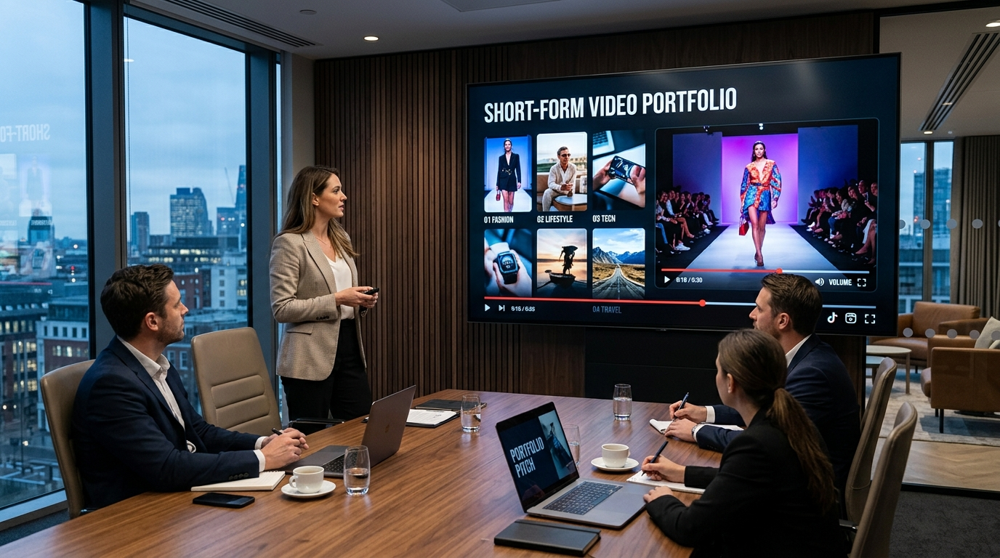

# Selling Content-Factory Output as a Service

> Businesses don't want views; they want the consistency that builds views.

**Track:** AI Content Factories  
**Time:** ~30 minutes  
**Prerequisites:** The Multi-Step Production Pipeline, Batching & Scheduling at Volume  

## The Problem

Most freelance video editors sell their services "per video" or "per hour." They charge $100 to edit a single clip. This pricing model forces you into a constant cycle of pitching: the moment you finish a project, your income drops to zero until you land the next client. You spend more time writing cold emails than actually editing.

Furthermore, clients are unreliable. They will order 3 videos, pause for a month, and then ask for a revision three weeks later. This breaks your factory pipeline and clogs your editing schedules.

To scale your income, you must stop selling one-off edits. Instead, package your factory output into a **monthly recurring retainer** (subscription agency model), selling consistent, predictable volume that keeps clients paying month after month.

## The Concept

The business model of a content factory agency is the **Subscription Content Retainer**:

```
Client Retainer ($1,500/mo)  ──►  Upfront Payment  ──►  Weekly Batch Delivery (7 Videos)
```

By transitioning to monthly subscriptions, you lock in:
* **Predictable Income:** You know exactly how much your agency will make next month, allowing you to hire assistants or invest in software.
* **Pipeline Planning:** You deliver videos in predictable weekly batches (e.g. 7 videos every Friday), eliminating emergency editing requests.
* **High Margins:** Because your factory utilizes fast AI generation tools, your cost per video is under $1. A $1,500 retainer costs you only $30 in API credits, yielding a **98% net profit margin**.

---

## Do It

### Step 1: Define Your Pricing Tiers
Open the [`templates/bulk-pricing-sheet.md`](templates/bulk-pricing-sheet.md). Select the packages you will offer:
* **Growth Factory ($1,500/mo):** 30 vertical videos, custom thumbnails, SEO tagging.
* **Syndication Network ($2,800/mo):** 60 vertical videos, scheduled across YouTube, TikTok, and Instagram.

### Step 2: Set Up Recurring Invoicing
Open a merchant account (Stripe, PayPal, or Whop). Set up a subscription product matching your package price. **Always bill clients upfront** at the start of the 30-day cycle. Never produce videos before the invoice is settled.

### Step 3: Target Your Ideal Clients
Focus on businesses that have high marketing budgets but no time to create content:
* Professional services (real estate brokers, law firms, accountants, private clinics).
* High-ticket consultants, business coaches, and software founders.
* E-commerce brand owners.

### Step 4: Send the Pitch Proposal
Draft a clear proposal using the [`templates/agency-retainer-proposal.md`](templates/agency-retainer-proposal.md). Keep it simple: state the deliverables, the delivery schedule (weekly batches), and the upfront price. 

### Step 5: Onboard & Set Up Shared Folders
Upon payment, open a shared folder (Google Drive or Dropbox) with the client. Set up subfolders:
* `[Raw_Assets_From_Client]`: For any logos, color books, or reference images they want you to use.
* `[Weekly_Deliveries]`: Where you upload the weekly batch of 7 videos.

---

## Worked Example

<p align="center">


</p>
<p align="center"><sub>Agency Pitch Image (Left) ──► Image-to-Video Boardroom Presentation (Right) · Video File: <a href="templates/examples/agency-pitch-clip.mp4">templates/examples/agency-pitch-clip.mp4</a></sub></p>

**Retainer Deal: "Apex Bookkeeping" Agency Agreement**


* **The Client:** A local accounting firm wanting to grow their TikTok/Reels presence to source tax clients.
* **The Deal Closed:** **$1,500/month retainer** for 30 short-form videos.
* **Delivery Pacing:** 7 videos uploaded to their Google Drive folder every Friday.
* **Agency Production Math:**
  * **Time Spent:** 4 hours/month scripting, 4 hours/month editing and captioning. (Total: **8 hours/month**).
  * **API Expense:** 30 videos @ $0.70/video = **$21.00/month**.
  * **Gross Income:** **$1,500.00/month**.
  * **Net Monthly Profit:** **$1,479.00**.
  * **Hourly rate equivalent:** **$184.87 / hour**.

**Why this works:** The client receives a high-quality video uploaded once a day, keeping their brand visible online. The agency makes a 98% profit margin by using a batched AI pipeline to deliver the assets.

---

## Compare Tools

| Platform / Tool | Invoicing Capabilities | Re-billing Setup | Best for |
|---|---|---|---|
| **Stripe Billing / Invoicing** | Professional layout, auto-payment collection, cards storage, support for multiple currencies. | Auto-renewing subscriptions | Professional business clients and corporate accounts. |
| **Whop Creator Portal** | Built-in affiliate tracking, custom access links, simple dashboard. | Subscription links | Influencer clients, courses, and creator communities. |
| **DocuSign / PandaDoc** | Legally binding digital signatures, contract tracking. | N/A | Securing high-value corporate agency contracts. |

For small agencies, Stripe Billing is the standard invoicing tool. Send your PDF proposal along with a Stripe subscription payment link. Once the payment clears, automate a welcome email onboarding sequence.

---

## Launch It

**How to scale your agency:**
* **Limit Revisions:** In your agreement contract, specify that revisions must be requested in a single batch within 48 hours of delivery. This stops clients from dragging out project feedback over weeks.
* **The Upload Add-on:** Sell an add-on service: you manage the posting and scheduling on their accounts for an extra **$300/month**. This makes the deal more valuable and creates a friction-free service for the client.

---

## Exercises

1. **Easy:** Draft your own customized agency package pricing sheet.
2. **Medium:** Fill out the Content Factory Retainer Proposal template with a mock client name, defining the weekly batch deliverables.
3. **Hard:** Find three local professional service websites (e.g. accounting, local dentist, real estate broker) that have blank social media feeds. Draft a cold email pitch using your pricing tiers to offer them a 10-video test batch.

---

## Templates

* [`templates/agency-retainer-proposal.md`](templates/agency-retainer-proposal.md) — a contract proposal template covering scope, schedule, and payment.
* [`templates/bulk-pricing-sheet.md`](templates/bulk-pricing-sheet.md) — pricing ranges and margins for bulk reels/shorts.

---

[← Batching & Scheduling at Volume](05-batching-and-scheduling.md) · [Track overview](README.md)
