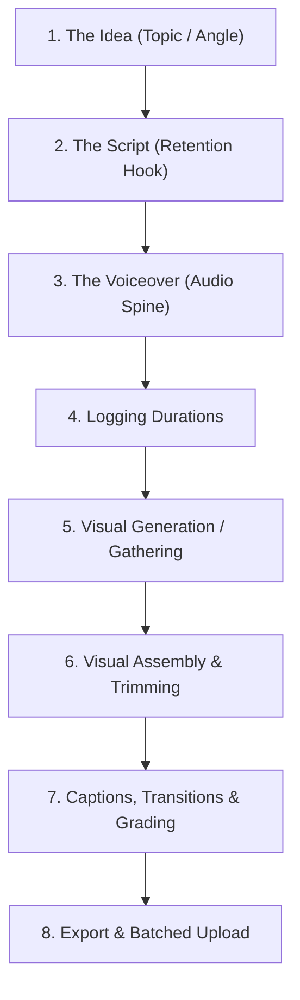

# Production Pipeline Flowchart

Use this flowchart and mapping sheet to audit your factory's production steps. Keep each video's linear flow unidirectional to avoid double-handling assets.

---

## 1. Linear Pipeline Diagram

---

## 2. Pipeline Station Audit

| Station | Owner / Tool | Inputs Needed | Payout / Output | Target Time |
|---|---|---|---|:---:|
| **1. Idea** | LLM / Reddit / Trends | Niche keyword | Title hook & 3 script angles | 5 min |
| **2. Script** | Claude 3.5 / Script Template | Graded topic | 150-word script text | 10 min |
| **3. Voice** | ElevenLabs / TTS API | Script text | Edited `.wav`/`.mp3` voice track | 5 min |
| **4. Logging** | Narration Log Sheet | Audio file | Millisecond cut stamps | 3 min |
| **5. Visuals** | muapi / Stock / Canvas | Visual descriptions | 5-10 background clips | 15 min |
| **6. Assembly** | CapCut / Premiere | Audio + Visual files | Rough cut timeline | 10 min |
| **7. Polish** | Text Captions + LUTs | Rough cut | Polished, captioned master | 10 min |
| **8. Queue** | Platform Web Uploaders | Master file + SEO description | Scheduled, pending release | 5 min |

**Total Cumulative Time per Video:** **63 minutes** (Target: Under 60 mins for experienced operators).
