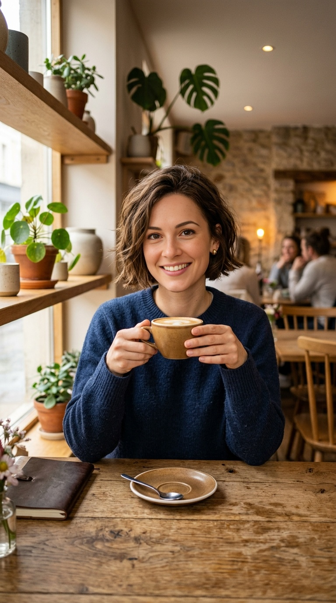

# Building a Consistent AI Character

> A virtual influencer needs a locked face, not a random prompt.

**Track:** AI Avatars & Influencers  
**Time:** ~45 minutes  
**Prerequisites:** None  

## The Problem

The single biggest hurdle in building a virtual influencer or a consistent brand spokesperson is **face drift**. If you write a prompt for a character in a bedroom, and then in an office, text-to-image models (like Midjourney or DALL-E) will output two different-looking people. The hair length changes, the facial symmetry shifts, and the clothing varies. 

If your character looks like a different person in every post, your audience will not build an emotional connection. The illusion of a real person is broken, and you cannot sell brand sponsorships. (Think of it this way: if a real influencer changed their hair colour, eye colour, and face shape between every Instagram post, you'd assume it was a different account entirely — AI characters suffer the same trust collapse.)

To build a viable virtual influencer, you must implement a structured prompting system and face-conditioning pipeline that locks in your character's facial features, hair, and wardrobe across multiple scenes.

## The Concept

Character consistency in generative AI relies on three core techniques:

### 1. The Description Anchor (Prompt Tokens):
Instead of typing a generic prompt (e.g. *"a beautiful woman"*), you must write a highly detailed, rigid description of the face, hair, and styling. Use unique tokens (e.g. *"textured crop brown hair, oval face, green eyes, slight freckles"*). Repeating these exact tokens in every prompt establishes a visual anchor.

### 2. The Wardrobe Anchor:
Keep your character's clothing constant. Do not change their outfit in every scene. Virtual characters (and cartoon characters) are recognized by their signature wardrobe. Lock down one or two clothing tags (e.g., *"wearing a dark blue crewneck sweater"*) and keep it identical across all renders.

### 3. Face-Swapping & Reference Conditioning (InsightFace / cref):
Even with locked prompts, minor facial details will shift based on lighting and camera angles. You resolve this by taking a high-quality master portrait of your character and using a face-swapping engine (like `z-image-p` via muapi) to project the master face onto any newly generated scene.

```
Master Face Portrait  ──►  New Scene Generation  ──►  Face Swap Layer  ──►  Consistent Render
```

---

## Do It

### Step 1: Define Your Character Profile
Open the [`templates/character-style-guide.md`](templates/character-style-guide.md). Write down your character's visual features, clothing style, and signature colors.

### Step 2: Generate the Master Portrait
Use `nano-banana-2` (aspect ratio set to `1:1`) to generate a clean, front-facing headshot of your character in soft, neutral lighting.
* *Example prompt:* `"Front portrait of Emma, a 28-year-old female influencer with a short textured brown bob, oval face, slight freckles on her nose, looking at the camera. Soft neutral studio lighting, clean gray background, photorealistic, 8k."`
Save the best render as your **Master Reference Face** (e.g., `emma-master.jpg`).

### Step 3: Generate New Scene Backgrounds
Write prompts for your character in new locations (e.g. at a cafe table, in an office). Keep the face descriptions, hair details, and wardrobe tags **100% identical** to your master prompt:
* *New prompt:* `"Emma, a 28-year-old female influencer with a short textured brown bob, oval face, slight freckles, wearing a dark blue crewneck sweater, sitting at a wooden cafe table holding a coffee cup. Minimalist cafe background, warm morning light, photorealistic, 8k."`

### Step 4: Run the Face-Swap Pipeline
If the face in the cafe generation drifts slightly from the master, use the `/z-image-p` (or InsightFace face swap) endpoint:
* **Source Image (Reference):** Upload your `emma-master.jpg`.
* **Target Image:** Upload your new cafe generation.
* The engine will align and swap the facial features, preserving the lighting and head angle of the target image while locking in Emma's exact nose, eyes, and cheek structure.

---

## Worked Example

<p align="center">



</p>
<p align="center"><sub>Master Avatar (Left) ──► Face-Swapped Output (Center) ──► Image-to-Video Motion (Right) · Video File: <a href="templates/examples/emma-cafe-motion.mp4">templates/examples/emma-cafe-motion.mp4</a></sub></p>

**Creating "Emma" (Tech Influencer Avatar)**


* **Master Reference Profile:** 28s, short textured brown bob, oval face, freckles, wearing a dark blue crewneck sweater. Master portrait saved to local folder.
* **Scene 1 (Office):** Generated Emma sitting at a corporate desk. Face swapped with Master.
* **Scene 2 (Home):** Generated Emma standing in a modern living room. Face swapped with Master.
* **Scene 3 (Studio):** Generated Emma speaking with professional studio microphones. Face swapped with Master.

**The Result:** Across three distinct scenes with varying lighting and backgrounds, Emma's face, hair, and sweater remain perfectly consistent. The character is ready to be animated into video.

**The comparison below is real, not a mockup** — showing Emma's Master Portrait side-by-side with her consistent cafe render (the master face was projected onto the target cafe scene via `ai-image-face-swap`):

<p align="center">
  
  &nbsp;&nbsp;&nbsp;&nbsp;&nbsp;&nbsp;&nbsp;&nbsp;
  
</p>

*How this was actually produced via the muapi API:*
1. Generated the master 1:1 square avatar portrait with **`nano-banana-2`** ($0.06/image).
2. Generated the 9:16 vertical cafe background with **`nano-banana-2`** using identical character prompt tokens.
3. Uploaded both files and submitted them to **`ai-image-face-swap`** ($0.03/swap) to align Emma's facial features onto the cafe scene.

---

## Compare Tools

| Platform / Tool | Consistency Capabilities | Payout / Credit Cost | Best for |
|---|---|---|---|
| **muapi `/ai-image-face-swap`** (Face Swap) | High (Preserves facial features across any angle or lighting) | ~$0.03 per swap | Fast, bulk face-swapping for image feeds. |
| **Midjourney `--cref`** | High (Character reference flag locks face and hair, but can struggle with precise clothing details) | Subscription-based | Generating initial background variations and poses. |
| **Stable Diffusion (IP-Adapter)** | Ultra-High (Unrestricted control over face and pose weight nodes) | Free (Runs locally on GPU) | Professional agencies building custom virtual models. |

For content creators starting out, using Midjourney or `nano-banana-2` to generate the background scene, followed by a quick pass through muapi's `/ai-image-face-swap` face swapper, is the fastest and most cost-effective pipeline to deliver client work.

---

## Launch It

**How to start the brand:**
* **Set Up a Business Profile:** Create a dedicated Instagram and TikTok account for your character. Do not label it as "AI Generated" in the main bio header — write a normal, humanized bio (e.g. *"Sharing automation hacks and tech reviews"*).
* **The Launch Batch:** Before publishing, generate at least **9 consistent posts** so that when a new viewer clicks your profile, they see a cohesive, professional image grid.

---

## Exercises

1. **Easy:** Write a detailed physical description for an AI character. Generate three front-facing headshots. Select the best master portrait.
2. **Medium:** Take your master portrait and generate two scene variations (e.g. walking in a city, sitting in a park) using identical prompt anchors.
3. **Hard:** Use a face-swapping engine to project your master character face onto a third-party stock photo scene, aligning the lighting and angles, and verify that the face features are held consistent.

---

## Templates

* [`templates/character-style-guide.md`](templates/character-style-guide.md) — a profile directory to lock in prompt anchors and seed lists.

---

[← Track overview](README.md) · Next: [Character to Content Pipeline →](02-character-content-pipeline.md)
