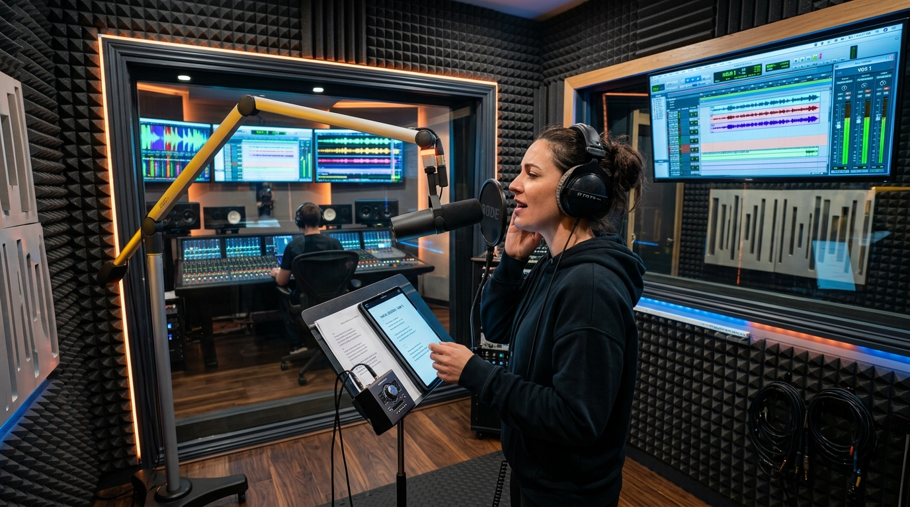

# Voice Cloning & Dialogue

> A face creates the identity, but the voice builds the relationship.

**Track:** AI Avatars & Influencers  
**Time:** ~35 minutes  
**Prerequisites:** Building a Consistent AI Character, Character to Content Pipeline  

## The Problem

A virtual influencer or corporate spokesperson can look 100% photorealistic, but if they speak with a generic, mechanical computer voice, the illusion is ruined. Cheap text-to-speech models lack the subtle details of human speech: breath sounds, natural pauses, rising inflections during questions, and varied word emphasis. 

When a viewer hears a robotic voice, they immediately recognize the speaker as fake, lose interest, and swipe away. 

To make your virtual influencer engaging and trustworthy, you must build a custom, high-fidelity **cloned voice profile** using real human speaking samples. This voice must remain consistent across all content releases and deliver script text with natural, lifelike inflections.

## The Concept

The vocal identity of your avatar relies on **Voice Cloning Synthesis** and **Phonetic Scripting**:

### 1. Training Sample Quality:
The output quality of a cloned voice is directly limited by the input audio. If you upload training files containing background noise, microphone static, or room echo, the AI model will learn those defects, outputting a raspy, low-fidelity voice profile. You need dry, clean, isolated mono recordings.

```
Clean Audio Samples (Dry/Mono)  ──►  Cloning Engine (ElevenLabs)  ──►  High-Fidelity Vocal Profile
```

### 2. Phonetic Adjustment:
AI voice generators frequently mispronounce brand names, industry acronyms, or custom terms (e.g. they might read *"SaaS"* as *"S-A-A-S"* or *"muapi"* as *"myoo-api"*). To fix this, you must build a **phonetic dictionary**, writing spelling workarounds in the generator text box (e.g. typing *"sass"* or *"moo-ah-pee"*) to force correct pronunciation.

### 3. Pacing with Punctuation:
AI readers interpret punctuation marks as breathing cues:
* A comma (`,`) triggers a short pause.
* An ellipsis (`...`) triggers a longer, reflective pause.
* A dash (`-`) creates a sudden shift in word flow.

---

## Do It

### Step 1: Record and Clean Training Audio
Record speaking samples following the [`templates/voice-cloning-checklist.md`](templates/voice-cloning-checklist.md). Read in a normal, conversational tone. Import the audio into a free editor (like Audacity), apply a **Noise Gate** to strip out silent floor noise, and export the file as a mono `.wav` file.

### Step 2: Upload to the Cloning Engine
Open ElevenLabs. Go to Voices -> Add Generative or Cloned Voice. Upload your training `.wav` file. Write a clear description of the vocal tone (e.g. *"Conversational, professional 20s female voice, warm and clear"*). Click generate to compile the voice profile.

### Step 3: Run Pronunciation Audits
Generate a test sentence containing your niche terms. Listen to the output. If the engine mispronounces a term, adjust its spelling phonetically in your script draft:
* *Standard spelling:* "Automate your invoice parsing using muapi."
* *Phonetic spelling:* "Automate your invoice parsing using moo-ah-pee."

### Step 4: Write Script Pacing Cues
Take your script text and insert punctuation cues to match a conversational rhythm. Avoid long, run-on sentences. 
* *Before:* "We connect Zapier to the database and then it populates the records automatically which takes ten seconds."
* *After:* "We connect Zapier to the database... and within ten seconds... the records populate... automatically."

---

## Worked Example

<p align="center">


</p>
<p align="center"><sub>Vocal Recording Studio (Left) ──► Image-to-Video Studio Motion (Right) · Video File: <a href="templates/examples/avatar-studio-clip.mp4">templates/examples/avatar-studio-clip.mp4</a></sub></p>

**Voice Clone Training for "Emma" (Tech Influencer)**


* **Audio Sourcing:** Recorded 8 minutes of clean vocal reading using a desk USB microphone inside a carpeted closet. Audio cleaned in Audacity (Noise gate applied, background hiss removed).
* **ElevenLabs Upload:** Cloned under the name `Emma_V1`.
* **Script & Phonetic Testing:**
  * Draft line: *"SaaS automation with Zapier."*
  * Audio test: AI pronounced SaaS as separate letters "S-A-A-S".
  * Fix: Adjusted script input to: *"Sass automation with Zapier."*
  * Final render: Correctly pronounced as a single word "Sass" with natural vocal flow.

**The Result:** The output audio is clear, contains natural breathing elements, and reads the technical script terms with correct pronunciation.

---

## Compare Tools

| Cloning Path | Fidelity & Realism | Payout / Credit Cost | Setup Effort |
|---|---|---|---|
| **ElevenLabs PVC** (Professional Voice Cloning) | Ultra-High (Virtually indistinguishable from a real speaker) | High (Requires high-tier subscriptions) | High (Requires uploading 30+ minutes of audio) |
| **ElevenLabs IVC** (Instant Voice Cloning) | High | Low | Low (Requires only 1-2 minutes of audio) |
| **Local XTTS v2** | Medium | **Free** (runs locally on GPU) | High (Requires Python code environment setup) |

For professional virtual influencers, ElevenLabs Professional Voice Cloning (PVC) is the industry standard. It captures the unique tone and speech patterns of the original reader. For early-stage testing or simple client explainers, Instant Voice Cloning (IVC) is fast and cost-effective.

---

## Launch It

**How to implement voice standards:**
* **Keep Settings Locked:** In ElevenLabs, once you find the ideal sliders for **Clarity** and **Stability**, write them down. Standard values are **Stability: 40%** and **Clarity: 75%** to allow expressive voice range without digital distortion.
* **Batch Generative Runs:** Generate all script lines for the month in one session to ensure the voice volume, tone, and pacing remain consistent across all videos in the batch.

---

## Exercises

1. **Easy:** Record 2 minutes of speaking audio. Clean the file in Audacity to remove any silent gaps or background fan hums.
2. **Medium:** Upload a 2-minute sample to an Instant Voice Cloning tool. Generate a 15-second test paragraph and analyze the vocal clarity.
3. **Hard:** Write a script containing three brand names or technical acronyms. Generate the voice. Audit the pronunciation, design a phonetic spelling workaround for any errors, and generate a clean final audio file.

---

## Templates

* [`templates/voice-cloning-checklist.md`](templates/voice-cloning-checklist.md) — training audio requirements, noise gates, and post-clone validation checklists.

---

[← Character to Content Pipeline](02-character-content-pipeline.md) · Next: [Monetization Tiers by Follower Count →](04-monetization-tiers.md)
