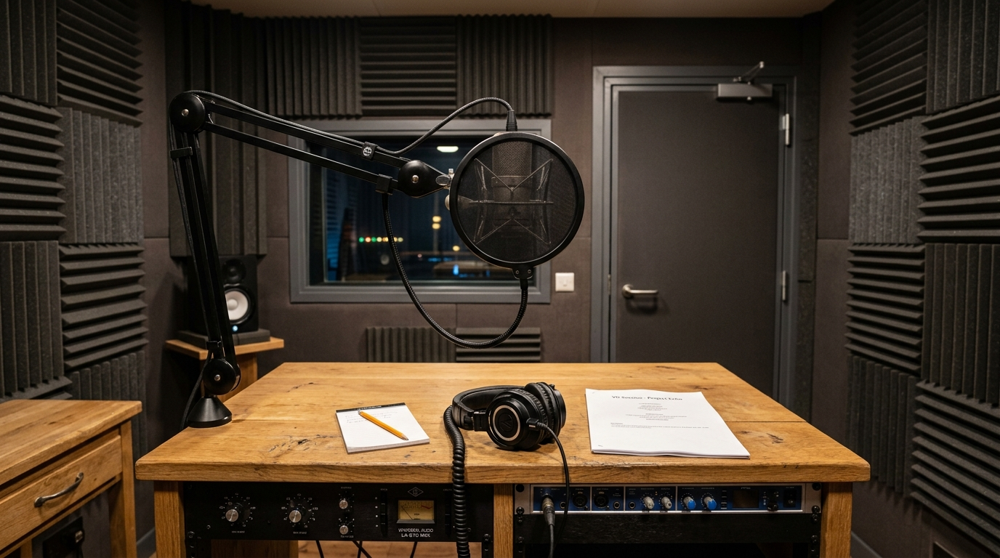

# Voice Cloning & TTS Basics

> A computer reads text; a clone reads the room.

**Track:** AI Audio & Music  
**Time:** ~40 minutes  
**Prerequisites:** None  

## The Problem

Traditional Text-to-Speech (TTS) systems sound robotic. They read sentences with static, predictable pitch curves, ignore the emotional context of the text, and generate zero breathing sounds. If you use these cheap default voices for your faceless videos, courses, or ads, viewers will immediately recognize the mechanical audio track and swipe away.

Simply recording your voice on a laptop microphone is not a scalable alternative for high-volume content factories. It takes too much time, and if you get sick or lose your voice, your production pipeline grinds to a halt.

To run a professional content agency, you must build high-fidelity, custom **cloned voice profiles** that capture the unique timbre, accent, and breathing elements of a real speaker, allowing you to generate hours of realistic narration from simple text scripts.

## The Concept

Vocal synthesis divides into two major technical categories:

### 1. Instant Voice Cloning (IVC):
Requires only **1 to 5 minutes** of sample audio. The cloning engine extracts the basic frequency signature (timbre) of the speaker. It is fast and cheap but can struggle with complex emotional ranges or unique pronunciations of technical terms.

### 2. Professional Voice Cloning (PVC):
Requires **30+ minutes** of high-fidelity, studio-quality speech samples. The model trains deep neural network weights specifically for that voice, capturing subtle throat dynamics, mouth clicks, laughing inflections, and accent parameters. The result is virtually indistinguishable from the original speaker.

```
Studio Capture (Dry/Mono)  ──►  ElevenLabs PVC Training  ──►  Deep Voice Lock (Accents/Breaths)
```

To ensure a clean training run, your raw samples must pass the target specifications defined in the [`templates/voice-cloning-spec.md`](templates/voice-cloning-spec.md).

---

## Do It

### Step 1: Configure Your Recording Hardware
Follow the [`templates/voice-cloning-spec.md`](templates/voice-cloning-spec.md). Use a cardioid condenser microphone. Position it 6 inches from your mouth. Record in a room with soft furnishings (carpets, curtains) to prevent room echo.

### Step 2: Record the Sample Reading Script
Read a diverse set of texts containing varied emotional tones (news paragraphs, technical explainers, conversational stories). Speak at a consistent volume. Do not rush. Collect at least 6 minutes of clean audio.

### Step 3: Run Audio Cleaning
Import the audio file into Audacity. Run these processes:
* **Noise Reduction:** Sample the silent room noise and apply noise reduction (level: 12dB).
* **Noise Gate:** Set a gate threshold at **-48dB** to completely silence gaps between breaths.
* **Normalize:** Peak amplitude set to **-3.0dB** to maximize volume without clipping.
Export the file as a mono `.wav` file.

### Step 4: Submit to the Cloning Engine
Open ElevenLabs. Go to VoiceLab -> Add Instant Voice. Upload your cleaned `.wav` files. Write down the label specifications (e.g. *"energetic male, American accent, clear presentation tone"*). Submit the files for synthesis.

### Step 5: Conduct the Stability Audit
Generate a 20-second test paragraph. Experiment with the configuration sliders:
* **Stability (Target: 40% - 45%):** Lower values allow the voice to sound more expressive and dynamic; higher values lock in a consistent reading style.
* **Clarity / Similarity (Target: 75% - 80%):** Higher values enforce the speaker's exact timbre, but setting it too high can introduce digital crackles.
Save your ideal configurations in the cloning log.

---

## Worked Example

<p align="center">


</p>
<p align="center"><sub>Voice Recording Booth Image (Left) ──► Image-to-Video Studio Motion (Right) · Audio File: <a href="templates/examples/rachel-vocal-cloned.mp3">templates/examples/rachel-vocal-cloned.mp3</a> · Video File: <a href="templates/examples/voice-studio-clip.mp4">templates/examples/voice-studio-clip.mp4</a></sub></p>

**Creating "Arthur" (B2B SaaS Spokesperson)**


* **Training Inputs:** 7 minutes of clean, dry wav recording of an instructional SaaS guide. Normalized to -3dB peak, gate set to -50dB.
* **Cloning Interface:** ElevenLabs IVC portal. Cloned as `Arthur_B2B_V1`.
* **Testing & Tuning Runs:**
  * Run 1: Stability 60%, Clarity 90%. Output sound: clean timbre, but voice is monotone and lacks natural breath pauses.
  * Run 2: Stability 40%, Clarity 75%. Output sound: voice is expressive, includes soft inhalation sounds at the start of sentences, and changes tone during question marks.

**The Result:** "Arthur" is ready for bulk voice synthesis. The output reads complex software documentation with the tone of a professional tech founder.

> [!NOTE]
> You can listen to a demo of a high-fidelity cloned vocal generated with this workflow here: [rachel-vocal-cloned.mp3](templates/examples/rachel-vocal-cloned.mp3).

---

## Compare Tools

| Platform / Tool | Synthesis Realism | Customization Settings | Best for |
|---|---|---|---|
| **ElevenLabs IVC / PVC** | Ultra-High (Includes breathing elements, emotional pacing) | Stability, Clarity, Exaggeration sliders | Professional narrations, ads, and spokesperson clones. |
| **Play.ht (v2.0)** | High | Speed and pitch controls | Conversational customer service avatars and explainers. |
| **Coqui TTS (Local)** | Medium | Python code integration | Programmatic bulk rendering with zero API credit costs. |

ElevenLabs is the benchmark for high-quality commercial voice cloning. For high-volume networks, use their Instant Voice Cloning API. If you need to scale up local systems with zero operational credit costs, implement local open-source voice generators like XTTS v2 or Coqui.

---

## Launch It

**How to manage voice assets:**
* **Keep training files isolated:** Store all raw training audio clips in a secure, local master folder. If the voice model ever suffers drift or updates, you can re-upload and re-train the model instantly.
* **Protect voice security:** Never share your cloned Voice ID string publicly. Malicious users can use the ID to generate unauthorized voice scripts using your API limits.

---

## Exercises

1. **Easy:** Record a 1-minute speaking sample. Import it into a free editor and check the decibel peak level of the silences.
2. **Medium:** Upload a 3-minute sample to a cloning engine. Generate a test script and find the slider settings where the voice stops sounding robotic.
3. **Hard:** Perform a full vocal preparation run: record 6 minutes of audio, run noise reduction, apply a noise gate below -48dB, export as mono wav, and train a cloned profile that passes the similarity test.

---

## Templates

* [`templates/voice-cloning-spec.md`](templates/voice-cloning-spec.md) — hardware guidelines, noise gate parameters, and stability logs.

---

[← Track overview](README.md) · Next: [AI Dubbing & Translation →](02-dubbing-translation.md)
