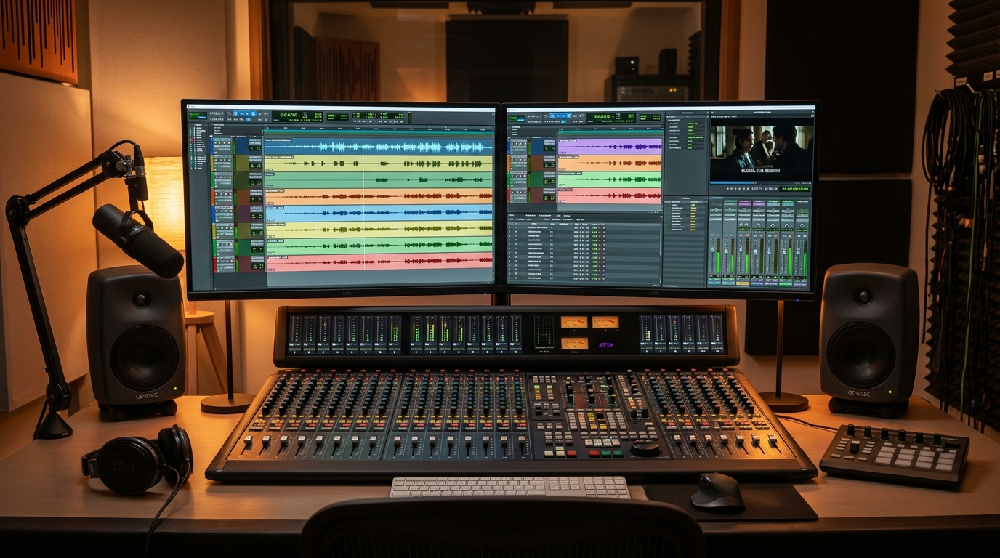

# AI Dubbing & Translation

> A video that speaks only one language reaches only a fraction of the world.

**Track:** AI Audio & Music  
**Time:** ~45 minutes  
**Prerequisites:** Voice Cloning & TTS Basics  

## The Problem

If you only distribute your content, ads, or online courses in English, you are ignoring over 80% of the world's internet users. Massive markets in Latin America, Europe, and Asia are completely locked out of your sales funnels.

However, traditional translation and localization are slow and expensive. You have to hire foreign translation specialists, contract local voice actors in multiple countries, record their voice tracks in professional studios, and manually align the new audio tracks to fit the exact pacing of the original video timeline.

To scale a global content network, you need a repeatable process to translate your audio tracks into multiple foreign languages automatically, while preserving the original speaker's tone, voice profile, and emotional inflections.

## The Concept

Automated audio translation relies on **Tone-Preserving Voice Dubbing** and **Time-Boundary Sync**:

```
English Voice Track  ──►  Translation Engine  ──►  Pitch/Timbre Mapping  ──►  Foreign Dub (Sync'd)
```

1. **Voice Preservation:** The dubbing model extracts the vocal resonance (timbre) and pitch curve of the original speaker, and projects it onto the target language's speech synthesizer. The speaker sounds like themselves speaking a foreign language.
2. **Expansion Pacing:** Different languages take different times to express the same idea. For example, translating the phrase *"Automate your billing"* into Spanish yields *"Automatice su facturación."* The Spanish phrase has more syllables and takes longer to speak. To prevent overlap, the translation engine must compress the speech speed slightly (e.g. by 1.1x) to fit the original time slot.
3. **Timeline Alignment:** You follow the [`templates/dubbing-translation-checklist.md`](templates/dubbing-translation-checklist.md) to audit timecode boundaries, ensuring sound effects and visuals align perfectly with the translated audio.

---

## Do It

### Step 1: Prep Your Source Dialogue
Open the [`templates/dubbing-translation-checklist.md`](templates/dubbing-translation-checklist.md). Export the text transcript of your source video. Remove any filler words. Extract the timecode logs (e.g. *Line 1: 0:00.00 to 0:04.50*).

### Step 2: Configure the Translation Engine
Open ElevenLabs and navigate to the **Dubbing** tab (or call the `/dubbing` API route). Set up the project:
* **Source Language:** English (or detect automatically).
* **Target Language:** Spanish (or German, French, Hindi, etc.).
* **Resolution Settings:** Select "Highest Resolution" to preserve background music isolation.

### Step 3: Run the Dubbing Synthesis
Submit the video file. The AI engine will:
* Separate the dialogue track from the background music track using stem splitting.
* Translate the English text.
* Re-synthesize the dialogue in the target language using the cloned voice of the original speaker.
* Re-combine the new dialogue with the original background music track.

### Step 4: Pacing and Syllable Speed Audit
Listen to the generated foreign dub. Zoom in to the timeline in your editor:
* Check for "chipmunk" speed issues where the translation was compressed too much to fit a short duration.
* If a translated line is clipped at the end, adjust the visual editor timeline by splitting the background clip and adding a 0.5-second freeze frame, allowing the voice track to finish naturally.

---

## Worked Example

<p align="center">


</p>
<p align="center"><sub>Dubbing Studio Image (Left) ──► Image-to-Video Dubbing Motion (Right) · Audio File: <a href="templates/examples/rachel-vocal-dubbed.mp3">templates/examples/rachel-vocal-dubbed.mp3</a> · Video File: <a href="templates/examples/dubbing-studio-clip.mp4">templates/examples/dubbing-studio-clip.mp4</a></sub></p>

**Translating a SaaS Tutorial Video (English to Spanish)**


* **Original Clip:** Duration: 4.5 seconds. Dialogue: *"Here is how to parse your invoice files instantly."*
* **Dubbing Output:** Spanish translation: *"Aquí le mostramos cómo analizar sus archivos de facturas al instante."*
* **Synthesis Audit:**
  * The Spanish voice sounds exactly like the English speaker's vocal timbre.
  * Because the Spanish text contains more syllables, the engine auto-compressed the speech speed by **1.12x**.
  * The audio track was aligned to start at exactly 0:00.00 and end at 0:04.45.
* **The Result:** The Spanish dub sits perfectly on the original video timeline. The user can export and publish the video directly.

> [!NOTE]
> You can listen to a demo of a tone-preserved Spanish dub generated with this workflow here: [rachel-vocal-dubbed.mp3](templates/examples/rachel-vocal-dubbed.mp3).

---

## Compare Tools

| Platform / Tool | Voice Preservation Quality | Pacing & Alignment | Best for |
|---|---|---|---|
| **ElevenLabs Dubbing API** | Ultra-High (Preserves vocal timbre and background music track separation) | Good (Auto-compresses speech speed to match time boundaries) | Fast, automated dubbing of YouTube videos and ads. |
| **HeyGen Video Translate** | High (Includes automated lip-sync translation to match foreign mouth shapes) | Fair | Face-to-camera videos where lip movement matches target audio. |
| **Local Pipeline (Whisper + XTTS)** | Medium | Manual (Requires manual timeline alignment of audio clips) | Custom development with zero API costs. |

For B2B faceless channels, using the ElevenLabs Dubbing API is the most efficient choice because it processes both translation and background audio reconstruction in a single pipeline. For face-to-camera spokesperson videos, HeyGen Video Translate is ideal because it matches mouth shapes to the new language.

---

## Launch It

**How to manage localized channels:**
* **Use YouTube Multi-Language Audio:** YouTube allows you to upload multiple audio tracks (English, Spanish, Portuguese) to a single video file. This consolidates all views on a single URL, boosting your ranking in the algorithm.
* **Translate metadata:** Do not upload a Spanish audio track with an English title and description. Translate your titles, descriptions, and tag files using your media checklist templates.

---

## Exercises

1. **Easy:** Translate a 3-sentence script into Spanish. Read both versions aloud and measure the time difference in spoken duration.
2. **Medium:** Submit a 10-second video to an automated dubbing engine. Download the output and audit the voice similarity.
3. **Hard:** Produce a translated video with background sound effects. Verify that the sound effects occur at the exact same visual frame boundaries as the original, while the translated audio remains clear and synced.

---

## Templates

* [`templates/dubbing-translation-checklist.md`](templates/dubbing-translation-checklist.md) — script translation guides, timestamp allocations, and speed pacing checks.

---

[← Voice Cloning & TTS Basics](01-voice-cloning-tts.md) · Next: [Podcast Production & Audio Cleaning →](03-podcast-production.md)
