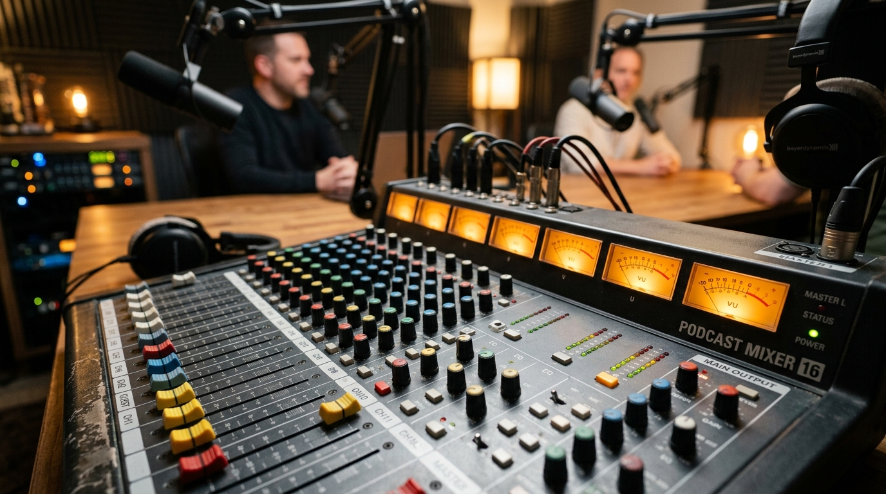

# Podcast Production & Audio Cleaning

> Bad audio is turned off; good audio is listened to for hours.

**Track:** AI Audio & Music  
**Time:** ~35 minutes  
**Prerequisites:** None  

## The Problem

Listeners are forgiving of low video resolution, but they will turn off a video, podcast, or course within 10 seconds if the audio track is painful to hear. Raw voice recordings are plagued with structural audio defects:
* **Room Echo:** The sound bouncing off bare walls.
* **Low Rumble:** Low-frequency vibrations from traffic outside or AC units.
* **Sibilance:** Sharp, piercing "S" sounds.
* **Volume Swings:** The speaker gets quiet, then suddenly shouts, forcing the listener to adjust their headphone volume.

If you deliver raw, unpolished audio tracks to clients or platforms, your content will look amateurish, reducing retention metrics.

To succeed in audio production, you must implement a standardized vocal cleaning and mastering pipeline that outputs clear, consistent, professional voice tracks.

## The Concept

The vocal mastering pipeline consists of five key processing stations:

```
Raw Vocal ──► High-Pass (Rumble) ──► Noise Gate (Hum) ──► EQ Boost (Clarity) ──► Compressor (Volume) ──► Limiter (-16 LUFS)
```

1. **The High-Pass Filter (HPF):** Human speech does not contain useful information below 80Hz. An HPF cuts off these deep frequencies, immediately removing low rumbles and microphone bumps.
2. **The Noise Gate:** Silences all signal levels below a set threshold (e.g. -48dB). When the speaker pauses, the gate shuts, silencing room hums and breath sounds.
3. **Equalization (EQ):** Tweaks specific frequency bands. Boosts presence (3kHz–5kHz) for clarity and cuts mud (300Hz–400Hz) to make the voice sound clear.
4. **Compression:** Acts like an automatic volume fader. It turns down loud spikes and boosts quiet syllables, flattening the volume range.
5. **Loudness Normalization:** Standardizes output volume. Podcasts and streaming platforms target **-16 LUFS** for stereo tracks and **-19 LUFS** for mono tracks to prevent distortion on mobile devices.

---

## Do It

### Step 1: Analyze Your Raw Track
Import your voice file into Audacity. Track your adjustments using the [`templates/podcast-production-sheet.md`](templates/podcast-production-sheet.md). Note your initial decibel peak levels.

### Step 2: Clean the Low Frequencies
Apply a High-Pass Filter:
* **Frequency:** Set to **80Hz** for male voices, **100Hz** for female voices.
* **Rolloff:** Select 24dB per octave.
This instantly clears up mud and structural rumble.

### Step 3: Configure the Noise Gate
Apply the Noise Gate:
* **Gate Threshold:** Set to **-48dB** (or slightly higher if your room has loud hums).
* **Attack time:** Set to 10ms.
* **Release time:** Set to 150ms.
Ensure the gate does not cut off the start or end syllables of words.

### Step 4: Apply Vocal Compression
Apply a Compressor:
* **Threshold:** Set to -16dB.
* **Ratio:** Set to **3:1** (conversational dialogue).
* **Makeup Gain:** Enable auto-makeup to restore average volume levels.

### Step 5: Export to Loudness Standards
Run a Loudness Normalization effect:
* Set target loudness to **-16.0 LUFS** (Loudness Units relative to Full Scale — the industry-standard way to measure and match audio volume across platforms) for stereo, or **-19.0 LUFS** for mono tracks.
* Set the **True Peak Limiter** to **-1.0 dBTP** to prevent digital clipping when uploaded to platforms like Spotify or Apple Podcasts.

---

## Worked Example

<p align="center">


</p>
<p align="center"><sub>Podcast Console Image (Left) ──► Image-to-Video VU Meter Motion (Right) · Video File: <a href="templates/examples/podcast-console-clip.mp4">templates/examples/podcast-console-clip.mp4</a></sub></p>

**Mastering a Raw Podcast Interview Track**


* **Input File:** Recorded in a home office with a USB desk mic. Contained computer fan noise and volume fluctuations.
* **Mastering Run:**
  * High-Pass Filter applied at 90Hz to clear mic rumble.
  * Noise Gate set to -45dB to silence fan hum during pauses.
  * EQ Presence boost of +2dB at 4kHz.
  * Compressor (Ratio: 3:1, Threshold: -18dB) applied to flatten peaks.
  * Mastered to exactly **-16.0 LUFS** with True Peak at **-1.0 dBTP**.

**The Result:** The voice sounds clean, warm, and professional. The background room noise is completely silenced, and the loudness levels are matched to platform standards.

---

## Compare Tools

| Platform / Tool | Audio Quality | Control Depth | Setup Effort |
|---|---|---|---|
| **Audacity / Audition** | High | Ultra-High (Unrestricted control over EQ nodes and compressors) | Medium (Requires manual configurations) |
| **Adobe Enhance API** | High (Cleans severe echo, but can introduce artificial digital sounds) | None | Low (One-click processing) |
| **Auphonic / Wavespeed** | High | Medium (Excellent loudness target matching) | Low (Automated API workflows) |

For content creators starting out, using Audacity or Adobe Audition gives you the best control over vocal quality. For high-volume factories processing client recordings, running tracks through automated tools like Adobe Enhance or Auphonic APIs speeds up your delivery pipeline while maintaining a consistent quality benchmark.

---

## Launch It

**How to monetize audio cleaning:**
* **Podcast Mastering Service:** Offer audio cleanup as a standalone service to indie podcasters and YouTubers. A typical 30-minute episode cleaning and mastering package runs **$50–$150 per episode**. Because the pipeline runs in under 15 minutes, your effective hourly rate is well over $200.
* **Retainer Editing Package:** Sign podcast clients on a monthly retainer (e.g. 4 episodes/month for **$300–$500/month**) to ensure consistent income. Clients value consistency — a podcaster who records weekly is an ideal recurring contract.

**How to manage audio files:**
* **Keep tracks dry:** When recording, never apply reverb, delay, or EQ effects during capture. Keep the raw file clean and dry so you can adjust settings in post-production.
* **Check your audio in mono:** Many listeners use a single headphone earbud. Switch your final mix to mono in your editor to verify that vocal tracks do not cancel each other out or fade.

---

## Exercises

1. **Easy:** Import a voice recording into Audacity. Apply a High-Pass Filter at 80Hz and log the change in vocal clarity.
2. **Medium:** Configure a Noise Gate in your editor. Adjust the threshold until silent gaps between spoken words read as complete silence (-inf dB).
3. **Hard:** Master a 1-minute podcast intro track. Apply a high-pass filter, a noise gate, a compressor, and a peak limiter to output a final track targeting -16 LUFS.

---

## Templates

* [`templates/podcast-production-sheet.md`](templates/podcast-production-sheet.md) — equalization nodes, noise gates, compression ratios, and mastering LUFS targets.

---

[← AI Dubbing & Translation](02-dubbing-translation.md) · Next: [AI Music & Sound Effects →](04-music-sfx-generation.md)
