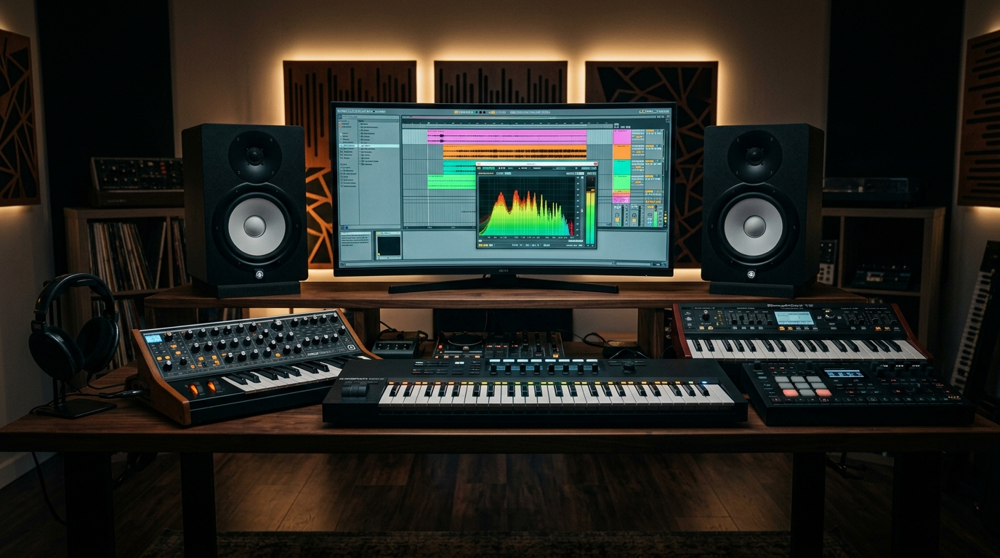

# AI Music & Sound Effects

> The right sound turns b-roll into a movie.

**Track:** AI Audio & Music  
**Time:** ~35 minutes  
**Prerequisites:** None  

## The Problem

Finding high-quality background music and sound effects (SFX) is a massive bottleneck. Stock music sites charge expensive monthly subscriptions. If you try to use free, popular music from the internet, social media platforms will demonetize your channel, mute your video audio, or issue copyright strikes.

Even if you find copyright-free music, matching the track's tempo, mood, and drops to your video script is frustrating. You end up spending hours cutting and fading tracks to fit.

To run a fast content factory, you need to generate custom, copyright-free background loops and specific sound effects on demand, and automate how they sit in your video mix.

## The Concept

The pipeline for video audio assembly uses **Generative Audio Prompts** and **Auto-Ducking**:

### 1. The BGM Prompt Matrix:
Rather than prompting AI music engines with abstract moods (e.g. *"cool coding music"*), write structured musical prompts specifying **Tempo (BPM)**, **Genre**, **Lead Instruments**, and **Vocal Exclusions** (always specify *"no vocals"* or *"instrumental only"* to prevent AI voices from competing with your narrator).

### 2. Isolated SFX Sourcing:
Sound effects (whooshes, UI clicks, paper slides) must be generated in isolation. Use the formulas in the [`templates/audio-prompt-library.md`](templates/audio-prompt-library.md) to generate clean tracks with zero echo or background reverb so they blend naturally into any video scene.

### 3. Auto-Ducking:
The background music track must automatically lower in volume whenever the narrator speaks:

```
[Voice Track A1 (Speaking)] ──► Auto-Ducks ──► [Music Track A2 (-18dB)]
[Voice Track A1 (Silence)]  ──► Auto-Boosts ──► [Music Track A2 (-12dB)]
```

---

## Do It

### Step 1: Generate Background Tracks
Select a formula from the [`templates/audio-prompt-library.md`](templates/audio-prompt-library.md). Open an AI music engine (e.g., Suno or Udio).
* *Example prompt:* `"120 BPM, clean corporate tech house loop. Minimalist synthesizer, warm deep bass, soft digital percussion, optimistic mood. Instrumental only, seamless audio loop, high fidelity."`
Generate and download the instrumental loop `.mp3`.

### Step 2: Generate Specific Transition SFX
Open ElevenLabs and select the **Sound Effects** tool (or call the `/sound-effects` API). Generate transition sounds:
* *Prompt:* `"Cinematic sub-bass whoosh transition sound effect, deep low rumble, clean isolated track."`
Download the output files.

### Step 3: Set Up Timeline Channels
Open your video editor. Set up a standard track layout:
* **Track A1:** Voiceover narration (volume: 0dB).
* **Track A2:** Sound Effects (SFX) (volume: -6dB).
* **Track A3:** Background Music (BGM) (volume: -18dB).

### Step 4: Configure Auto-Ducking
If your editor supports auto-ducking (e.g. Premiere Pro or CapCut):
* Select the music track (A3) and enable the "Ducking" toggle.
* Link it to the voiceover track (A1).
* Set the ducking amount to **-18dB** when voice is detected, and configure the fade-in/fade-out speed to **0.3 seconds**. 
* If editing manually, place keyframes on the A3 volume line, dropping the volume to -18dB during talking sections and raising it to -12dB during visual splits.

---

## Worked Example

<p align="center">


</p>
<p align="center"><sub>Synthesizer Workstation Image (Left) ──► Image-to-Video Visualizer Motion (Right) · Video File: <a href="templates/examples/ai-music-workstation-clip.mp4">templates/examples/ai-music-workstation-clip.mp4</a></sub></p>

**Sound Design for a 15-Second Vertical SaaS Ad**


* **Voice Track:** Narrator speaks from 0:00 to 0:03, silences from 0:03 to 0:06 (visual demo), speaks from 0:06 to 0:15.
* **Music Track:** generated 120 BPM tech house loop.
* **Ducking keyframes:**
  * **0:00 - 0:03:** Music volume set to **-18dB** (vocal is speaking).
  * **0:03 - 0:06:** Music volume rises to **-12dB** (visual demo only).
  * **0:06 - 0:15:** Music volume drops back to **-18dB** (vocal speaks CTA).
* **SFX Placements:** Added a digital UI click sound effect at 0:03.50 when the screen cursor clicks a button on screen.

**The Result:** The voice is clear and easy to understand. During the visual split, the music volume boosts naturally to fill the gap. The transition click makes the interface demo feel responsive.

---

## Compare Tools

| Platform / Tool | Generation Purpose | Audio Output Control | Best for |
|---|---|---|---|
| **Suno / Udio** | Creative full-length songs and background music loops | Good (Supports extension loops) | Creating unique, genre-specific background tracks. |
| **Mubert / Soundraw** | Loop-centric background audio | High (Allows muting specific stems like drums or synths) | Fast, modular background tracks for B2B channels. |
| **ElevenLabs SFX** | Specific, isolated sound effects | Instant (Generates 2-4s isolated sound clips) | Sourcing custom transition sounds and button taps. |

For B2B marketing channels, Soundraw is highly effective because you can manually mute the melody track, keeping only the drum and bass tracks so they do not distract from the voiceover. For sound design details (whooshes, UI clicks), ElevenLabs SFX provides clean, isolated sounds.

---

## Launch It

**How to organize your sound library:**
* **Build an SFX vault:** Keep a local library of your most-used sound effects (e.g. `whoosh_fast.wav`, `click_modern.wav`). Instead of generating them for every video, import them from your vault to speed up edits.
* **Use constant music volume:** Never let your music volume exceed -10dB. If music is too loud, mobile phone speakers will compress the entire audio track, making the voiceover sound distorted and hard to hear.

---

## Exercises

1. **Easy:** Generate a 1-minute background loop using Mubert or Suno. Ensure the prompt contains "instrumental" and "loop".
2. **Medium:** Import a voice track and a music track. Apply manual volume keyframes to drop the music volume by 6dB during speaking sections.
3. **Hard:** Generate 3 distinct transition sound effects using an SFX engine. Import them into your editor and align them to match the exact visual frames of a logo reveal or video cut.

---

## Templates

* [`templates/audio-prompt-library.md`](templates/audio-prompt-library.md) — music loops, mood anchors, and transition sound effects prompt keys.

---

[← Podcast Production & Audio Cleaning](03-podcast-production.md) · Next: [Singing Voice Conversion & Vocal Synthesis →](05-singing-vocal-synthesis.md)
