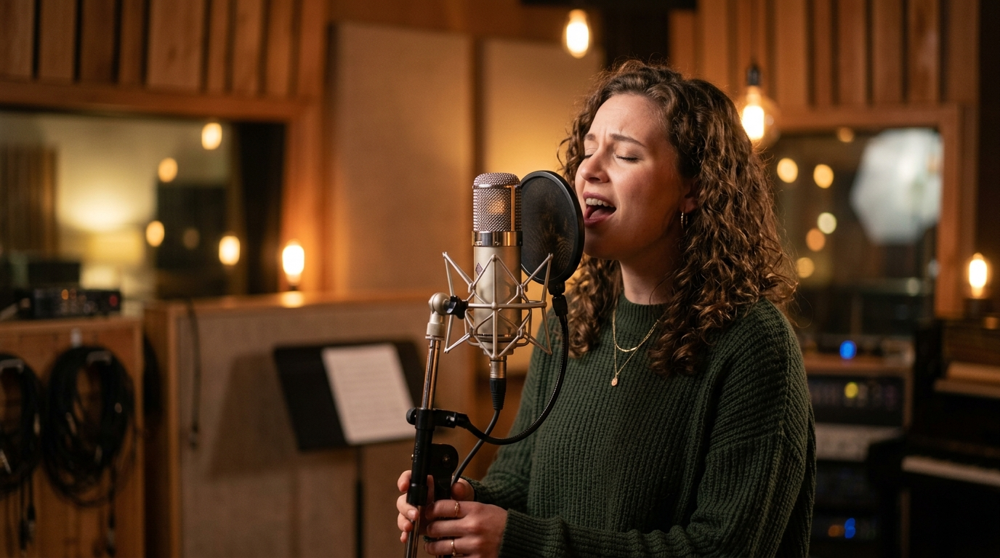

# Singing Voice Conversion & Vocal Synthesis

> Synthesize the melody, clone the artist.

**Track:** AI Audio & Music  
**Time:** ~30 minutes  
**Prerequisites:** Voice Cloning & TTS Basics  

## The Problem

You want to produce a custom theme song, a musical ad, or a parody intro track for a client, but you cannot sing. Hiring professional studio vocalists for one-off projects is expensive, and trying to sing the vocals yourself results in pitch errors or ranges your voice cannot hit.

Standard Text-to-Speech (TTS) models cannot sing. If you feed them lyrics, they will read them like a boring lecture, with zero rhythm, melody, or timing.

To produce musical content without singing, you need to implement a **Singing Voice Conversion (SVC)** pipeline — a tool that takes your voice as input and outputs the same melody sung in a completely different vocal timbre (voice quality). This technology allows you to record a basic "guide vocal" (even if you sing poorly or speak in rhythm) and convert the vocal timbre into the singing voice of a professional model, preserving the original pitch, timing, and melody.

## The Concept

The vocal synthesis pipeline relies on **Retrieval-based Voice Conversion (RVC)** — a technique that looks up a target singer's voice characteristics from a trained model and projects them onto your guide vocal — combined with **Timbre Transfer** (swapping the unique "colour" of a voice while keeping its pitch and timing intact):

```
Source Guide Vocal  ──►  Pitch Correction (Auto-Tune)  ──►  RVC Timbre Transfer  ──►  Target Singing Master
```

* **Voice-to-Voice Conversion:** Unlike text-to-speech, voice-to-voice takes an audio input. It ignores the *text* of the words and analyzes the *pitch* (fundamental frequency) and *volume* envelope. It then swaps the vocal cords (timbre signature) of the source speaker with the target model.
* **Acapella Extraction:** The source guide vocal must be dry and isolated — meaning just your voice with no background music playing. For example, if you record yourself singing while a piano track is playing in the room, the converter will try to convert those piano notes into singing voices too, creating jarring digital screeches. Record your guide vocal in silence, then layer the music back in afterwards.
* **Transposition (Pitch Shift):** If you are a male editor recording a guide vocal for a female avatar, you must transpose the pitch up by **+12 semitones** (one full octave) so the model can process the vocals inside the target singer's natural pitch range. Configure these parameters inside the [`templates/vocal-conversion-brief.md`](templates/vocal-conversion-brief.md).

---

## Do It

### Step 1: Prep Your Guide Vocal
Record a dry vocal track singing the lyrics. Don't worry if your voice sounds flat. Import the track into your editor. Apply a pitch correction tool (such as GSnap or Auto-Tune) to snap the vocal notes to the correct musical key. Save the clean track as `guide_vocal.wav`.

### Step 2: Configure the Conversion Model
Open your RVC interface (or call the `/voice-to-voice` API). Upload `guide_vocal.wav`.
* **Select Target Model:** Choose the vocal model corresponding to your character (e.g. `emma_singing_v2`).
* **Transpose:** Set pitch shift. If male guide -> female target: set to **+12 semitones**. If female guide -> male target: set to **-12 semitones**.

### Step 3: Configure Retrieval Settings
Experiment with these parameters:
* **Feature Retrieval Index Rate (Target: 0.65 - 0.70):** Controls how much of the target model's character is projected. If set too high (e.g. 0.90), it will sound robotic; if set too low (e.g. 0.40), it will retain too much of the original guide singer's tone.
* **Consonant Protection (Target: 0.33):** Protects the voiceless consonants ("s", "t", "sh") to prevent them from sounding like digital static.

### Step 4: Run the Timbre Transfer
Click convert to compile the track. Download the output `.wav` file.

### Step 5: Clean and Mix the Final Vocal
Import the converted singing track back into your audio editor. Add a subtle plate reverb and a stereo delay to make the vocals blend into the instrumental background music track. Limit the vocal peak level to -3dB.

---

## Worked Example

<p align="center">


</p>
<p align="center"><sub>Singing Studio Image (Left) ──► Image-to-Video Studio Bokeh Motion (Right) · Video File: <a href="templates/examples/singing-vocal-studio-clip.mp4">templates/examples/singing-vocal-studio-clip.mp4</a></sub></p>

**Creating a Theme Song Vocal (Male Guide to Emma Avatar)**


* **Guide Recording:** A male editor recorded a basic guide vocal singing: *"Automate your SaaS..."* in key. Pitch correction snapped the notes to C-Major.
* **RVC Setup:**
  * Target Model: `emma_singing_v2` (female).
  * Pitch Shift: **+12 semitones** (to shift male range to female octave).
  * Index Rate: **0.68**.
* **Audio Synthesis:** Converted file outputted a clean, on-pitch female vocal singing the melody with Emma's voice timbre.
* **Mixing Station:** Vocal track mixed with lofi backing track, reverb set to 15% wet, mastered to -16 LUFS.

**The Result:** The avatar has a custom theme song. The singing voice is on-pitch, natural, and matches the visual character profile perfectly.

---

## Compare Tools

| Platform / Tool | Conversion Quality | Payout / Credit Cost | Setup Effort |
|---|---|---|---|
| **Retrieval-based Voice Conversion (RVC)** | High (Excellent for stylized singing and quick conversions) | **Free** (runs locally on GPU) | Medium (Requires running WebUI script) |
| **ElevenLabs Voice-to-Voice** | Ultra-High (Preserves complex vocal inflections and breaths) | High (Billed per character generated) | Low (Simple web dashboard) |
| **So-Vits-SVC 4.0** | Ultra-High | Free | High (Complex Python training pipeline) |

For fast, cost-effective content creation, running RVC v2 on a local GPU is the standard method. It allows you to convert multiple tracks with zero API credit costs. For maximum vocal realism and breathing integration, ElevenLabs Voice-to-Voice provides the highest fidelity.

---

## Launch It

**How to manage copyrights:**
* **Use open voice models:** Never use RVC models trained on famous pop stars (like Drake or Ariana Grande) for commercial client projects or monetized channels. Platforms are actively removing these tracks, and you can face copyright lawsuits.
* **Train custom singing models:** Have a local singer record 20 minutes of scales and songs, train a custom model, and lock the IP ownership of that voice for your agency.

---

## Exercises

1. **Easy:** Record a 10-second guide track of yourself speaking in a rhythmic, sing-song voice.
2. **Medium:** Submit your guide track to a voice-to-voice converter with a pitch shift of +12 semitones. Analyze the octave shift.
3. **Hard:** Produce a complete 15-second vocal loop. Extract the acapella guide, run auto-tune, convert the timbre using RVC, apply delay and reverb, and mix it back over an instrumental loop.

---

## Templates

* [`templates/vocal-conversion-brief.md`](templates/vocal-conversion-brief.md) — acapella preparation checklists, transposition charts, and retrieval logs.

---

[← AI Music & Sound Effects](04-music-sfx-generation.md) · [Track overview](README.md)
