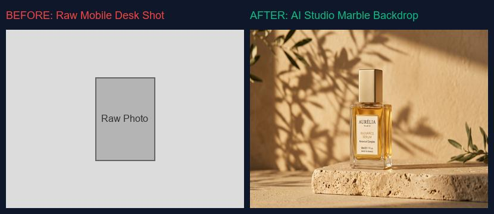

# Product Shots Without a Photographer

> A premium backdrop shifts your product from cheap to premium.

**Track:** AI Product Photography & E-commerce  
**Time:** ~45 minutes  
**Prerequisites:** None  

## The Problem

E-commerce brands live or die by their product photography. Hiring a studio photographer, renting cameras and lighting rigs, sourcing props, and hiring editors to clean up reflections costs thousands of dollars per product and takes weeks of coordination.

If you try to take the photos yourself on a mobile phone against a cheap background, the listing looks unprofessional. Customers equate poor-quality images with poor-quality products, causing conversion rates to plummet.

To launch products rapidly and test catalog variations, you need to generate high-end, studio-grade product photos in minutes at zero physical setup cost.

## The Concept

The pipeline for AI product photography relies on **Product Isolation**, **Backdrop Generation**, and **Composite Relighting**:

```
Raw Product Photo ──► Background Mask Removal ──► AI Backdrop Generation ──► Layer Composite & Shadow Casting
```

* **Label Preservation:** Standard image generators (like Stable Diffusion or FLUX) cannot render existing product labels or logos accurately. Instead of generating the product from scratch, you must photograph the physical product once, isolate it as a transparent PNG, and build the environment *around* it.
* **Ambient Lighting Sync:** Simply pasting a product onto an AI background looks fake because the lighting colors do not match. You must adjust the color curves of the product layer to match the ambient tone of the background (e.g., warming the product colors if it is placed in a sunset backdrop).
* **Double Shadow Technique:** To make the composite look real, you must cast two types of shadows:
  1. **Contact Shadow (Ambient Occlusion):** A very thin, dark, highly-softened shadow directly underneath the product base where it touches the surface.
  2. **Directional Shadow:** A larger, lighter shadow that stretches away from the product, matching the angle of the light sources in the background.

---

## Do It

### Step 1: Capture and Isolate Your Product
Take a clear, well-lit photo of your product with your phone. Ensure the label is clean, in focus, and has no extreme glare. Submit the photo to an AI background remover (such as Photoroom, Clipdrop, or call the `/remove-background` API). Download the output as a transparent `product_mask.png`.

### Step 2: Generate the Studio Backdrop
Open your photography brief in [`templates/photography-brief-template.md`](templates/photography-brief-template.md). Generate a background environment using an image generator:
* *Prompt:* `"An elegant studio product backdrop. A single rectangular travertine stone slab on a beige concrete surface, soft side golden sunlight, warm shadows, minimalist aesthetic, commercial product setup, high resolution, f/4 lens, depth of field."`
Run the model and save the generated image as `backdrop.jpg`.

### Step 3: Composite the Layers
Open a photo editor (like Photoshop, Photopea, or run a Python Pillow composting script). Place the `backdrop.jpg` as the bottom layer and import `product_mask.png` as the top layer. Scale the product to sit naturally on the travertine stone slab surface.

### Step 4: Cast Real Shadows
Create a new transparent layer between the product and the backdrop. Set the brush tool to black, opacity to 40%, hardness to 0%:
* Paint a tight contact shadow right beneath the bottom edge of the product.
* Paint a soft, elongated shadow stretching to the left, matching the angle of the sunlight in the backdrop. Set the layer blend mode to **Multiply**.

### Step 5: Adjust Color Harmony
Apply a color balance adjustment layer clipped to the product layer:
* If the backdrop is a warm golden hour scene, add a slight yellow and red highlight shift to the product.
* If the backdrop is an overcast beach scene, add a subtle blue/cyan midtone shift.

---

## Worked Example

<p align="center">

<br>

</p>
<p align="center"><sub>Raw Photo vs. AI Studio Backdrop (Top) ──► Image-to-Video Reflection Loop (Bottom) · Video File: <a href="templates/examples/perfume-motion.mp4">templates/examples/perfume-motion.mp4</a></sub></p>

**Backdrop Shift for an Organic Aloe Vera Gel Tube**


* **Source File:** A raw photo of a green plastic bottle shot on a white desk under office lighting.
* **Isolator:** Background removed, saving only the clean green plastic container.
* **Backdrop prompt:** `"Minimalist bathroom counter, white marble surface, warm sunbeams passing through a window, soft shadows, green eucalyptus leaf casting shadows, high-end organic cosmetic background, 85mm, photorealistic."`
* **Compositing:** Tube scaled to occupy 70% of the vertical frame. A soft contact shadow painted at the base. Color temperature warmed by +10 to match the golden window sunbeams.

**The Result:** The product looks like it was shot in a high-end luxury spa, instantly raising its perceived value.

> [!NOTE]
> You can view a high-end product photography backdrop example here: [perfume-bottle-studio.jpg](templates/examples/perfume-bottle-studio.jpg) and its corresponding silent animation loop here: [perfume-motion.gif](templates/examples/perfume-motion.gif).

---

## Compare Tools

| Platform / Tool | Generation Purpose | Control Customization | Best for |
|---|---|---|---|
| **FLUX Dev / Schnell** | Environment backdrop generation | High (Extremely responsive to prop and lighting prompts) | Generating complex, stylized studio settings. |
| **Photoroom / Clipdrop** | Fast background replacement and auto shadow casting | Instant (Template-driven auto-shadows) | Fast, automated batch rendering of basic Amazon listings. |
| **Magnific AI / Relight** | High-resolution image detailing and color matching | High | Mastering premium hero images for luxury websites and landing pages. |

For standard e-commerce listings, Photoroom's web app allows you to drag-and-drop a product shot and output a clean white-background listing with auto-shadows in 5 seconds. For creative banner campaigns, generating custom backdrops with FLUX and manually compositing them provides the highest quality results.

---

## Launch It

**How to set up your directory:**
* **Keep lighting consistent:** When taking your raw product photo, use diffused daylight from a window. Avoid mixing warm yellow house lamps with cool white daylight, as this creates mixed reflections on the packaging that are impossible to correct with AI.
* **Scale product layers correctly:** Never stretch or warp the aspect ratio of your product PNG when scaling it to fit the background. Always hold `Shift` in your editor to scale proportionally.

---

## Exercises

1. **Easy:** Photograph a household object (like a coffee mug). Use a free online background remover to isolate it as a transparent PNG.
2. **Medium:** Generate a studio setting backdrop containing a wooden block surface with a soft sunset shadow. Composite your isolated object onto it.
3. **Hard:** Paint a realistic two-part shadow (contact shadow + directional shadow) under your composited object. Apply a color balance filter to make the object's highlight colors match the background light source.

---

## Templates

* [`templates/photography-brief-template.md`](templates/photography-brief-template.md) — backdrop environments, composition structures, and prompt assembly logs.

---

[Track overview](README.md) · Next: [Before/After Conversion Case Studies →](02-conversion-case-studies.md)
