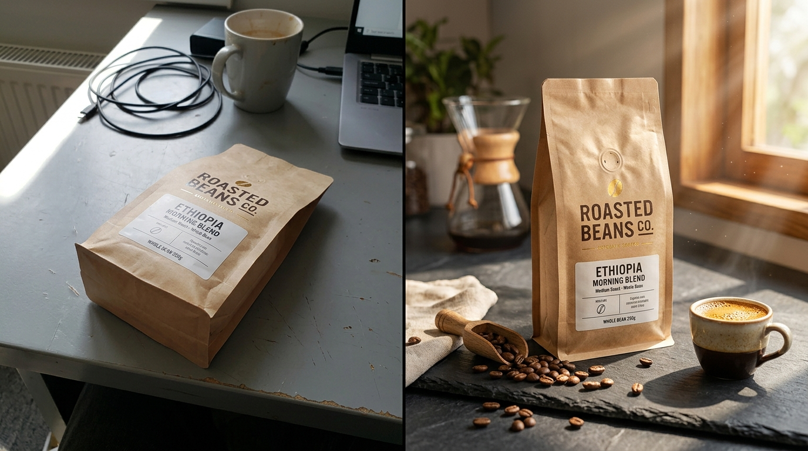

# Before/After Conversion Case Studies

> Clean images get clicks; contextual images get sales.

**Track:** AI Product Photography & E-commerce  
**Time:** ~40 minutes  
**Prerequisites:** None  

## The Problem

Brands update their websites and ad creatives blindly. They assume that if an image looks "pretty" to them, it will sell. But without structured Conversion Rate Optimization (CRO) methodology, they have no way of knowing whether a visual change is making money or driving customers away.

If a listing has high traffic but low sales, the images are failing to answer customer questions or build trust. If a listing has low clicks on search pages, the main search image lacks the visual contrast needed to stand out from competitors.

To run a profitable e-commerce channel, you must implement A/B testing frameworks and understand the visual psychology that drives customers to click the "Add to Cart" button.

## The Concept

The conversion optimization loop is driven by **Click-Through Rate (CTR)**, **Conversion Rate (CVR)**, and **Statistical Significance**:

```
Identify Listing Bottleneck ──► Formulate Visual Hypothesis ──► Generate Test Assets ──► A/B Split Run ──► Audit CVR
```

### 1. Main Search Image (CTR Hook):
On Amazon or Google Shopping, your main image must stand out in a grid of 20 competitors. Standard white background photos are the baseline. To increase CTR, use high-contrast lighting, bold product angles, and crisp shadows to create depth.

### 2. Gallery / Lifestyle Images (CVR Closer):
Once a customer clicks your listing, they need to visualize the product in their life. Lifestyle images must evoke an emotional response. A face cream shouldn't just sit in empty space; placing it on a marble vanity surrounded by fresh morning light builds an immediate association with luxury self-care.

### 3. Split-Testing Rigor:
Never deploy new images permanently without running a split test. Run the original image (Variant A) and the new AI-generated image (Variant B) concurrently using tools that direct 50% of traffic to each page. Run the test until you reach **95% statistical significance** (ensuring the change was caused by the image, not random chance).

---

## Do It

### Step 1: Audit the Bottleneck
Open the [`templates/conversion-audit-checklist.md`](templates/conversion-audit-checklist.md). Review the current metrics of your target product page:
* If the page has high traffic but a conversion rate below **2%**, your gallery images are weak. Proceed to redesign the lifestyle context.
* If the page has low organic traffic, focus on redesigning the Main Hero Image to stand out on the search results page.

### Step 2: Formulate the Visual Hypothesis
Identify the core objection of the customer:
* *Hypothesis:* `"Replacing the flat white background of the facial oil listing with a premium marble counter backdrop will increase user trust, boosting CVR by 20%."`

### Step 3: Compile and Design Test Variants
Generate your new Variant B lifestyle graphics following the rules in Module 1. Map benefit callouts (e.g. *"100% Organic Cold-Pressed"*) over the image using clean, high-contrast text overlays.

### Step 4: Configure the A/B Split Test
Open your split-testing software (e.g., VWO, AB Tasty, or Shopify's native test features).
* Set Variant A as the control (original images).
* Set Variant B as the test page (new AI environment visuals).
* Split incoming traffic: **50% Control / 50% Test**.

### Step 5: Run the Test and Audit CVR
Allow the test to run for at least 14 days to capture mid-week and weekend shopping behaviors. Do not stop the test early. Analyze the results:
* Check conversion rates and total revenue.
* If Variant B shows a lift with >95% significance, push the changes live to 100% of traffic. Log the results in your case study index.

---

## Worked Example

<p align="center">

<br>

</p>
<p align="center"><sub>AI Product Image Redesign (Top) ──► Image-to-Video Steam Loop (Bottom) · <a href="templates/examples/coffee-motion.mp4">MP4</a></sub></p>

**Redesigning a High-End Specialty Coffee Bag Listing**


* **Initial Listing Status:** The brand sold a $25 bag of coffee beans using a flat stock photograph. Average Conversion Rate was **1.8%**.
* **Visual Redesign (Variant B):**
  * Main Hero: Replaced flat file with high-contrast angled packaging shot casting a realistic, long shadow.
  * Lifestyle Gallery: Composite bag onto an AI-generated dark slate kitchen bar. Added soft morning light beams passing through window frames, an espresso cup with a glossy crema texture, and scattered roasted beans at the base.
* **A/B Test Run:**
  * Sample Size: 3,000 visitors per variant over 14 days.
  * **Variant A CVR:** 1.8% (54 conversions).
  * **Variant B CVR:** 3.1% (93 conversions).
* **Financial Impact:** A **72% increase in sales** with zero additional advertising spend.

---

## Compare Tools

| Platform / Tool | Optimization Purpose | Implementation Speed | Best for |
|---|---|---|---|
| **VWO / AB Tasty** | Enterprise A/B testing and split runs | Medium (Requires inserting tracking scripts) | Comprehensive CRO audits across custom websites. |
| **Shopify Split-Testers** | Direct e-commerce store variant testing | Fast (One-click app integrations) | Fast split-testing of product gallery images. |
| **Hotjar / Clarity** | Visual heatmapping and scroll depth logs | Fast | Auditing how far down users scroll before abandoning the page. |

For fast e-commerce setups, Shopify apps like *Themewood* or *A/B testing* packages are the fastest way to split-test product images. If you are building high-volume custom landing pages, VWO provides deep analytics, tracking not just conversion rates but hover times and specific clicks.

---

## Launch It

**How to manage listing tests:**
* **Test one variable at a time:** Never change both the product price and the main product image at the same time. If conversions jump, you won't know whether it was the new image or the lower price.
* **Optimize for mobile first:** Over **70%** of e-commerce traffic is on mobile devices. Always check your test images on a physical mobile screen. Ensure any text overlays are large enough to read without pinching and zooming.

---

## Exercises

1. **Easy:** Open your favorite online brand and find a product listing with weak lifestyle gallery photos. Identify 3 ways to improve their visual appeal.
2. **Medium:** Complete a full visual audit of a mock listing using the [`templates/conversion-audit-checklist.md`](templates/conversion-audit-checklist.md). Write down a clear split-test hypothesis.
3. **Hard:** Design Variant A (standard product on white) and Variant B (premium composite on AI stone base) for a kitchen product. Prepare the mobile-optimized crop templates for both variants.

---

## Templates

* [`templates/conversion-audit-checklist.md`](templates/conversion-audit-checklist.md) — metric trackers, split-testing criteria, and conversion logs.

---

[← Product Shots Without a Photographer](01-product-photography.md) · Next: [Selling as a Productized Service →](03-productized-service.md)
