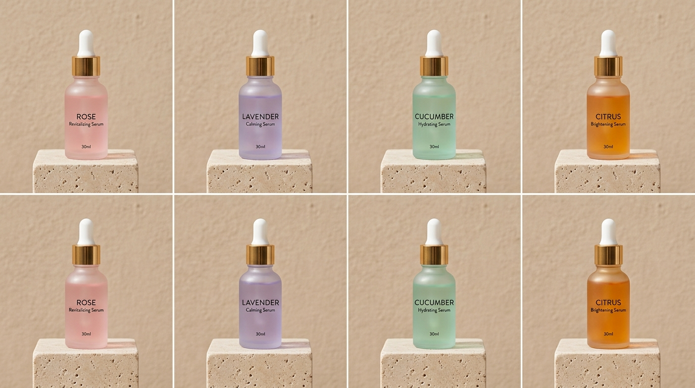
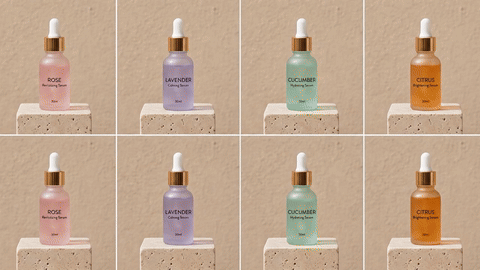

# Batch Workflows for Catalogs

> Consistency is what turns separate photos into a brand catalog.

**Track:** AI Product Photography & E-commerce  
**Time:** ~45 minutes  
**Prerequisites:** Product Shots Basics  

## The Problem

Brands rarely sell just a single item. They launch full catalog collections containing 20, 50, or 200 variations (such as 10 different scent profiles of the same perfume bottle, or varying color patterns of the same water flask).

If you design each backdrop prompt from scratch, the lighting angles, shadows, and camera coordinates will differ. When displayed on a catalog page, the products will look messy, jumping around the screen as the user scrolls.

Designing these variations one-by-one is also incredibly slow. If you spend 1 hour editing each product, a 50-item catalog eats up a week of labor, destroying your agency's margins. You need a batch workflow to keep layouts identical and render catalogs in minutes.

## The Concept

Scaling catalog production requires **Layout Standardization**, **Prompt Pinning**, and **Batch Masking**:

```
[20 Product Images] ──► Batch Background Remover ──► Locked Backdrop Prompt ──► Template Bounding Box ──► Export WebP
```

* **Prompt Pinning:** To ensure the background environment remains identical, use the same prompt and seed for the backdrop scene. Do not generate a new background for each product. Place the products onto the *same* pre-rendered background image.
* **Layout Standardization:** Establish rigid bounding box coordinates. In a product lineup, all containers must sit at the exact same vertical baseline (Y-coordinate) and occupy the same relative height percentage inside the frame.
* **Batch Masking:** Use programmatic API folder calls or batch tools to remove backgrounds in bulk. This eliminates the need to manually click and erase pixels for every item.

---

## Do It

### Step 1: Set Up Your Catalog Folders
Open [`templates/batch-catalog-spec.md`](templates/batch-catalog-spec.md). Build your local folder structure to separate work-in-progress files from completed assets:
* Place all raw product shots in `01_raw_assets/`.
* Name files by their product SKU (e.g., `sku_lavender_01.jpg`, `sku_rose_02.jpg`).

### Step 2: Batch Remove Backgrounds
Run a batch background removal tool. If using Photoshop:
* Open File -> Scripts -> Image Processor.
* Set source folder to `01_raw_assets/` and select "Save as PSD".
* Open the actions panel, record a new action: select Subject, apply Mask, and save as transparent PNG. Run the batch action on the folder to output files into `02_isolated_masks/`.
If using an API, run a Python script to send the folder files to `/remove-background` and download the results.

### Step 3: Select and Lock Your Backdrop
Generate and select your best-performing studio backdrop image. Scale and center the travertine block or pedestal surface. Save this single master image as `master_background.jpg`.

### Step 4: Construct the Alignment Template
Open `master_background.jpg` in your photo editor. Pull down a horizontal ruler guide to set the baseline height where the bottom of the products will touch the pedestal surface. Mark side guides to represent the maximum padding limits. Save this document as `catalog_template.psd`.

### Step 5: Run Batch Compositing
Import your isolated PNG masks into the template:
* Align each product mask's base to the horizontal baseline guide.
* Proportional Scale: Ensure each variation fills the standard bounding box (e.g. 80% height).
* Duplicate the shadow layer under the product. Since the lighting is identical, the same contact and drop shadow layers can be reused across all files.
* Save each product variation layer group separately, and export the files as WebP into `05_final_deliver/`.

---

## Worked Example

<p align="center">


</p>
<p align="center"><sub>Skincare Collection Catalog Image (Left) ──► Image-to-Video Batch Lighting Motion (Right) · Video File: <a href="templates/examples/batch-skincare-grid-clip.mp4">templates/examples/batch-skincare-grid-clip.mp4</a></sub></p>

**Batch Catalog Refurbishing for a Skincare Brand**


* **Catalog Scope:** 5 different facial serum droppers (Rose, Lavender, Cucumber, Tea Tree, Citrus).
* **Baseline Setup:**
  * Master environment: Travertine marble ledge against a cream stucco background.
  * Baseline coordinate: Set at Y: 800px on a 1920x1920px square canvas.
  * Product height: Standardized to exactly 1100px.
* **Batch Processing:**
  * Ran folder-wide background removal on the 5 raw product shots.
  * Imported all 5 PNG masks into the template PSD.
  * Toggled each dropper layer on one by one (in Photoshop: click the eye icon next to a layer to show/hide it), keeping the base shadows and background layers identical.
* **Results:** Generated 5 perfectly matching catalog images with uniform lighting, shadows, and sizing in under 10 minutes.

---

## Compare Tools

| Platform / Tool | Automation Speed | Workflow Suitability | Best for |
|---|---|---|---|
| **Photoshop Batch Actions** | High (Processes local folders using recorded hotkeys) | Excellent (Preserves manual control over adjustments) | Professional designers managing complex layer adjustments. |
| **Photoroom Batch API** | Ultra-High (Processes hundreds of files concurrently in the cloud) | Good | High-volume store operations with simple layouts. |
| **Python Pillow (PIL)** | Ultra-High | Good (Requires writing python scripts) | Programmers automating bulk catalog overlays. |

For design agencies, recording batch actions in Photoshop is the best workflow. It allows you to automate the repetitive tasks (masking, importing, positioning) while giving you the freedom to manually tweak the final shadows for high-quality QA. For massive catalogs (e.g. 500+ items), Photoroom's Batch API provides the fastest cloud execution.

---

## Launch It

**How to organize file names:**
* **Use standardized SKU tags:** Always name your files using the product SKU code (e.g., `SKU-BOT-01.webp`). This allows web developers to import and link images to correct product listings automatically via CSV spreadsheets, saving hours of manual uploads.
* **Keep canvas sizes uniform:** Ensure all final exported images are exported at the same aspect ratio (e.g., 2000x2000px square). Mix-matching square and vertical shapes will cause your e-commerce layout grid to break.

---

## Exercises

1. **Easy:** Set up the standard directory folders (`01_raw_assets/`, `02_isolated_masks/`, `03_ai_backgrounds/`, `04_composite_drafts/`, `05_final_deliver/`) on your computer.
2. **Medium:** Record a Photoshop Action (or write a basic Python script) to scale an image to 1080x1080px and add a 10% outer border.
3. **Hard:** Batch process 3 different colored beverage cans. Place them on the same background ledge at the exact same baseline coordinate, apply the same drop shadow layer, and export 3 matching catalog WebP files.

---

## Templates

* [`templates/batch-catalog-spec.md`](templates/batch-catalog-spec.md) — directory setups, bounding box maps, catalog logs, and workflow checklists.

---

[← Selling as a Productized Service](03-productized-service.md) · [Track overview](README.md)
