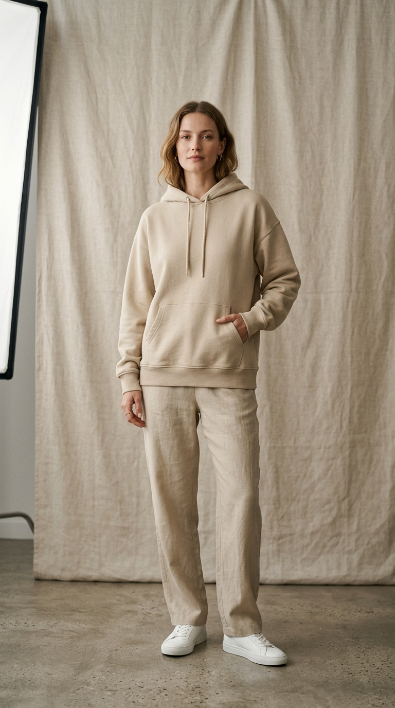

# High-converting Studio Lookbooks

> A lookbook doesn't just sell clothes; it sells a lifestyle.

**Track:** AI Fashion & Virtual Try-On  
**Time:** ~40 minutes  
**Prerequisites:** None  

## The Problem

To launch a seasonal collection (e.g., Autumn/Winter), fashion brands require editorial "lookbooks"—lifestyle catalogs showcasing garments in stylized environments. Organizing these outdoor shoots is a logistics nightmare: dealing with weather delays, booking travel to exotic locations, renting studio props, and managing lighting across different times of day.

If you try to shoot lookbooks in a basic office room, they look flat and cheap. If you use stock photography, they look generic and do not match your brand's unique aesthetic identity.

To maintain a premium brand presence, you need to generate high-end, cohesive fashion lookbook backdrops on demand, and composite your collection models into them with perfect lighting harmony.

## The Concept

The lookbook production pipeline relies on **Visual Theming**, **Symmetrical Lighting Design**, and **Cohesive Color Grading**:

```
Define Theme Archetype ──► Design Lighting & Backdrops ──► Composite VTO Models ──► Apply Batch Color Grade
```

* **Theming Consistency:** A lookbook must feel like a single story. If your first model is shot against a textured plaster screen in warm sand, the next model cannot sit in a high-tech concrete warehouse. Establish a unified backdrop palette and texture set before generating images.
* **Studio Lighting Presets:** Standardize light directions across your catalog. Lookbook backdrops should feature diffused side softbox lighting, casting soft, neutral shadows. Avoid harsh direct sunbeams unless specifically designing a high-contrast summer collection.
* **Cohesive Color Grading:** In fashion publishing, images are processed through color profiles (LUTs) in post-production. You must apply a uniform color grading map across all final composite images (e.g., cooling the shadows and warming the highlights) to make them look like they were taken during the same shoot.

---

## Do It

### Step 1: Lock the Moodboard Theme
Open [`templates/lookbook-moodboard.md`](templates/lookbook-moodboard.md). Select your visual archetype, core color palette, and studio lighting setup.
* *Example Theme:* "Nordic Autumn" with taupe, soft sand, and slate grey colors.

### Step 2: Generate Lookbook Backdrops
Use an image generator to create the studio backdrops according to your moodboard specs:
* *Prompt:* `"A high-end fashion studio backdrop. A minimalist light grey textured plaster screen, soft diffused overcast window light casting faint shadows, editorial fashion set, photorealistic, 8k resolution, shot on 85mm lens, f/5.6."`
Run the model and save the backdrop as `studio_bg_01.jpg`.

### Step 3: Composite the Model Layer
Drape your collection garment onto your model using the VTO pipeline (Module 1). Import the model layer over `studio_bg_01.jpg`. Position the model centered in the frame.

### Step 4: Align Lighting & Cast Shadows
Verify that the light highlights on the model's face and shoulders match the light direction in the backdrop (e.g. key light coming from the top-left).
* Paint a soft shadow on the plaster screen layer where the model's shoulders and torso block the key light. Set layer opacity to **25%** and blend mode to **Multiply**.
* Paint a soft contact shadow under the model's shoes at the baseline.

### Step 5: Apply Batch Color Grading
Create a global color grading layer (such as a gradient map, color lookup table, or Lightroom preset) and apply it across all final lookbook assets.
* Shift shadows slightly toward teal and midtones toward warm beige.
* Limit maximum contrast to maintain soft details in dark fabrics.
Export the completed lookbook files as high-quality WebP.

---

## Worked Example

<p align="center">


</p>
<p align="center"><sub>Editorial Studio Lookbook Image (Left) ──► Image-to-Video Camera Motion (Right) · Video File: <a href="templates/examples/fashion-lookbook-loop.mp4">templates/examples/fashion-lookbook-loop.mp4</a></sub></p>

**Cashmere Collection Lookbook (Nordic Autumn Theme)**


* **Theme Spec:** Minimalist plaster backdrop, soft side daylight, earth-tone colors.
* **Backdrop Asset:** Generated a warm grey stucco wall scene with a soft shadow of a window frame cast on it.
* **Model Layer:** Model wearing a beige oversized organic cashmere knit sweater.
* **Grading Settings:**
  * Shadows: Teal shift (+5%).
  * Highlights: Gold shift (+8%).
  * Grain: Added 5% digital noise to replicate high-end film stock.
* **Export Format:** 1080x1350px vertical format.

**The Result:** The brand received a 10-page editorial lookbook ready for print and web launch, looking exactly like a premium studio shoot.

> [!NOTE]
> You can view a high-end studio lookbook model photography example here: [fashion-lookbook-model.jpg](templates/examples/fashion-lookbook-model.jpg) and its corresponding silent animation loop here: [fashion-lookbook-loop.gif](templates/examples/fashion-lookbook-loop.gif).

---

## Compare Tools

| Platform / Tool | Generation Quality | Batch Processing | Best for |
|---|---|---|---|
| **FLUX Pro / Midjourney** | Ultra-High (Excellent styling details, studio backdrop presets) | Low | Generating creative, high-end editorial backdrops. |
| **Lightroom / Capture One** | High | Ultra-High (Allows batch syncing of color profiles across hundreds of images) | Syncing final color grading and grain details. |
| **Photoshop / Photopea** | High | Medium | Compositing model layers, masking shadows, and QA check edits. |

For backdrop generation, FLUX Pro is highly effective at rendering realistic studio textures (plaster, wood, fabric). For the final post-production stage, import all composite images into Adobe Lightroom to batch-sync your color grading presets, ensuring catalog consistency.

---

## Launch It

**How to manage editorial assets:**
* **Keep skin textures natural:** When editing lookbooks, avoid over-smoothing the model's skin using heavy blur filters. Professional fashion lookbooks preserve natural skin textures, pores, and hair, which builds credibility.
* **Use high-resolution outputs:** Export lookbook images at a minimum of 2000px vertical resolution. This allows e-commerce platforms to display zoom features without the image looking pixelated.

---

## Exercises

1. **Easy:** Customize the [`templates/lookbook-moodboard.md`](templates/lookbook-moodboard.md) spec sheet for a Summer swimwear collection.
2. **Medium:** Generate 2 cohesive lookbook backdrops using different prompts, but keep the color palette and lighting angles identical.
3. **Hard:** Composite a fashion model onto your generated backdrop. Apply a custom color lookup table (LUT) to match the model's highlights with the backdrop's warm tone. Add a soft grain layer across the composite.

---

## Templates

* [`templates/lookbook-moodboard.md`](templates/lookbook-moodboard.md) — aesthetic themes, lighting coordinates, backdrop presets, and prompt tokens.

---

[← Garment Try-on for Fashion E-commerce](01-garment-tryon.md) · Next: [Sizing / Layout consistency →](03-sizing-layout-consistency.md)
