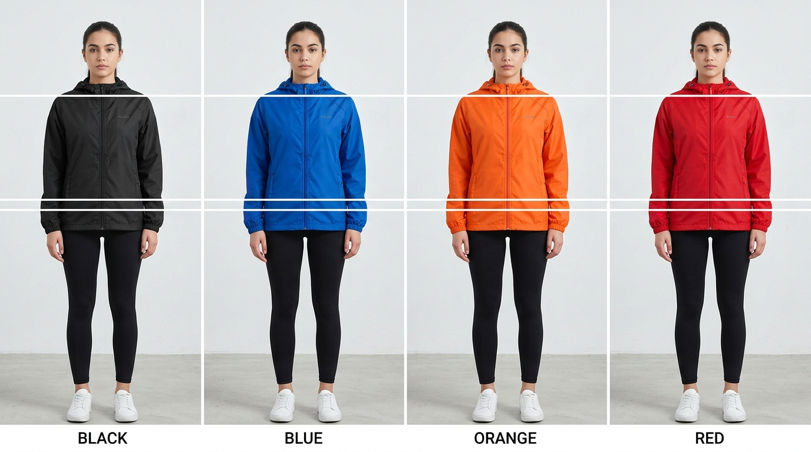
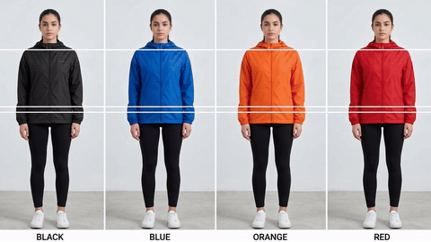

# Sizing & Layout Consistency

> Proportions build the canvas; alignment builds the brand.

**Track:** AI Fashion & Virtual Try-On  
**Time:** ~35 minutes  
**Prerequisites:** Garment Try-on Basics  

## The Problem

When browsing an online clothing store, consistency is key to a professional experience. If the model's head size jumps around, or if the shoulder baseline shifts up and down as you click between different shirts, the website looks cheap and messy.

If you try to align each virtual try-on image by eye, you will inevitably make errors. Some models will look too tall, others too short, and the clothing alignment will be inconsistent.

To build a professional brand catalog, you must implement a standardized layout grid and keep all model proportions, heights, and poses aligned across your entire collection.

## The Concept

Standardizing fashion catalog layouts relies on **Bounding Margins**, **Baseline Joint Coordinates**, and **Pose Templates**:

```
Model Try-On Render ──► Import into Grid Canvas ──► Joint Guide Alignment ──► Baseline Stabilization ──► Export WebP
```

* **The Shoulder Baseline Rule:** The shoulders are the anchor point of any garment. To align shirts, jackets, or dresses, always align the model's shoulder joints to the same vertical coordinate (Y-axis) in your template. This keeps the chest and neck lines consistent across your listing grid.
* **Aspect Ratio Margins:** E-commerce channels require specific margins. For a standard 4:5 vertical format (1080x1350px), maintain a **10%** bottom margin for the feet and a **12%** top margin for head clearance to prevent text overlays from covering the model.
* **Center Seam Centering:** The vertical center seam of the garment (the zipper or button line) must align perfectly with the horizontal center of the canvas (X-axis center). This prevents the product from looking off-center or tilted.

---

## Do It

### Step 1: Set Up the Canvas Grid
Open [`templates/mannequin-alignment-template.md`](templates/mannequin-alignment-template.md). Configure your canvas guides in your editor:
* Set canvas size to **1080 x 1350px**.
* Add a vertical center guide at **X: 540px**.
* Add horizontal baseline guides: Shoulder Line at **Y: 400px**, Waist Line at **Y: 750px**, Hip Line at **Y: 950px**.

### Step 2: Import the Model Layer
Import your generated model try-on layer into the template. Position it roughly in the center.

### Step 3: Align the Shoulders
Scale the model layer proportionally (hold `Shift` in your editor):
* Drag the model layer until the left and right shoulder seams align exactly with the horizontal **Shoulder Line (Y: 400px)** guide.
* Let the head and legs scale naturally. This ensures the chest and torso placement is uniform across all product listings.

### Step 4: Align the Center Seam
Move the model layer left or right until the shirt's collar button or zipper line aligns exactly with the **Center Vertical Guide (X: 540px)**.

### Step 5: Verify Margins & Export
Perform a visual QA check:
* Ensure the top of the model's head does not cross the top safety line.
* Ensure the hands and sides do not cross the side padding guides.
Hide the grid template layers, and export the file as WebP. Repeat this process for all items in the catalog collection.

---

## Worked Example

<p align="center">


</p>
<p align="center"><sub>Baseline Grid Alignment Image (Left) ──► Image-to-Video Grid Lighting Motion (Right) · Video File: <a href="templates/examples/mannequin-grid-clip.mp4">templates/examples/mannequin-grid-clip.mp4</a></sub></p>

**Aligning a 5-Item Windbreaker Collection**


* **Catalog Resolution:** 1080x1350px vertical.
* **Baseline Settings:**
  * Center Guide: X: 540px.
  * Shoulder Guide Y: 400px.
  * Waist Guide Y: 750px.
* **Execution:**
  * Imported 5 separate VTO model renders (Black, Blue, Orange, Red, Grey windbreakers).
  * Scaled each layer so the jacket shoulder seams snapped to the Y: 400px line.
  * Centered each zipper line to the vertical center.
* **Results:** When browsing the catalog page, the models stand at the exact same height and center, allowing shoppers to focus on comparing the product colors without visual distractions.

---

## Compare Tools

| Platform / Tool | Automation Capability | Layout Control | Best for |
|---|---|---|---|
| **Photoshop / Photopea** | Low (Requires manual scaling to guides) | Ultra-High (Pixel-perfect visual guides) | High-end listing photography QC. |
| **Python Pillow (PIL)** | Ultra-High (Can write scripts to crop and auto-align eyes/shoulders using keypoints) | Medium | Programmatic batch processing of large catalog datasets. |
| **Figma** | Low | High | Creating user interface mockups and checking page layout consistency. |

For design QA, using Photoshop's horizontal guidelines is the best workflow. For developers managing massive databases (e.g. 1000+ fashion catalog updates), writing a Python script using a keypoint detection model (like YOLO-pose) to detect shoulder joints and auto-crop the canvas is the standard way to scale the pipeline.

---

## Launch It

**How to organize pose templates:**
* **Lock the camera angle:** Keep the camera height at chest level (approx. 4 feet off the ground) for all catalog photography. Changing camera heights (e.g., low-angle shots vs. high-angle shots) alters perspective, making it impossible to align baseline coordinates.
* **Use standardized baselines:** Document your grid settings in the [`templates/mannequin-alignment-template.md`](templates/mannequin-alignment-template.md) file and share it with your design team.

---

## Exercises

1. **Easy:** Open a photo editor and draw guides for a square 1:1 e-commerce layout (Shoulders at Y: 300px, Waist at Y: 600px).
2. **Medium:** Import 2 model photos and scale them so their shoulders align perfectly to your guides. Toggle the layers to verify alignment.
3. **Hard:** Write a mock checklist to QA a batch of 10 clothing listing pages. List 4 potential alignment errors (e.g., off-center zipper, head clipping) and how to fix them.

---

## Templates

* [`templates/mannequin-alignment-template.md`](templates/mannequin-alignment-template.md) — canvas sizes, margin constraints, baseline coordinate maps, and QC checklists.

---

[← High-converting Studio Lookbooks](02-studio-lookbooks.md) · Next: [Before/After Conversion Cases →](04-conversion-cases.md)
