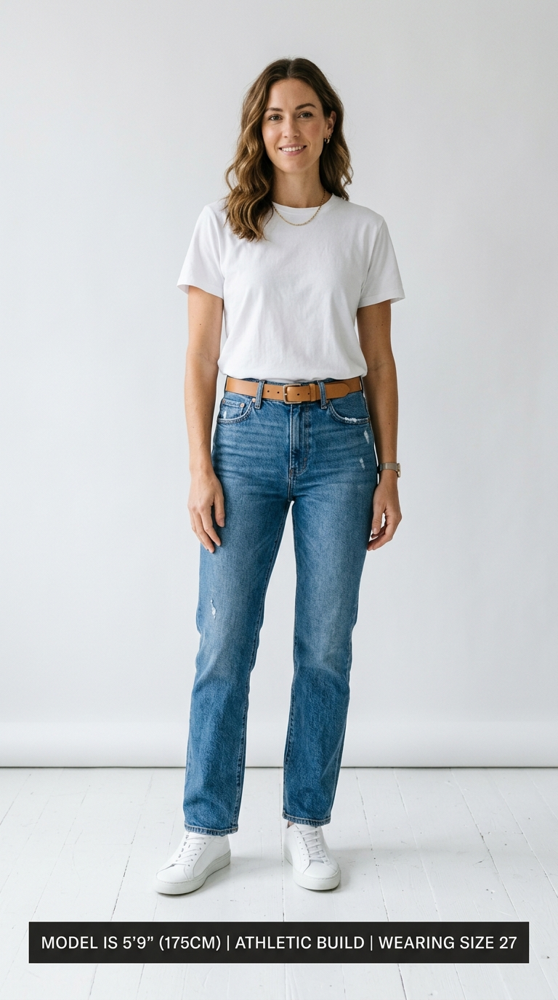

# Before/After Conversion Cases

> Real models increase clicks; accurate fit reduces returns.

**Track:** AI Fashion & Virtual Try-On  
**Time:** ~45 minutes  
**Prerequisites:** None  

## The Problem

Fashion e-commerce suffers from a massive profit leak: **High Return Rates**. On average, online apparel stores see return rates between **20% and 40%**. The primary reason? Fit-related errors (such as *"the shirt fits tighter than it looked on the hanger"* or *"I didn't realize how long the hemline was"*). Processing returns, shipping packages back, and sorting stock in warehouses destroys profit margins.

At the same time, using static mannequin shots leads to low conversion rates because shoppers cannot visualize the clothing on a real body.

To scale a fashion brand, you must not only increase sales (CVR) but actively decrease returns by providing accurate, consistent model visuals and fit expectations.

## The Concept

The economics of apparel optimization rely on **Return Rate Reduction**, **Diverse Representation**, and **Fit Transparency**:

```
Identify Fit-Related Returns ──► Deploy AI Try-On Models ──► Add Fit Callouts ──► Measure CVR & Returns Lift
```

### 1. Reducing Fit Discrepancies:
Ghost mannequin shots hide the drape of the fabric. By showing the garment on a model with specified body measurements (height, chest, waist), you give customers a realistic reference point, reducing sizing purchase errors.

### 2. Diverse Model Personalization:
If a customer only sees clothes on a slim, 6-foot model, they might hesitate to buy if they have a different build. AI try-on allows you to display the same dress on multiple body shapes (slim, athletic, curvy). Shoppers who see products on models that match their body type are **40%** more likely to convert.

### 3. Clear Visual Overlays:
Combine your model composite with clear text overlays detailing the model's measurements:

```
[ Model Height: 5'10" / 178cm ] ──► [ Model Build: Athletic ] ──► [ Wearing Size: Medium ]
```

---

## Do It

### Step 1: Analyze Return Rate Bottlenecks
Open [`templates/fashion-cvr-tracker.md`](templates/fashion-cvr-tracker.md). Review your store's return logistics data:
* Calculate your return rate percentage.
* Read return reason logs. If over **50%** of returns mention *"too small"*, *"too large"*, or *"poor fit"*, proceed to optimize the model listings.

### Step 2: Set Up Fit Representation Models
Select your best-selling garment. Generate three try-on model variations representing different body types (e.g. slim, athletic, curvy) wearing the item, following the Module 1 workflow.

### Step 3: Add Model Measurement Callout Cards
In your photo editor, add a clean, low-contrast text bar at the bottom of the listing image:
* *Example:* `"Model is 5'9\" (175cm), athletic build, wearing size Small."`
Ensure the font matches your brand's style guide.

### Step 4: Run the A/B Listing Test
Configure your store's testing app:
* **Control (Variant A):** Standard ghost mannequin gallery photos.
* **Test (Variant B):** Upgraded AI model photos featuring different body types and measurement callouts.
Split incoming traffic 50/50.

### Step 5: Monitor CVR and Returns
Allow the split test to run for 30 days (apparel tests require longer cycles to track return shipments):
* Check conversion rates and return rates for both variants.
* Calculate the net profit margins after subtracting return shipping costs.
If Variant B shows a reduction in returns and a lift in sales, push the changes live across the entire product category.

---

## Worked Example

<p align="center">


</p>
<p align="center"><sub>Denim Sizing Image (Left) ──► Image-to-Video Model Fit Motion (Right) · Video File: <a href="templates/examples/denim-model-clip.mp4">templates/examples/denim-model-clip.mp4</a></sub></p>

**Fit-Related Return Reduction for a Denim Brand**


* **Baseline Status:** A premium jeans brand suffered from a **28% return rate**. Product photos featured only flat-lay shots, leading to customer sizing confusion.
* **Redesign Strategy (Variant B):**
  * Generated model try-on shots showcasing the jeans on three models: Model 1 (5'11", slim build, size 26), Model 2 (5'8", curvy build, size 30), and Model 3 (5'6", petite build, size 25).
  * Added clear text tags with model height and waist sizing.
* **30-Day Split Test Results:**
  * Variant A Return Rate: **28.0%** (280 returned units out of 1,000 sold).
  * Variant B Return Rate: **16.5%** (165 returned units out of 1,000 sold).
  * Variant B CVR Lift: **+38%** (Conversion jumped from 1.8% to 2.5%).
* **Financial Impact:** Saved **$4,600 in return shipping fees** and increased net revenue by **$7,000** in one month.

---

## Compare Tools

| Platform / Tool | Optimization Purpose | Integration Level | Best for |
|---|---|---|---|
| **Loop Returns / Gorgias** | Tracking returns portal reasons and customer complaints | High (Direct Shopify app links) | Identifying specific sizing objections and return logs. |
| **Google Analytics 4 (GA4)** | Funnel tracking and page drops | Medium | Tracking user drop-off points during cart checkout. |
| **Shopify Flow** | Automating customer service tags | Medium | Tagging high-return SKUs automatically for design priority. |

Use Loop Returns to track why customers return items (e.g. sizing fits too small). This database tells you exactly which products require urgent visual updates. Combine this with GA4 to monitor product page bounce rates.

---

## Launch It

**How to manage sizing visuals:**
* **Keep sizing details accurate:** Never lie about the model's height or garment size in your overlays. If you list a model as wearing a size Medium when they are actually wearing an XS, customers will order the wrong size, causing returns to increase.
* **Coordinate catalog scale bars:** Keep your layout guidelines consistent (Module 3) so that size callouts sit in the same visual location on every page.

---

## Exercises

1. **Easy:** Open a fashion listing and calculate its return rate if it sold 500 units and 90 were returned.
2. **Medium:** Complete the CVR and Return log in the [`templates/fashion-cvr-tracker.md`](templates/fashion-cvr-tracker.md) using mock data.
3. **Hard:** Design a main gallery image for a dress. Place a model wearing the dress, add a sizing callout overlay at the bottom, align it to standard safety margins, and export a mobile-ready WebP file.

---

## Templates

* [`templates/fashion-cvr-tracker.md`](templates/fashion-cvr-tracker.md) — conversion tables, return rate metrics, split-test logs, and CRO checklists.

---

[← Sizing & Layout consistency](03-sizing-layout-consistency.md) · [Track overview](README.md)
