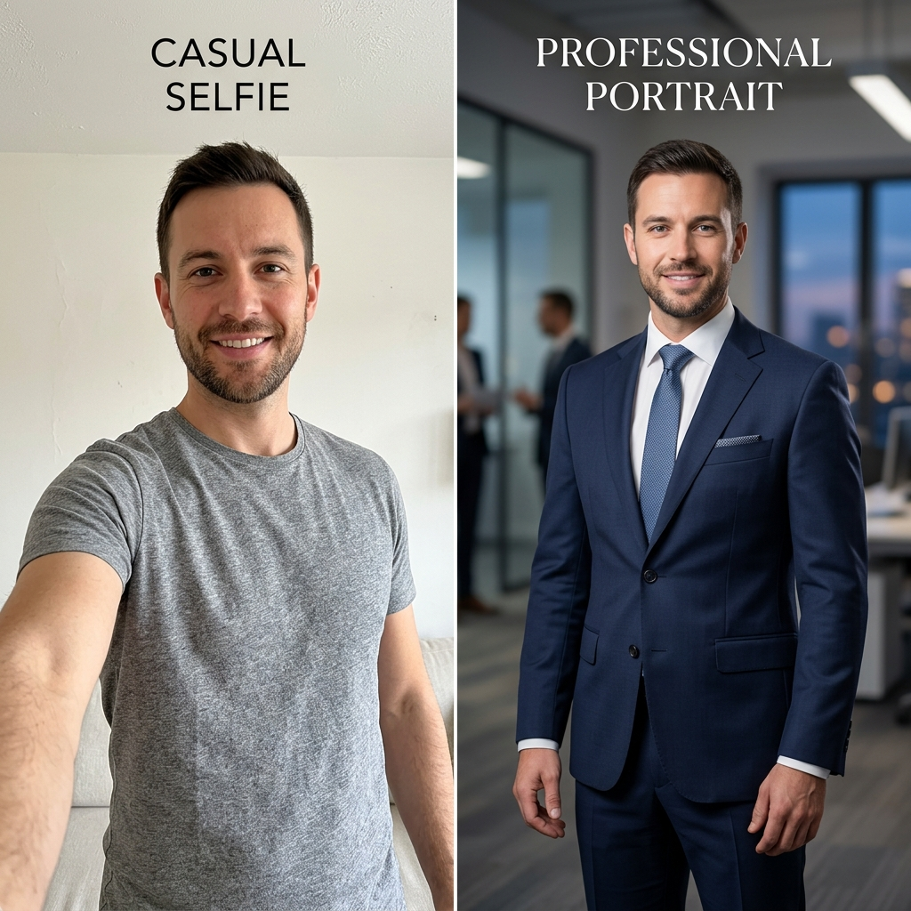

# Standing Out Against Fiverr Competition

> Escape the $5 consumer headshot race to the bottom by selling high-ticket B2B team packages to corporate companies.

**Track:** AI Headshots & Portraits  
**Time:** ~45 minutes  
**Prerequisites:** [01: Consistent Headshot Generation](01-consistent-headshot-generation.md)  

## The Problem

The consumer market for AI headshots is heavily commoditized. Cheap automated apps and Fiverr freelancers sell **$5 to $10 headshot packs**, flooding the market with over-filtered, plastic-looking portraits that look like obvious AI renders.

If you try to sell $10 headshots to individual consumers, your business model fails: customer acquisition costs eat up your margins, buyers complain about tiny facial quirks, and refund requests ruin your profitability.

At the same time, companies, law firms, tech startups, and consulting agencies spend **$3,000 to $10,000 annually** updating team headshots for new hires and website rebrands. They refuse to use cheap $5 apps due to privacy concerns, lack of brand consistency, and poor image resolution.

---

## The Concept

The key to building a profitable AI headshot business is transitioning from **B2C Consumer Micro-Transactions** to **B2B Corporate Team Packages**:

```
B2C Freelance Trap ($5/photo to individuals) ──► B2B Corporate Agency Model ($599/team package to companies)
```

### The 4 Pillars of B2B Differentiation:

1. **Brand Style Guide Matching:** Companies require every employee headshot to feature the exact same background color gradient, lighting ratio, and dress code (e.g., navy blazer with white shirt on dark charcoal background).
2. **Enterprise Privacy & Data Compliance:** Corporate HR departments will not allow employee photos to be stored on unverified consumer servers. Offering **GDPR-compliant data purging** (deleting all source selfies within 7 days of delivery) wins corporate security reviews.
3. **High-Resolution Vector Upscaling:** Delivering 300dpi 4000px+ images suitable for print annual reports, conference banners, and press kits—not just 512px social media avatars.
4. **Self-Serve Team Intake Portals:** Providing a simple white-labeled submission link where employees upload their selfies directly, selecting their preferred outfit style from a drop-down menu.

---

## Do It

### Step 1: Define Your B2B Corporate Packages
Structure your offers to target HR directors, marketing managers, and operations leads:

```
┌─────────────────────────┐  ┌─────────────────────────┐  ┌─────────────────────────┐
│   Startup Team Pass     │  │   Corporate Standard    │  │   Enterprise Unlimited  │
│        $399             │  │        $799             │  │       $1,499            │
├─────────────────────────┤  ├─────────────────────────┤  ├─────────────────────────┤
│ • Up to 10 Employees    │  │ • Up to 25 Employees    │  │ • Up to 50 Employees    │
│ • 3 Styles per Person   │  │ • 5 Styles per Person   │  │ • Custom Brand Background│
│ • Brand Background Match│  │ • Custom Brand Match    │  │ • Priority 12h SLA      │
│ • 48h Turnaround        │  │ • 24h Turnaround        │  │ • GDPR Data Purge Cert  │
└─────────────────────────┘  └─────────────────────────┘  └─────────────────────────┘
```

### Step 2: Build a White-Labeled Intake Form
Set up a clean form (via Tally, Typeform, or your own domain) using the structure in [`templates/b2b-headshot-proposal.md`](templates/b2b-headshot-proposal.md):
* Employee Full Name & Title.
* Email address for direct proof delivery.
* Outfit Preference selection (e.g., Executive Suit, Tech Casual Sweater, Creative Blazer).
* Upload field for 3 crisp selfies.

### Step 3: Target High-Growth Companies with Team Rebrands
Use LinkedIn Sales Navigator or Apollo to find companies that recently:
* Announced a Series A/B funding round.
* Rebranded their corporate website.
* Hired 5+ new remote employees in the past month.

### Step 4: Pitch the "Unified Remote Team Headshot" Solution
Send this targeted B2B cold pitch to HR Heads & VP of Marketing:

> **Subject:** Consistent headshots for [Company Name]'s remote team?
> 
> Hi [HR Director Name],
> 
> I noticed [Company Name]'s team page features great talent, but the headshots range from professional studio shots to vacation photos and outdoor selfies.
> 
> As remote teams grow, getting 25 employees across 4 time zones into a consistent photography studio is nearly impossible.
> 
> Our studio provides **Unified AI Corporate Headshots** for remote teams:
> * Every team member gets 5 polished, studio-quality executive portraits matching your exact company brand guidelines.
> * Zero studio travel — employees upload 3 selfies from their phone in 2 minutes.
> * Full GDPR compliance & automated selfie deletion after 7 days.
> 
> I put together a quick 30-second sample showing what your team page would look like with a unified brand background:
> 
> **[Link to 30-Sec Sample / Before-After Image]**
> 
> Would you be open to testing 2 free employee headshot samples for your leadership team this week?
> 
> Best,  
> [Your Name]  
> Founder, [Your Agency Name]

### Step 5: Deliver High-Res Bundles & Master Assets
Deliver completed team headshots organized by employee name folders containing:
* `john_doe_linkedin_1:1.jpg` (1080x1080px for LinkedIn/Slack).
* `john_doe_website_4:5.jpg` (2400x3000px for corporate team page).
* `john_doe_print_300dpi.png` (High-res print transparent PNG for press releases).

---

## Worked Example

<p align="center">

</p>
<p align="center"><sub>Casual Smartphone Selfie (Left) ──► Studio-Grade AI Corporate Executive Headshot (Right)</sub></p>

**B2B Campaign Results for "FinTech Solutions Inc."**

* **Client Situation:** 35-person remote engineering and sales team with inconsistent, outdated profile photos.
* **Closed Package:** Corporate Standard Tier ($799 for 25 employees + $20/person for 10 additional team members = **$999 Total**).
* **Execution Time:** Employees submitted selfies via form on Monday; all 35 completed high-res bundles delivered Wednesday morning (48-hour turnaround).
* **Agency Production Cost:** $0.06 × 35 = **$2.10 total API credit cost**.
* **Gross Profit:** **$996.90** (99.7% margin).

---

## Compare Tools

| Model / Feature | B2C Freelance Model ($5) | B2B Agency Model ($799) |
|---|---|---|
| **Target Client** | Individual budget shoppers | HR Directors, Marketing VPs, Corporate Agencies |
| **Identity Precision** | Generic face swap apps | Controlled InstantID / FLUX PuLID identity vectors |
| **Output Resolution** | 512px - 1024px web JPEGs | 3000px+ 300DPI print & web compliant bundles |
| **Data Privacy** | Images saved on public app servers | Signed GDPR data purge certificates (7-day wipe) |
| **Client Value** | $5 one-off transaction | $799 - $1,499 per company + ongoing new-hire add-ons |

---

## Launch It

**Essential enterprise closing rules:**
* **Provide a GDPR Data Purge Guarantee:** Give corporate clients peace of mind by including a signed data privacy clause stating all source employee selfies are permanently deleted from your servers within 7 business days.
* **New-Hire Monthly Retainers:** Charge companies a **$99/month recurring retainer** to automatically generate headshots for up to 3 new hires every month as they join the team.

---

## Exercises

1. **Easy:** Create a B2B intake form template with fields for employee name, title, outfit choice, and selfie upload.
2. **Medium:** Take 1 casual selfie of a friend or colleague and transform it into 3 distinct corporate styles (Navy Suit, Tech Turtleneck, Creative Blazer) matching a unified grey gradient background.
3. **Hard:** Pitch a local company or startup with a team of 10+ employees by creating a custom Before/After sample of their CEO's profile photo.

---

## Templates

* [`templates/b2b-headshot-proposal.md`](templates/b2b-headshot-proposal.md) — Enterprise sales proposals, intake form schemas, GDPR privacy agreements, and SLA contracts.

---

[← Consistent Headshot Generation](01-consistent-headshot-generation.md) · [Track Overview](README.md)
