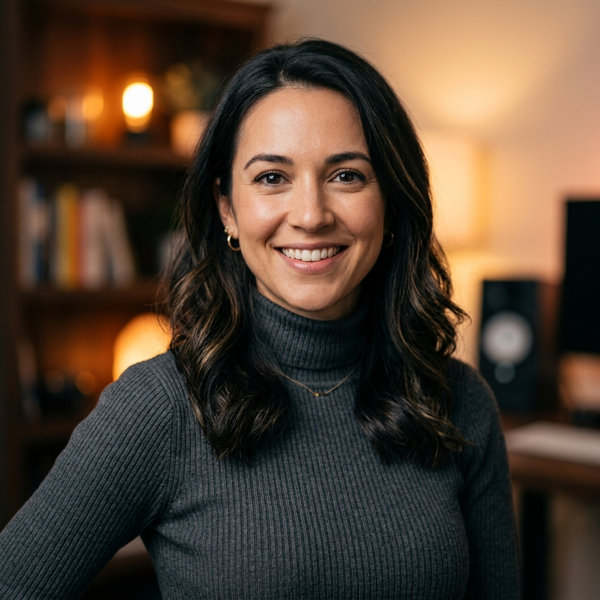

# Creative Headshots & Stylized Executive Portraits

> Expand into high-ticket editorial, keynote speaker, author, and creative industry portraits using cinematic mood lighting.

**Track:** AI Headshots & Portraits  
**Time:** ~40 minutes  
**Prerequisites:** [01: Consistent Headshot Generation](01-consistent-headshot-generation.md), [02: Standing Out Against Fiverr Competition](02-standing-out-against-fiverr-competition.md)  

## The Problem

While formal corporate headshots (suits & grey backgrounds) cover traditional corporate clients, creative professionals reject bland corporate photography. 
* **Keynote Speakers & Authors:** Need dramatic stage lighting, dark moody backgrounds, and high-impact editorial framing for book covers and conference banners.
* **Music Artists & Podcasters:** Require gel lighting accents (neon cyan, warm amber), cinematic depth, and stylized artistic mood.
* **Tech Founders & Designers:** Prefer relaxed environmental settings (sunlit lofts, architectural brick walls, outdoor urban lofts).

If you only offer standard corporate suit headshots, you miss out on high-paying creative, media, and executive editorial clients who pay **$150 to $350 per custom portrait pack**.

---

## The Concept

The **Creative Editorial Portrait Pipeline** shifts lighting geometry and environment dynamics:

```
Identity Vector Lock ──► Cinematic Mood Prompt ──► Gel & Environmental Light Sync ──► High-Res Editorial Polish
```

### Creative Portrait Styles:

1. **The Keynote Speaker (Dramatic Stage Lighting):** Dark moody background, strong directional key light, warm backlight rim, dramatic shadow falloff.
2. **The Tech Founder Loft (Architectural Environmental):** Sunlit brick loft background, soft natural window light, relaxed business casual attire (turtlenecks, denim blazers).
3. **The Podcast / Media Creator (Color Gel Accents):** Dual-tone lighting (magenta key light + cyan rim light), dark studio background, high energy expression.

---

## Do It

### Step 1: Select the Creative Aesthetic Style
Open [`templates/headshot-style-guide.md`](templates/headshot-style-guide.md). Match your client's brand personality:

* **Keynote Author Prompt:**  
  > `"Photorealistic 8k editorial portrait photograph of [Identity Anchor], thoughtful confident expression, dark moody studio background, dramatic Rembrandt side lighting, warm rim light on hair and shoulders, 85mm f/1.4 lens, shallow depth of field, high contrast, NYT bestseller book cover style."`
* **Creative Tech Founder Prompt:**  
  > `"Photorealistic 8k environmental portrait of [Identity Anchor], approachable friendly smile, wearing a dark navy turtleneck, exposed brick loft background with warm window sunlight, soft bokeh, 85mm lens."`

### Step 2: Lock Identity & Execute Inference
Pass your client's selfie into your identity-locked generator (muapi `/nano-banana-2` or InstantID). Set identity weight to `0.85` to ensure 100% facial accuracy while allowing the model to generate creative lighting effects.

### Step 3: Refine Micro-Details & Color Grade
Apply a subtle color balance filter (cinematic teal & orange or warm amber midtones) to match magazine cover aesthetics. Save as `creative-studio-headshot.jpg`.

---

## Worked Example

<p align="center">

</p>
<p align="center"><sub>Creative Studio Tech Founder Portrait (Warm Bokeh & Soft Studio Butterfly Lighting)</sub></p>

**Creative Portrait Campaign for "Keynote Speaker Series"**

* **Client:** Bestselling Author & Keynote Speaker.
* **Target Deliverable:** 5 Editorial Portraits for Book Cover, Billboard, and Speaker One-Sheet.
* **Selected Styles:** Keynote Stage Lighting, NYT Author Mood, Warm Urban Loft.
* **Package Rate:** **$249.00**.
* **Production Time:** 25 minutes.

---

## Launch It

* **Offer Pitch-Deck Formatting:** Package completed creative headshots into pre-sized assets for Spotify podcast covers (3000x3000px), YouTube banners (2560x1440px), and speaker press kits.

---

## Exercises

1. **Easy:** Generate a creative portrait with dual-color gel lighting (blue key light + amber rim light).
2. **Medium:** Create an environmental loft headshot for a tech founder with exposed brick background.
3. **Hard:** Produce a 4-portrait editorial press kit (Author Cover, Stage Lighting, Loft Casual, Studio Dark) for a keynote speaker.

---

## Templates

* [`templates/headshot-style-guide.md`](templates/headshot-style-guide.md) — Creative lighting prompts, gel lighting ratios, and editorial negative prompts.

---

[← Batch Headshots for Remote Teams](03-batch-headshots-for-remote-teams.md) · [Track Overview](README.md)
