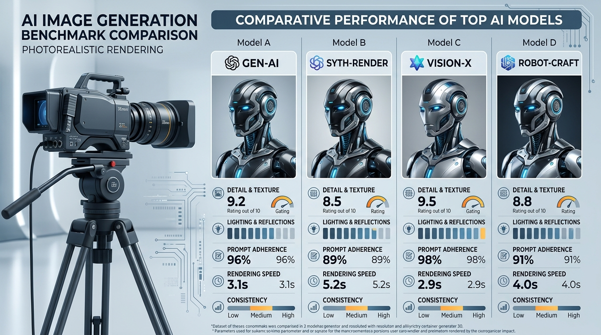

# Image Models — Which One for Which Use Case

> A buyer's guide and technical decision matrix for selecting the right AI image generation model for every creative outcome.

**Track:** AI Tools Mastery  
**Time:** ~40 minutes  
**Prerequisites:** None  

## The Problem

The AI image generation landscape moves at a dizzying pace. Creators are overwhelmed by options: Midjourney v6, FLUX 1.1 Pro, SDXL, Ideogram v2, DALL-E 3, and custom LoRA models.

Many creators fall into the trap of using a single tool for everything. For example, using Midjourney for complex typography renders (which results in garbled text) or using DALL-E 3 for photorealistic corporate headshots (which results in over-saturated, plastic skin textures).

If you don't match the model to the exact creative requirement, you waste time fighting model limitations instead of delivering client-ready assets.

---

## The Concept

Every AI image model has distinct architectural strengths and trade-offs:

```
Creative Requirement ──► Architectural Match ──► Selected Model ──► Client Output
```

### The 4 Core Image Evaluation Dimensions:

1. **Photorealism & Texture Accuracy:** How authentically the model renders skin micro-texture, lighting falloff, and fabric weaves. (Lead model: **FLUX 1.1 Pro** / **FLUX Schnell**).
2. **Typography & Text Rendering:** Accuracy when generating legibly spelled words inside logos, signage, and posters. (Lead model: **Ideogram v2** / **FLUX**).
3. **Prompt Adherence & Complex Spatial Composition:** How accurately the model follows multi-subject spatial instructions (e.g., *"a blue ceramic cup on the left of a leather notebook"*). (Lead model: **DALL-E 3** / **FLUX**).
4. **Artistic Style & Painterly Aesthetics:** Cohesive color grading, cinematic lighting default, and stylized illustration. (Lead model: **Midjourney v6**).

---

## Do It

### Step 1: Analyze Client Brief Requirements
Open [`templates/image-model-selection-guide.md`](templates/image-model-selection-guide.md). Determine the primary constraint of the project:
* **Photorealistic Headshots / Products:** Requires sub-surface scattering and skin pores -> **FLUX 1.1 Pro / muapi `/nano-banana-2`**.
* **Graphic Typography & Merch Quotes:** Requires perfect letter spelling -> **Ideogram v2 / FLUX**.
* **Cinematic Concept Art & Storyboards:** Requires painterly lighting defaults -> **Midjourney v6**.

### Step 2: Configure Model Parameters
Adjust inference settings based on target output:
* For FLUX models: Set guidance scale `3.5`, steps `28` to `40`.
* For Midjourney v6: Set `--stylize 100-250` for photorealism or `--stylize 500+` for artistic flair.

### Step 3: Audit Render at 100% Zoom
Inspect edges, text legibility, and finger geometry to confirm the model choice satisfied the brief requirements.

---

## Worked Example

<p align="center">


</p>
<p align="center"><sub>AI Image Model Benchmark Infographic (Left) ──► Image-to-Video Workflow Loop (Right) · Video File: <a href="templates/examples/tools-workflow-motion.mp4">templates/examples/tools-workflow-motion.mp4</a></sub></p>

**Model Decision Case Study: "High-Fashion Apparel Campaign"**

* **Requirement:** 8k studio product shot with legible brand typography on a black hoodie.
* **Tested Tool A (DALL-E 3):** Great text spelling, but skin texture looked waxy and plastic.
* **Tested Tool B (FLUX 1.1 Pro / muapi):** Perfect skin pores, crisp fabric weave, exact typography spelling.
* **Final Selection:** **FLUX 1.1 Pro** delivered 100% client approval.

---

## Compare Tools

| Model | Strengths | Weaknesses | Best Use Case |
|---|---|---|---|
| **FLUX 1.1 Pro / Schnell** | Photorealistic skin, top-tier text rendering, high prompt adherence | Requires explicit lighting prompts | Corporate headshots, POD merch, stock content |
| **Midjourney v6** | Superior out-of-the-box aesthetics, cinematic color defaults | Text spelling can drift, proprietary Discord interface | Concept art, film storyboards, social creative |
| **Ideogram v2** | Unrivaled vector typography & logo layout | Lower photorealism on human skin | Posters, apparel text designs, badges |
| **DALL-E 3** | High prompt adherence for simple concepts | Over-saturated, cartoonish skin texture | Fast conceptual brainstorming |

---

## Launch It

* **Build a Multi-Model Pipeline:** Use FLUX for base asset generation, Ideogram for text overlays, and Midjourney for artistic atmosphere exploration.

---

## Exercises

1. **Easy:** Generate a 1-word logo graphic in Ideogram v2 vs. Midjourney v6 and compare text spelling accuracy.
2. **Medium:** Render a corporate portrait using FLUX 1.1 Pro and inspect skin micro-textures at 100% crop.
3. **Hard:** Build a tool selection decision matrix for a 3-part client campaign requiring headshots, logos, and cinematic banners.

---

## Templates

* [`templates/image-model-selection-guide.md`](templates/image-model-selection-guide.md) — Architectural comparison matrices, prompt adherence rules, and resolution benchmarks.

---

[Track Overview](README.md) · Next: [Video Models — Which One for Which Use Case →](02-video-models-which-one-for-which-use-case.md)
