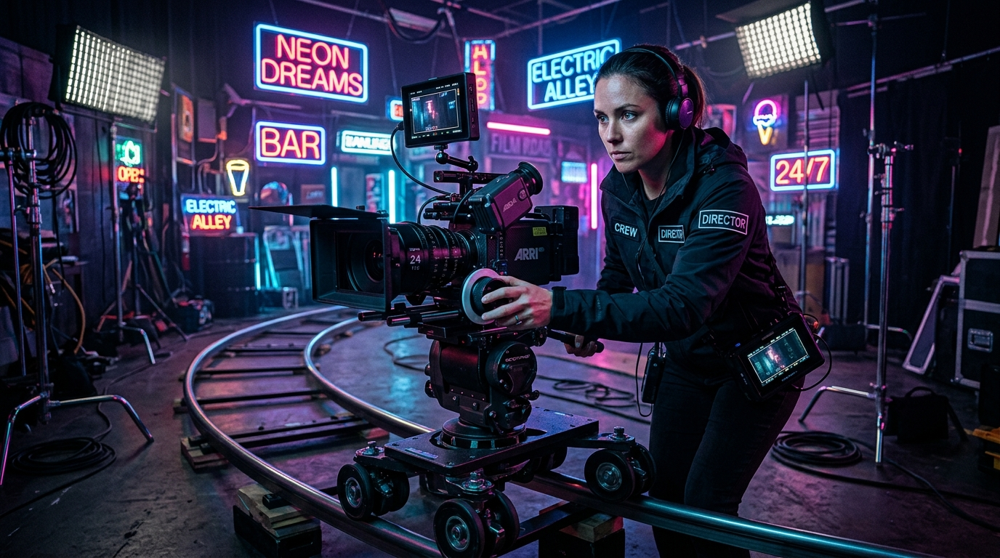

# Video Models — Which One for Which Use Case

> Master the video generation ecosystem: Runway Gen-3 Alpha, Kling 1.5, Luma Dream Machine, Sora, and Seedance 2 I2V.

**Track:** AI Tools Mastery  
**Time:** ~40 minutes  
**Prerequisites:** [01: Image Models](01-image-models-which-one-for-which-use-case.md)  

## The Problem

Generative video is the fastest-growing sector of AI creation, but video credits are expensive ($0.25 to $1.50 per 5-second generation).

Choosing the wrong video model wastes money:
* Using high-motion models for subtle camera pans causes extreme morphing distortion.
* Using low-motion models for action sequences produces static, frozen frames.
* Using Text-to-Video (T2V) instead of Image-to-Video (I2V) destroys visual consistency across scenes.

You need a clear decision framework to select the exact video model for your desired camera movement and motion speed.

---

## The Concept

AI video models excel at different motion profiles and temporal physics:

```
Source Image ──► Motion Profile Requirements ──► Video Model Match ──► Render Output
```

### The 4 Core Video Evaluation Factors:

1. **Image-to-Video (I2V) Fidelity:** How accurately the model preserves the original lighting, face identity, and composition from the source image. (Lead model: **Kling 1.5** / **Seedance 2 I2V**).
2. **Camera Controls (Pan, Zoom, Orbit):** Precision when executing specific cinematographer movements (e.g., slow push-in, orbital pan). (Lead model: **Runway Gen-3 Alpha** / **Luma Dream Machine**).
3. **Physics Simulation & Fluid Motion:** Realistic motion of water, smoke, fire, cloth, and human movement without limb warping. (Lead model: **Kling 1.5** / **Sora**).
4. **Rendering Speed & API Efficiency:** Fast 10-30 second generation times for high-volume commercial production. (Lead model: **Seedance 2 I2V Fast** via muapi).

---

## Do It

### Step 1: Define Desired Motion Control
Open [`templates/video-audio-stack-matrix.md`](templates/video-audio-stack-matrix.md). Map your scene's motion needs:
* **Subtle Slow Architectural Pan / Product Rotation:** Requires high I2V stability -> **Kling 1.5 / Seedance 2 I2V**.
* **Dramatic Cinematic Camera Zoom & Fly-Through:** Requires keyframe camera control -> **Runway Gen-3 Alpha**.
* **Complex Fluid Dynamics (Water splashes, explosions):** Requires advanced physics -> **Kling 1.5 / Sora**.

### Step 2: Formulate the Motion Prompt
Append explicit camera movement tokens to your prompt:
* `"Camera slowly pans right across the modern living room, soft sunlight streaming through windows, 24fps film grain, photorealistic."`

### Step 3: Set Motion Scale & Camera Locks
Set motion strength scale:
* Low motion (`2 - 4`): Ideal for portraits, headshots, real estate.
* High motion (`6 - 8`): Ideal for action, sports, vehicles.

---

## Worked Example

<p align="center">

</p>
<p align="center"><sub>Cinematic Camera Motion Reference Graphic (Studio Camera Setup)</sub></p>

**Video Model Decision Case Study: "Commercial Car Reel"**

* **Requirement:** 5-second tracking shot of a sports car driving on a coastal road at sunset.
* **Tested Model A (Text-to-Video):** Car shape morphed into a different vehicle halfway through the clip.
* **Tested Model B (I2V with Kling 1.5 / Seedance 2):** Locked exact vehicle geometry from keyframe image, generating smooth reflections along the chassis.
* **Result:** 100% stable motion reel.

---

## Compare Tools

| Video Model | Camera Control | Motion Fidelity | Best For |
|---|---|---|---|
| **Runway Gen-3 Alpha** | **Extremely High** (Keyframe camera controls) | High | Film trailers, dramatic camera moves, advertising |
| **Kling 1.5** | High | **Superior Physics** & Human motion | Real estate walkthroughs, character motion, I2V stability |
| **Luma Dream Machine** | Medium | High dynamic camera movement | Fast 3D camera sweeps and conceptual loops |
| **Seedance 2 I2V Fast (muapi API)** | High | **Fastest API Inference** (~15s) | High-volume client pipelines, social media clips |

---

## Launch It

* **Always Start with Image-to-Video (I2V):** Never rely on Text-to-Video for commercial work. Generate a pristine 8k image first, then animate it with I2V to maintain 100% brand consistency.

---

## Exercises

1. **Easy:** Animate a static product photo using Seedance 2 I2V with a slow camera zoom prompt.
2. **Medium:** Compare the camera control of Runway Gen-3 vs. Kling 1.5 on the same keyframe image.
3. **Hard:** Produce a 3-shot video scene with consistent lighting using I2V keyframes across scenes.

---

## Templates

* [`templates/video-audio-stack-matrix.md`](templates/video-audio-stack-matrix.md) — Motion control parameters, camera movement guides, and model speed benchmarks.

---

[← Image Models](01-image-models-which-one-for-which-use-case.md) · Next: [Voice & Audio Models →](03-voice-audio-models-which-one-for-which-use-case.md)
